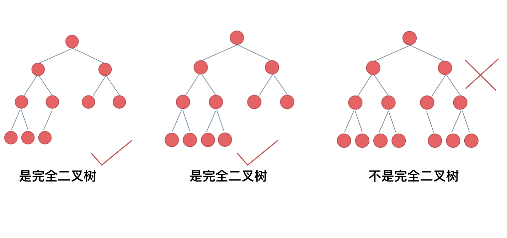

# 二叉树种类

### 满二叉树

满二叉树：如果一棵二叉树只有度为 0 的结点和度为 2 的结点，并且度为 0 的结点在同一层上，则这棵二叉树为满二叉树。


### 完全二叉树

什么是完全二叉树？

完全二叉树的定义如下：在完全二叉树中，除了最底层节点可能没填满外，其余每层节点数都达到最大值，并且最下面一层的节点都集中在该层最左边的若干位置。若最底层为第 h 层，则该层包含 1~ 2^(h-1) 个节点。


### 二叉搜索树

**二叉搜索树是有序树**

- 若它的左子树不空，则左子树所有节点均小于它的根节点的值
- 若它的子树不空，则右子树所有节点的值均大于它的根节点的值
- 它的左右子树也分别为二叉排序树

## 平衡二叉搜素树

平衡二叉搜索树：又被称为 AVL（Adelson-Velsky and Landis）树，且具有以下性质：它是一棵空树或它的左右两个子树的高度差的绝对值不超过 1，并且左右两个子树都是一棵平衡二叉树。


# 二叉树的存储方式

**二叉树可以链式存储，也可以顺序存储**

## 链式存储


## 数组存储二叉树


**父节点的数组下标是 i，左孩子是 i \_ 2+1 ，右孩子是 i \*2+2**

# 二叉树的遍历方式

- 深度优先遍历：先往深走，遇到叶子节点再往回走。
- 广度优先遍历：一层一层的去遍历。
  这两种遍历是图论中最基本的两种遍历方式，后面在介绍图论的时候 还会介绍到。

那么从深度优先遍历和广度优先遍历进一步拓展，才有如下遍历方式：

- 深度优先遍历

  - 前序遍历（递归法，迭代法）
  - 中序遍历（递归法，迭代法）
  - 后序遍历（递归法，迭代法）

- 广度优先遍历
  - 层次遍历（迭代法）
    在深度优先遍历中：有三个顺序，前中后序遍历， 有同学总分不清这三个顺序，经常搞混，我这里教大家一个技巧。

这里前中后，其实指的就是中间节点的遍历顺序，只要大家记住 前中后序指的就是中间节点的位置就可以了。

看如下中间节点的顺序，就可以发现，中间节点的顺序就是所谓的遍历方式

前序遍历：中左右
中序遍历：左中右
后序遍历：左右中
大家可以对着如下图，看看自己理解的前后中序有没有问题。

# 二叉树的定义

```js
function TreeNode(val, left, right) {
  this.val = val || null;
  this.left = left || undefined;
  this.right = right || undefined;
}
```

## 递归遍历的三部曲

1. 确定递归函数的参数和返回值:确定哪些参数是递归需要处理，那么就在递归过程中加上这个参数，并且还要明确每次递归的返回值是是什么进而确定函数的返回值类型
2. 确定终止条件:递归没有终止条件，栈比溢出
3. 确定单层逻辑： 确定每一层递归需要处理的信息。在这里也就会重复调用自己来实现递归的过程。

可以函数递归的时候，是函数里面的函数递归，从而形成一个闭包

```js
var preorderTraversal = function (root) {
  let res = [];
  const dfs = function (root) {
    if (root === null) return;
    //先序遍历所以从父节点开始
    res.push(root.val);
    //递归左子树
    dfs(root.left);
    //递归右子树
    dfs(root.right);
  };
  //只使用一个参数 使用闭包进行存储结果
  dfs(root);
  return res;
};
```
