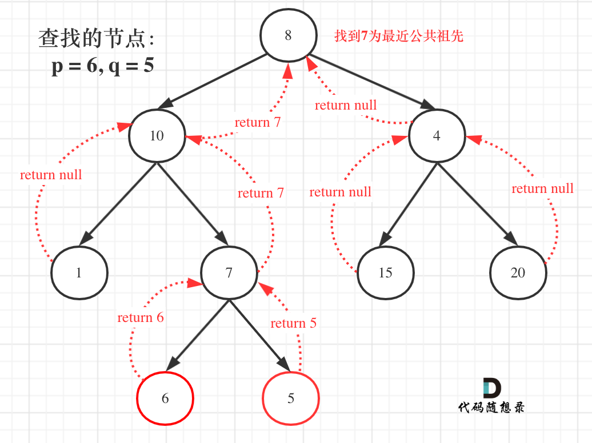

## 回溯每个节点都要有返回值



## 思路后序遍历(递归)

```js
/**
 * Definition for a binary tree node.
 * function TreeNode(val) {
 *     this.val = val;
 *     this.left = this.right = null;
 * }
 */
/**
 * @param {TreeNode} root
 * @param {TreeNode} p
 * @param {TreeNode} q
 * @return {TreeNode}
 */
var lowestCommonAncestor = function (root, p, q) {
  if (root == null || root == q || root == p) return root;
  //左
  let left = lowestCommonAncestor(root.left, q, p);
  //右
  let right = lowestCommonAncestor(root.right, p, q);
  //中
  if (left && right) return root;
  if (left && !right) return left;
  if (!left && right) return right;
  return null;
};
```
