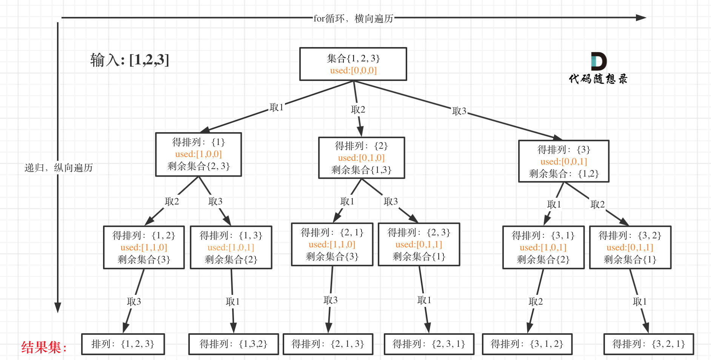

## 46.全排列

给定一个没有重复数字的排序，返回其所有可能的全排列



使用 used 数组记录每个数据的使用情况，1 已使用，0 没有使用

## 回溯三部曲

- 递归函数参数

  **排列是有序的[1,2]和[2,1]**

```js
let result=[],path=[]
function backtracing(used)
```

- 终止条件 path.length==nums.length

- 单层搜索的逻辑
  **for 循环不用 startIndex**
  **而 used 数组，其实就是记录此时 path 里面有哪些元素使用，一个排列里一个元素只能使用一次**

```js
function(let i=0;i<nums.lenght;i++){
  if(used[i]==true) continue;//path里已经收集的元素，直接跳过
  used[i]=true
  path.push(nums[i])
  backtracing(used)
  path.pop()
  used[i]=false
}

```

## 代码

```js
/**
 * @param {number[]} nums
 * @return {number[][]}
 */
var permute = function (nums) {
  let path = [],
    res = [];
  let used = new Array(nums.length).fill(false);
  function backtracing(used) {
    if (path.length == nums.length) {
      res.push([...path]);
      return;
    }
    for (let i = 0; i < nums.length; i++) {
      if (used[i] == true) continue;
      path.push(nums[i]);
      used[i] = true;
      backtracing(used);
      path.pop();
      used[i] = false;
    }
  }
  backtracing(used);
  return res;
};
```
