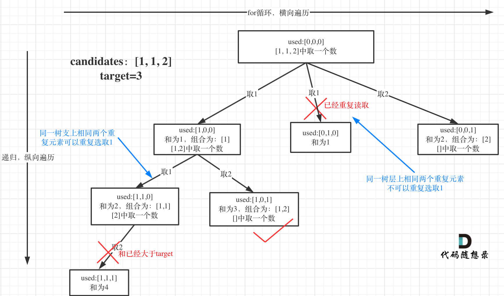

## 40.组合总和 III

给定一个数组 candidates 和一个目标数 target ，找出 candidates 中所有可以使数字和为 target 的组合。
candidates 中的每个数字在每个组合中只能使用一次。

**树层去重**
**树层去重，需要对数组排序**


## 思路

1. 递归函数参数
   多一个数组，used 去重

2. 递归终止条件
   同上

3. 单层逻辑
   最大的不同就是要去重


可以看出 candidates[i]===candidates[i-1]相同的情况下

- used[i-1]==true ,说明同一树枝 candidates[i-1]使用过
- used[i-1]==false,说明同一树层 candidates[i-1]使用过

```js
/**
 * @param {number[]} candidates
 * @param {number} target
 * @return {number[][]}
 */
var combinationSum2 = function (candidates, target) {
  let res = [],
    path = [];
  candidates.sort();
  function backtracking(candidates, target, startIndex) {
    if (target < 0) return;
    if (target == 0) {
      res.push([...path]);
      return;
    }
    for (let i = startIndex; i < candidates.length; i++) {
      if (i > startIndex && candidates[i] == candidates[i - 1]) {
        continue;
      }

      path.push(candidates[i]);
      backtracking(candidates, target - candidates[i], i + 1);
      path.pop();
    }
  }
  backtracking(candidates, target, 0);
  return res;
};
```
