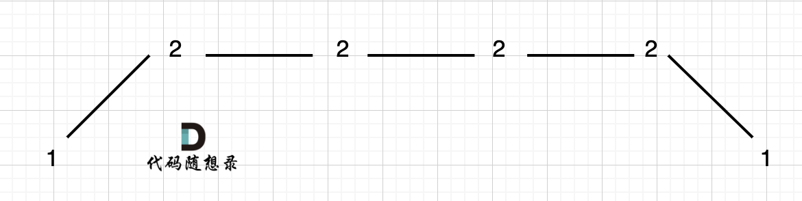
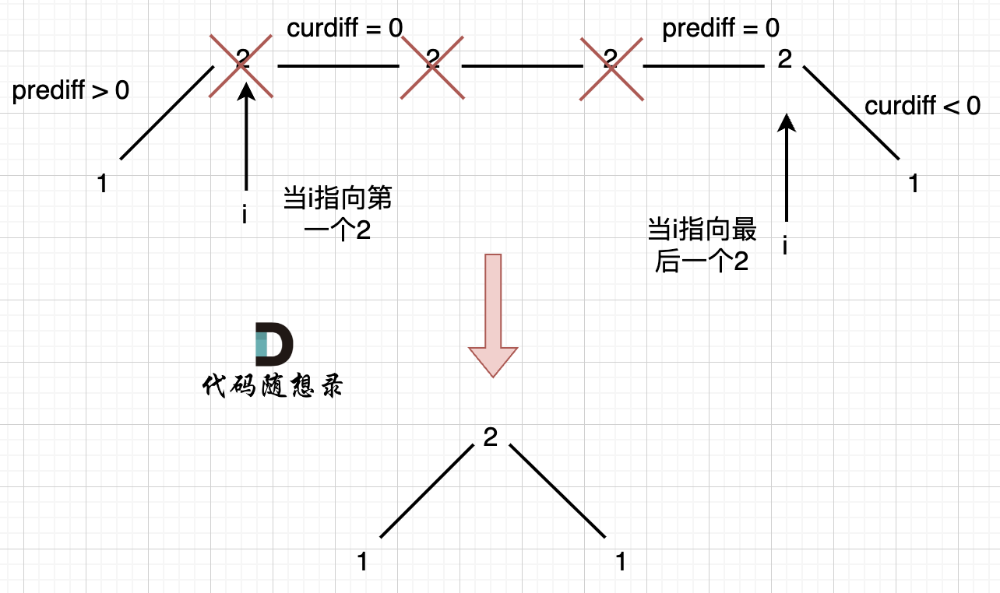

## 摆动序列

如果连续数字之间的差严格地在正数和负数之间交替，则数字序列称为摆动序列。第一个差（如果存在的话）可能是正数或负数。少于两个元素的序列也是摆动序列。

例如， [1,7,4,9,2,5] 是一个摆动序列，因为差值 (6,-3,5,-7,3) 是正负交替出现的。相反, [1,4,7,2,5] 和 [1,7,4,5,5] 不是摆动序列，第一个序列是因为它的前两个差值都是正数，第二个序列是因为它的最后一个差值为零。

给定一个整数序列，返回作为摆动序列的最长子序列的长度。 通过从原始序列中删除一些（也可以不删除）元素来获得子序列，剩下的元素保持其原始顺序。

示例 1:

输入: [1,7,4,9,2,5]
输出: 6
解释: 整个序列均为摆动序列。
示例 2:

输入: [1,17,5,10,13,15,10,5,16,8]
输出: 7
解释: 这个序列包含几个长度为 7 摆动序列，其中一个可为[1,17,10,13,10,16,8]。
示例 3:

输入: [1,2,3,4,5,6,7,8,9]
输出: 2

## 思路 1(贪心算法)找不出反例

局部最优：删除单调坡度上的节点（不包括单调坡度两端的节点），那么这个坡度就可以有两个局部峰值。

整体最优：整个序列有最多的局部峰值，从而达到最长摆动序列。

局部最优推出全局最优，并举不出反例，那么试试贪心！

（为方便表述，以下说的峰值都是指局部峰值）

实际操作上，其实连删除的操作都不用做，因为题目要求的是最长摆动子序列的长度，所以只需要统计数组的峰值数量就可以了（相当于是删除单一坡度上的节点，然后统计长度）

这就是贪心所贪的地方，让峰值尽可能的保持峰值，然后删除单一坡度上的节点

在计算是否有峰值的时候，大家知道遍历的下标 i ，计算 prediff（nums[i] - nums[i-1]） 和 curdiff（nums[i+1] - nums[i]），如果 prediff < 0 && curdiff > 0 或者 prediff > 0 && curdiff < 0 此时就有波动就需要统计。

这是我们思考本题的一个大题思路，但本题要考虑三种情况：

情况一：上下坡中有平坡
情况二：数组首尾两端
情况三：单调坡中有平坡

### 情况一:上下坡中有平坡

例如[1,2,2,2,1]这样的数组:

删除左边的 3 个 2

在图中，当 i 指向第一个 2 的时候，prediff > 0 && curdiff = 0 ，当 i 指向最后一个 2 的时候 prediff = 0 && curdiff < 0。

如果我们采用，删左面三个 2 的规则，那么 当 prediff = 0 && curdiff < 0 也要记录一个峰值，因为他是把之前相同的元素都删掉留下的峰值。

所以我们记录峰值的条件应该是： (preDiff <= 0 && curDiff > 0) || (preDiff >= 0 && curDiff < 0)，为什么这里允许 prediff == 0 ，就是为了 上面我说的这种情况。

### 数组首尾两端

如果数组长度只有 2，初始化 prediff=0

所以本题统计峰值的时候，数组最左面和最右面如果统计呢？

题目中说了，如果只有两个不同的元素，那摆动序列也是 2。

例如序列[2,5]，如果靠统计差值来计算峰值个数就需要考虑数组最左面和最右面的特殊情况。

因为我们在计算 prediff（nums[i] - nums[i-1]） 和 curdiff（nums[i+1] - nums[i]）的时候，至少需要三个数字才能计算，而数组只有两个数字。

这里我们可以写死，就是 如果只有两个元素，且元素不同，那么结果为 2。

不写死的话，如果和我们的判断规则结合在一起呢？

可以假设，数组最前面还有一个数字，那这个数字应该是什么呢？

之前我们在 讨论 情况一：相同数字连续 的时候， prediff = 0 ，curdiff < 0 或者 >0 也记为波谷。

那么为了规则统一，针对序列[2,5]，可以假设为[2,2,5]，这样它就有坡度了即 preDiff = 0，如图

### 情况三单调坡度有缓坡

图中，我们可以看出，版本一的代码在三个地方记录峰值，但其实结果因为是 2，因为 单调中的平坡 不能算峰值（即摆动）。

之所以版本一会出问题，是因为我们实时更新了 prediff。

那么我们应该什么时候更新 prediff 呢？

我们只需要在 这个坡度 摆动变化的时候，更新 prediff 就行，这样 prediff 在 单调区间有平坡的时候 就不会发生变化，造成我们的误判。

所以本题的最终代码为：
