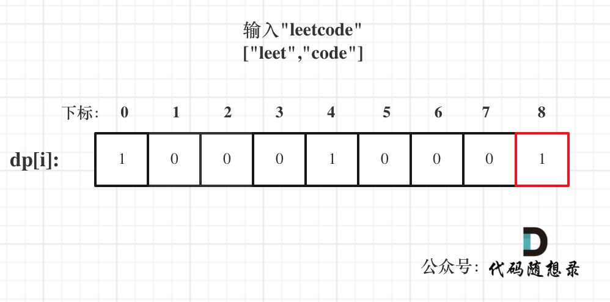

## 139.单词拆分

给定一个非空字符串 s 和一个包含非空单词的列表 wordDict，
判定 s 是否可以被空格拆分为一个或多个在字典中出现的单词。

输入: s = "applepenapple", wordDict = ["apple", "pen"]
输出: true
解释: 返回 true 因为 "applepenapple" 可以被拆分成 "apple pen apple"。
注意你可以重复使用字典中的单词。

## 背包问题

单词就是物品，字符串 s 就是背包，单词能否组成字符串 s，就是问物品能不能把背包装满

1.  确定 dp 数组以及下标的含义
    **dp[i]：字符串长度为 i 的话，dp[i]为 true，表示可以拆分一个或多个在字典中出现的单词**

2.  确定递推公式
    确定 dp[j]是 true，且[j,i]这个区间的子串出现在字典里，那么 dp[i]一定是 true
    (j<i)，所以递推公式是 if(j,i)这个区间的子串出现在字典里&&dp[j]是 true 那么 dp[i]=true

3.  dp 数组如何初始化
    从递推公式可以看出,dp[i]的状态依靠 dp[j]是否为 true，那么 dp[0]就是递推的根基，
    dp[0]一定要 true，否则递推下去后面都是 false。那么 dp[0]初始为 true 完全就是为了推导公式。
    下标非 0 的 dp[i]初始化为 false，只要没有被覆盖说明都是不可拆分为一个或多个在字典中出现的单词

4.  确定遍历顺序
    这个是完全背包里面是正序，是一个排列外层遍历背包重量
    "apple" + "apple" + "pen" 或者 "pen" + "apple" + "apple" 是不可以的，那么我们就是强调物品之间顺序。
    所以说，本题一定是 先遍历 背包，再遍历物品。

5.  举例推导 dp[i]
    以输入: s = "leetcode", wordDict = ["leet", "code"]为例，dp 状态如图：



```js
/**
 * @param {string} s
 * @param {string[]} wordDict
 * @return {boolean}
 */
var wordBreak = function (s, wordDict) {
  //s就是背包的长度,wordDict就是物品

  //1.dp[j],j是字符串遍历的长度，dp[j]是否可以用wordDict构成
  //2.递归数组 if(wordDitc.include(word)&&dp[j])
  //3.遍历顺序，完全排列，外层遍历正序遍历背包，内存正序遍历word
  //4.初始化全为false，dp[0]=true,为了可以赋值为true
  //5.推导
  let dp = new Array(s.length + 1).fill(false);
  dp[0] = true;
  for (let i = 0; i <= s.length; i++) {
    for (let j = 0; j < wordDict.length; j++) {
      if (i >= wordDict[j].length) {
        if (
          dp[i - wordDict[j].length] &&
          wordDict.includes(s.slice(i - wordDict[j].length, i))
        ) {
          dp[i] = true;
        }
      }
    }
  }
  return dp[s.length];
};
```
