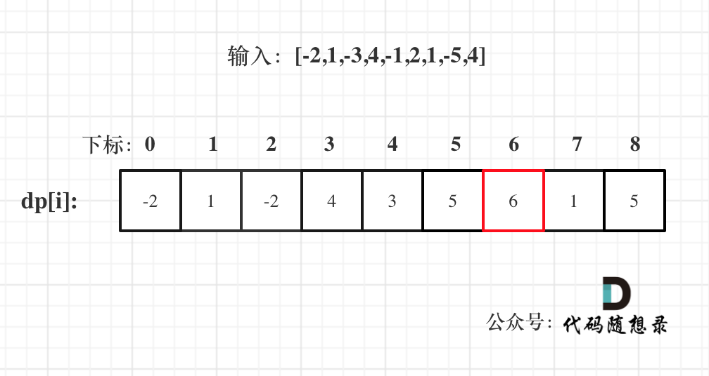

## 53.最大子序和

给定一个数组 nums,找到一个具有最大和的连续子数组(子数组最少包含一个元素)，返回最大和。

示例: 输入: [-2,1,-3,4,-1,2,1,-5,4] 输出: 6 解释: 连续子数组 [4,-1,2,1] 的和最大，为 6。

## 思路

动规五部曲

1. 确定 dp 数组(dp table)以及下标的含义
   **dp[i]：包括下标 i(以 nums[i]为结尾)的最大连续子序列和为 dp[i]**

2. 确定递推公式
   dp[i]只有两个方向可以推出来

- dp[i-1]+nums[i],即:nums[i]加入当前连续子序列和为 dp[i]
- nums[i]即：从头开始计算当前连续子序列和
  取最大的，dp[i]=Math.max(dp[i-1]+nums[i],nums[i])

3. dp 数组如何初始化
   从递推公式可以看出 dp[i]是依赖于 dp[i-1],dp[0]是递推公式的基础，dp[0]=nums[0]

4. 确定遍历顺序
   从前往后

5. 

```js
function maxSubArray(nums) {
  if (nums.length == 0) return 0;
  let dp = new Array(nums.length).fill(0);
  dp[0] = nums[0];
  let res = nums[0];
  for (let i = 1; i < nums.length; i++) {
    //正是因为连续
    dp[i] = Math.max(dp[i - 1] + nums[i], nums[i]);
    res = Math.max(res, dp[i]);
  }
  return res;
}
```
