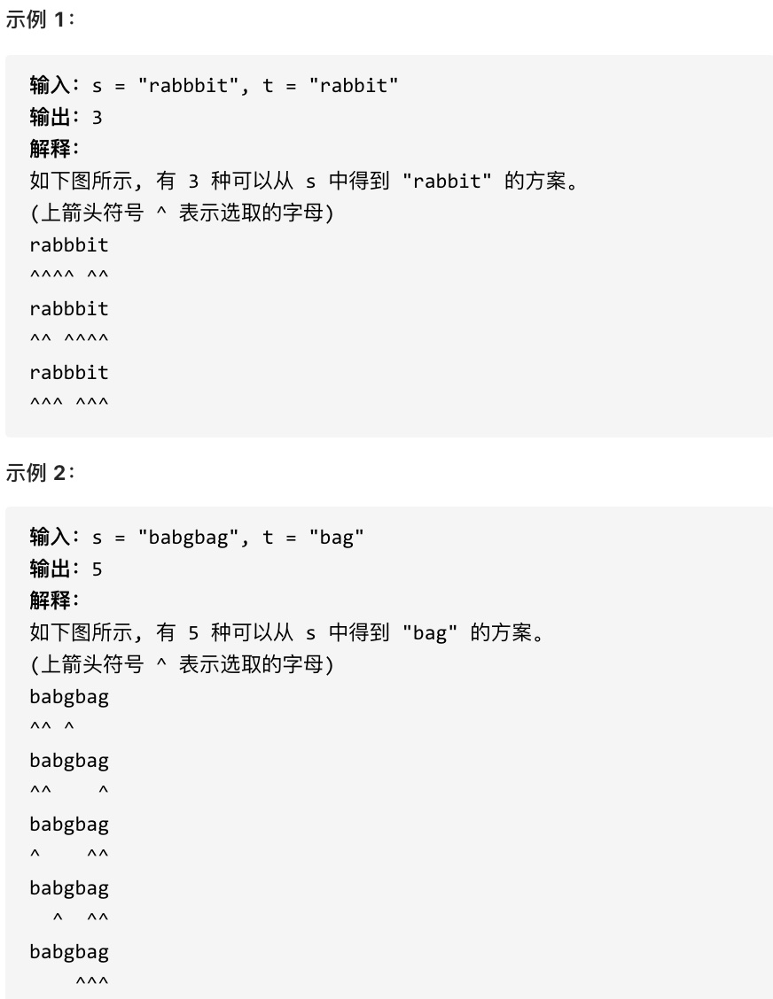

## 115.不同的子序列

给定一个字符串 s 和一个字符串 t，计算在 s 的子序列中 t 出现的个数



## 思路

1. 确定 dp 数组(dp table) 以及下标的含义
   dp[i][j]:以 i-1 为结尾的 s 子序列中出现 j-1 为结尾 t 的个数 dp[i][j]

2. 确定递推公式
   这一类问题,基本要分析两种情况

- s[i-1]与 t[j-1]相等
- s[i-1]与 t[j-1]不相等

  1. 当 s[i-1]与 t[j-1]相等，dp[i][j]有两部分组成
     一部分是用 s[i-1]来匹配，那么个数 dp[i-1][j-1].
     一部分是不需要 s[i-1]来匹配。是之前就匹配好了个数 dp[i-1][j]
     dp[i][j]=dp[i-1][j-1]+dp[i-1][j]

  2. 如果不相等 s[i-1]与 t[j-1]
     dp[i][j]=dp[i-1][j]

## 代码

```js
  function numDistinc(s.t){
    let dp=new Array(s.lenght).map(()=>new Array(t.length+1))
    for(let i=0;i<s.length;i++) dp[i][0]=1
    for(let j=1;j<t.length;j++) dp[0][j]=0
    for(let i=1;i<=s.length;i++){
      for(let j=1;j<=t.lenght;j++){
        if(s[i-1]==t[j-1]){
          dp[i][j]=dp[i-1][j-1]+dp[i-1][j]
        }else{
          dp[i][j]=dp[i-1][j]
        }
      }
    }
    return dp[s.length][t.length]
  }
```
