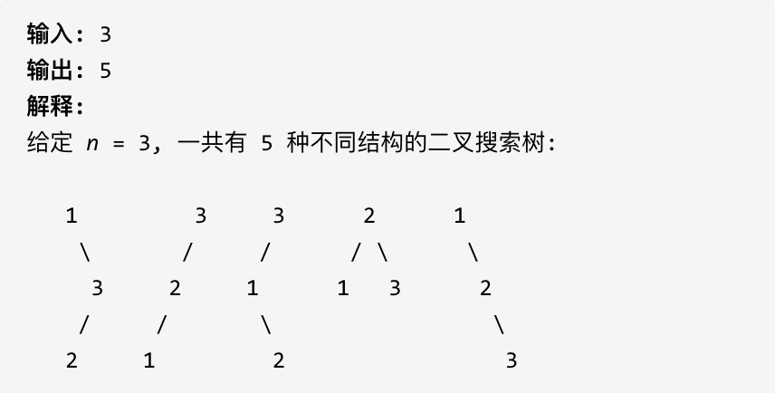

## 96.不同的二叉搜索树

给定一个整数 n，求以 1 ... n 为节点组成的二叉搜索树有多少种？


## 思路


dp[3]，就是 元素 1 为头结点搜索树的数量 + 元素 2 为头结点搜索树的数量 + 元素 3 为头结点搜索树的数量

元素 1 为头结点搜索树的数量 = 右子树有 2 个元素的搜索树数量 \* 左子树有 0 个元素的搜索树数量

元素 2 为头结点搜索树的数量 = 右子树有 1 个元素的搜索树数量 \* 左子树有 1 个元素的搜索树数量

元素 3 为头结点搜索树的数量 = 右子树有 0 个元素的搜索树数量 \* 左子树有 2 个元素的搜索树数量

有 2 个元素的搜索树数量就是 dp[2]。

有 1 个元素的搜索树数量就是 dp[1]。

有 0 个元素的搜索树数量就是 dp[0]。

**所以 dp[3] = dp[2] _ dp[0] + dp[1] _ dp[1] + dp[0] \* dp[2]**

1. dp[i]:i 能形成的二叉搜索树

2. 确定递推公式

dp[i]+=dp[以 j 为头节点左子树节点数量]\*dp[以 j 为头节点右子树节点数量]

j 相当于头结点的元素,从 1 遍历到 i 为止

所以递推公式 dp[i]+=dp[j-1]\*dp[i-j]，j-1 是 j 为头节点左子树节点数量,i-j

3. dp 数组如何初始化

初始化 dp[0]=1

4. 确定遍历顺序

首先一定是遍历节点数，从递归公式：dp[i] += dp[j - 1] \* dp[i - j]可以看出，节点数为 i 的状态是依靠 i 之前节点数的状态。

```js
for(let i=1;i<=n;i++){
  for(let j=1；j<=i;j++){
    dp[i]+=dp[j-1]*dp[i-j]
  }
}
```

5. 确定遍历顺序

## 代码

```js
function numTrees(n) {
  let dp = new Array(n + 1).fill(0);
  dp[0] = 1;
  for (let i = 1; i <= n; i++) {
    for (let j = 1; j <= i; j++) {
      dp[i] += dp[j - 1] * dp[i - j];
    }
  }
  return dp[n];
}
```
