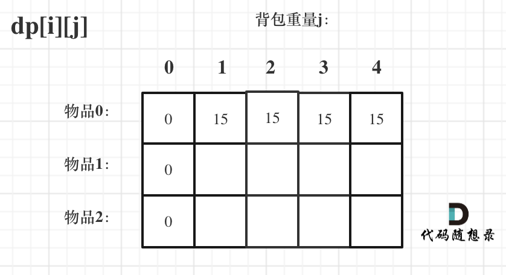

## 01 背包

有 n 件物品和一个最多能背重量为 w 的背包。第 i 件物品的重量 weight[i],
得到的价值是 value[i].每件物品只能用一次，
求解将哪些物品装入背包的物品价值总和最大。


## 二维 dp 数组 01 背包

1. 确定 dp 数组以及下标的含义

对于背包问题，有一种写法，是使用二维数组，即 dp[i][j]**表示从下标为[0-i]的物品里任意取，放进容易为 j 的背包，价值总和最大是多少?**


**要时刻记着这个 dp 数组的含义，下面的一些步骤都围绕这 dp 数组的含义进行的，如果哪里看懵了，就来回顾一下 i 代表什么，j 又代表什么。**

2. 确定递推公式

- 不放物品:由 dp[i-1][j]推出,即背包容量为 j，里面不放物品 i 的最大价值，此时 dp[i][j]就是 dp[i-1][j]
  (其实就是当物品的重量大于背包 j 的重量时，物品 i 无法放进背包中，所以背包内的价值依然和前面相同)

- 放物品:由 dp[i-1]j-weight[i]]推出，dp[i-1]j-weight[i]]为背包容易 j-weight[i]的时候不放物品 i 的最大价值，那么 dp[i-1]j-weight[i]]+value[i](物品i的价值)，就是背包物品 i 得到最大的价值

**这个 value[i],表示要添加第 i 个物品，能加入 dp[i-1]j-weight[i]]+value[i]，说明此时 j 能放入 i 和 i-1 之前的重量**
j-weight[i]就是说明要纳入 i，而且能有空间放 weight[i]

dp[i][j]=Math.max(dp[i-1][j],dp[i-1]j-weight[i]]+value[i])

3. dp 数组如何初始化

**关于初始化，一定要和 dp 数组定义吻合,否则递推公式就会越来越乱**

- j 重量为 0，所有 dp[i][0],初始化为 0;
  

- 状态转移方程 dp[i][j] = max(dp[i - 1][j], dp[i - 1]j - weight[i]] + value[i]);**可以看出 i 是由 i-1 推导出来，那么 i 为 0 的时候就一定要初始化。**
  dp[0][j]即:i 为 0，存放编号 0 的物品的时候，各个容量的背包能存放的最大价值

dp[0][j]，即：i 为 0，存放编号 0 的物品的时候，各个容量的背包所能存放的最大价值。

那么很明显当 j < weight[0]的时候，dp[0][j] 应该是 0，因为背包容量比编号 0 的物品重量还小。

当 j >= weight[0]时，dp[0][j] 应该是 value[0]，因为背包容量放足够放编号 0 物品。

```js
for (let i = 0; j < weight[0]; j++) {
  dp[0][j] = 0;
}
//正序遍历
for (let j = weight[0]; j <= bagweight; j++) {
  dp[0][j] = value[0];
}
```



剩余的全部初始化为 0


4. 遍历顺序

先遍历物品还是先遍历背包重量?
都可以

j<=bagweight 是背包能承受最大的重量，每次能承受的重量+1，遍历的终点就是背包最大能
承受的重量

每次遍历 j，都是看看能不能放下 i；i=0 这行已经被初始化了
如果没有到 i，
能放进去的大小不够放入 weight[i]就一直 dp[i][j]等于没有放入它的时候
能放入看看是，没有放入 i 的 i-1 大，还是丢弃 i-1，放入 i 的价值大，进行比较

## 代码

```js
function testWeightBagProblem(weight, value, size) {
  // 定义 dp 数组
  const len = weight.length,
    dp = Array(len)
      .fill()
      .map(() => Array(size + 1).fill(0));

  // 初始化
  for (let j = weight[0]; j <= size; j++) {
    dp[0][j] = value[0];
  }

  // weight 数组的长度len 就是物品个数
  for (let i = 1; i < len; i++) {
    // 遍历物品
    for (let j = 0; j <= size; j++) {
      // 遍历背包容量
      if (j < weight[i]) dp[i][j] = dp[i - 1][j];
      else
        dp[i][j] = Math.max(dp[i - 1][j], dp[i - 1][j - weight[i]] + value[i]);
    }
  }

  console.table(dp);

  return dp[len - 1][size];
}

function test() {
  console.log(testWeightBagProblem([1, 3, 4], [15, 20, 30], 5));
}

test();
```
