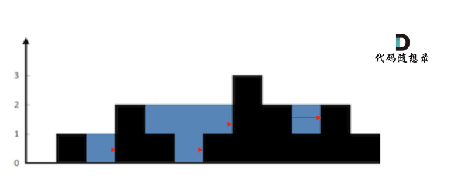

## 接雨水


输入:height=[0,1,0,2,1,0,1,3,2,1,2,1]
输出:6

## 思路

1. 暴力解法

   按照行来计算
   

按照列来计算


计算方式


列 4 左侧最高的柱子为列 3，高度为 2(lHeight)

列 4 右侧最高是列 7，高度为 3(rHeight)
那么列 4 的雨水高度为 列 3 和列 7 的高度最小值减列 4 高度，即： min(lHeight, rHeight) - height。

列 4 的雨水高度求出来了，宽度为 1，相乘就是列 4 的雨水体积了。

**第一根柱子和最后一根柱子不需要计算**

```js
function trap(height) {
  let sum = 0;
  for (let i = 0; i < height.length; i++) {
    if (i == 0 || i == height.length - 1) continue;
    let lheight = height[i];
    let rHeight = height[i];
    for (let r = i + 1; r < height.length; j++) {
      if (height[r] > rHeight) rHeight = height[r];
    }
    for (let l = i - 1; l >= 0; l--) {
      if (height[l] > lheight) lheight = height[i];
    }
    let h = Math.min(lheight, rHeight) - height[i];
    if (h > 0) sum += h;
  }
  return sum;
}
```

2.  双指针法

即从左向右遍历：maxLeft[i] = max(height[i], maxLeft[i - 1]);

从右向左遍历：maxRight[i] = max(height[i], maxRight[i + 1]);

```js
function trap(height) {
  if (height.length <= 2) return 0;
  let maxLeft = new Array(height.length).fill(0);
  let maxRight = new Array(height.length).fill(0);
  maxLeft[0] = height[0];
  for (let i = 1; i < height.length; i++) {
    maxLeft[i] = Math.max(maxLeft[i - 1], height[i]);
  }
  maxRight[height.length - 1] = height[height.length - 1];
  for (let j = height.length - 2; j >= 0; j--) {
    maxRight = Math.max(height[j], maxRight[i + 1]);
  }
  let sum = 0;
  for (let i = 0; i < height.length; i++) {
    let h = Math.min(maxLeft[i], maxRight[i]) - height[i];
    if (h > 0) {
      sum += h;
    }
  }
  return h;
}
```

3. 单调栈


因为一旦发现添加的柱子高度大于栈头元素了，此时就出现凹槽了，栈头元素就是凹槽底部的柱子，栈头第二个元素就是凹槽左边的柱子，而添加的元素就是凹槽右边的柱子。


**遇到相同高度的柱子**

遇到相同的元素，更新栈内下标，就是将栈里元素（旧下标）弹出，将新元素（新下标）加入栈中。

例如 5 5 1 3 这种情况。如果添加第二个 5 的时候就应该将第一个 5 的下标弹出，把第二个 5 添加到栈中。


**栈里保存什么数值**柱子下标

## 单调栈处理逻辑

- 情况一:当前遍历的元素(柱子)高度小于栈顶元素的高度压栈
- 情况二:当前元素=栈顶元素替换一下
- 情况三:当前元素大于栈顶元素

取栈顶元素，将栈顶元素弹出，这个就是凹槽的底部，也就是中间位置，下标记为 mid，对应的高度为 height[mid]（就是图中的高度 1）。

此时的栈顶元素 st.top()，就是凹槽的左边位置，下标为 st.top()，对应的高度为 height[st.top()]（就是图中的高度 2）。

当前遍历的元素 i，就是凹槽右边的位置，下标为 i，对应的高度为 height[i]（就是图中的高度 3）。

此时大家应该可以发现其实就是栈顶和栈顶的下一个元素以及要入栈的元素，三个元素来接水！

那么雨水高度是 min(凹槽左边高度, 凹槽右边高度) - 凹槽底部高度，代码为：int h = min(height[st.top()], height[i]) - height[mid]

```c++
class Solution {
public:
    int trap(vector<int>& height) {
        if (height.size() <= 2) return 0; // 可以不加
        stack<int> st; // 存着下标，计算的时候用下标对应的柱子高度
        st.push(0);
        int sum = 0;
        for (int i = 1; i < height.size(); i++) {
            if (height[i] < height[st.top()]) {     // 情况一
                st.push(i);
            } if (height[i] == height[st.top()]) {  // 情况二
                st.pop(); // 其实这一句可以不加，效果是一样的，但处理相同的情况的思路却变了。
                st.push(i);
            } else {                                // 情况三
                while (!st.empty() && height[i] > height[st.top()]) { // 注意这里是while
                    int mid = st.top();
                    st.pop();
                    if (!st.empty()) {
                        int h = min(height[st.top()], height[i]) - height[mid];
                        int w = i - st.top() - 1; // 注意减一，只求中间宽度
                        sum += h * w;
                    }
                }
                st.push(i);
            }
        }
        return sum;
    }
};
```
