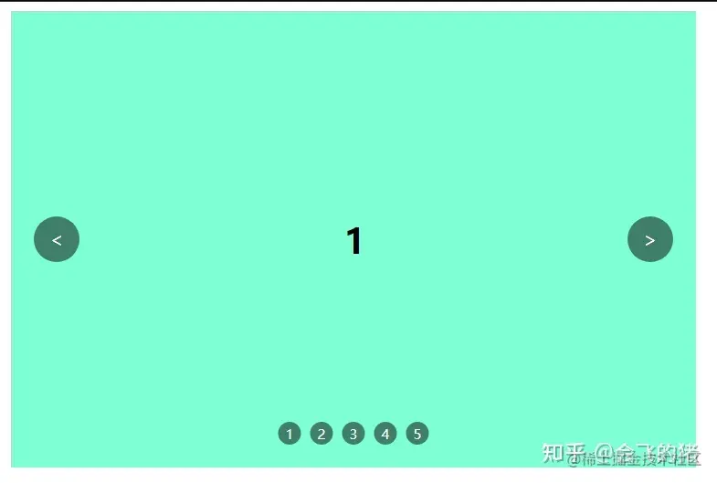

> 如果实现一个轮播组件

# 1.原理介绍

轮播图的原理不复杂，主要总结为两点

- 定位的运用
- 定时器的运用

# 2.实现的效果

整理要实现的效果

- 图片自动轮播
- 轮播有动画的效果
- 点击左右按钮可切换
- 点击数字按钮切换到对应图片
- 数字按钮有选中的效果
- 鼠标移入停止自动播放

# 3.具体实现方式

## 3.1 HTML 布局

主要分为三部分:左右切换按钮、图片列表、底部数字切换按钮

```html
<div class="container">
	<!--图片列表-->
	<ul class="ul-img">
		<li class="li-img">1</li>
		<li class="”li-img“">2</li>
		<li class="”li-img“">3</li>
		<li class="”li-img“">4</li>
		<li class="”li-img“">5</li>
	</ul>
    <!--上一张、下一张按钮-->
    <div class="prev">
        <span>&lt;</span>
    </div>
    <div class="next">
        <span>&gt;</spam>
    </div>
</div>
```

## 3.2 css 样式

```css
.container{
	position:relative,
	width:600px;
	height:400px;
	margin:0 auto;
	background-color:gray;
	overflow:hidden;
}
.ul-img{
	position:absolute;
	display:flex;
	width:4200px;
	height:400px;
	left:0;
	padding:0;
	margin:0;
}

.li-img{
	list-style:none;
	width:600px;
	height:400px;
	display:flex;
	align-items:center;
	justify-content:center;
	background-color:aquamarine;
	font-size:30px;
	font-weight:800;
	border:1px solid #ccc8
}
/*上一张，下一张*/
.prev
.next{
	position:absolute,
	height:400px;
	width:80px;
	display:flex;
	justify-content:center;
	align-items:center;
	top:0;
}
.prev{
	left:0;
}
.next{
	right:0;
}

.prev span
.next span{
	  display:block;
	  color:#fff;
	  width:40px;
	  height:40px;
	  display:flex;
	  justify-content:center;
	  align-items:center;
	  background-color:rgb(0,0,0,0.5)
	  border-radius:50%;
	  cursor:pointer;
}

/*数字切换按钮*/
.num-box{
	position:absolute;
	left:50%;
	bottom: 20px;
	transform:translate(-50%,0)
	z-index:2;
}
.num-ul{
	list-style:none;
	margin:0;
	padding:0;
	display:flex;
}
.num-ul li{
	height:20px;
	width:20px;
	border-radius:50%;
	background-color:rgb(0,0,0,0.5)
	display:flex;
	justify-content:center;
	align-items:center;
	font-size:9px;
	color:#fff;
	margin:0 4px;
	cursor:pointer;
	user-select:none;
}

```


