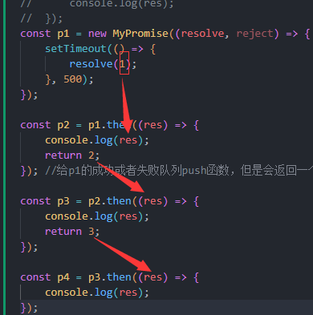

# PromiseA 规范

## 初步理解了

then 收集依赖->异步触发 resolve->resolve 执行依赖

then 那时候只是收集了依赖，并没有立刻执行，而是要等异步队列执行的时候

```js
const p1 = new Promise((resolve, reject) => {
	setTime(() => {
		resolve("result");
	}, 1000);
});

p1.then(
	(res) => console.log(res),
	(err) => console.log(err)
);
```

分析 Promise 的调用过程

- Promise 的构造方法接收一个 executor(),在 new Promise()是就立即执行这个 executor 回调

- executor()内部的异步任务被放入宏/微任务

- then()被执行，收集成功/失败回调，放入成功/失败队列
- executor()的异步任务被执行，触发 resolve/reject，从成功/失败队列中取出回调依次执行

```js
class MyPromise {
	//构造方法接收一个回调
	constructor(executor) {
		this._resolveQueue = []; //then 收集的执行成功的回调
		this._rejectQueue = []; //then  收集的执行失败的回调队列

		//由于resolve/reject是在executor内部被调用，因此需要使用箭头函数固定this指向
		let _resolve = (val) => {
			//从成功队列取出回调依次执行
			while (this._resolveQueue.length) {
				const callback = this._resolveQueue.shift();
				callback(val);
			}
		};

		//实现reject
		let _reject = (val) => {
			while (this._rejectQueue.length) {
				const callback = this._rejectQueue.shift();
				callback(val);
			}
		};
		//new Promise()时立即执行executor，并传入resolve和reject
		executor(_resolve, _reject); //传入的是一个函数，参数是class Promise传入，执行了setTimeOut
	}

	//then方法，将成功回调和一个失败的回调，push进对对应的数组
	then(resolveFn, rejectFn) {
		this._resolveQueue.push(resolveFn);
		this._rejectQueue.push(rejectFn);
	}
}

const p1 = new MyPromise((resolve, reject) => {
	setTimeout(() => {
		resolve("resolve"); //执行到这一步，会跳到_resolve
	}, 1000);
}); //(这里面整个都是executor而且new会执行一次)
p1.then((res) => console.log(res)); //这是放入_resolveQueue

//1.初始化了 p1,
//2. p1.then将function (res)=>console.log(res) 放入了_resolveQueue队列
//3.为什么会执行：executor()，执行了_resolve 为什么会在then后面因为_resolveQueue队列是空的
```

在 then 这里加入函数，然后在 executor 里面执行了

## Promise 状态

> Promise 本质是一个状态机，且状态只能为以下三种:Pengding(等待态)、Fulfilled(执行态)、Rejected(失败)
> 只能从 Pending->Fulfilled,或 Pending->Rejected

> then 方法接收两个可选参数，分别对应状态改变是触发的回调。then 方法返回一个 promise。then 方法可以被同一个 promise 调用多次。

```js
const PENDING = "pending";
const FUlFILLED = "fulfilled";
const REJECTED = "rejected";

class MyPromise {
	//构造方法接收一个回调
	constructor(executor) {
		this._status = PENDING; //Promise状态
		this._resolveQueue = []; //成功队列，resolve时触发
		this._rejectQueue = []; //失败队列，reject时触发

		//调用成功，需要箭头函数重新绑定this
		let _resolve = (val) => {
			if (this._status !== PENDING) return; //只能从PEDING-RJECTED
			this._status = FUlFILLED;
		};

		while (this._resolveQueue.length) {
			const callback = this._resolveQueue.shift();
			callback(val);
		}

		let _reject = (val) => {
			if (this._status !== PENDING) return;
			this._status = REJECTED;

			while (this._rejectQueue.length) {
				const callback = this._rejectQueue.shift();
				callback(val);
			}
		};
		executor(_resolve, _reject);
	}
	then(resolveFn, rejectFn) {
		this._resolveQueue.push(resolveFn);
		this._rejectQueue.push(rejectFn);
	}
}
```

## 3.then 的链式调用

先看 then 如何链式调用

```js
const p1 = new Promise((resolve, reject) => {
	resolve(1);
});

p1.then((res) => {
	console.log(res);
	//then回调中可以return 一个Promise
	return new Promise((resolve, reject) => {
		setTimeout(() => {
			resolve(2);
		}, 1000);
	});
})
	.then((res) => {
		console.log(res);
		//then回调也可以return 一个值
		return 3;
	})
	.then((res) => {
		console.log(res);
	});
```

思考如何实现这种链式调用

1. **显然.then()需要返回一个 Promise，才能找到 then 方法**，所以我们会把 then 方法的返回值包装成 Promise。
2. .then() 的回调需要拿到一个.then()返回值
3. .then() 的回调需要顺序执行。我们要等待当前 Promise 状态变更后，再执行下一个 then 收集的回调

每一次 then,都 return new myPromise，创建很多 promise

然后，才将 then，里面函数 filledFn or rejectedFn push 到相应的 resolve 和 reject 队列中

再者，执行 fn

```js
let x = resolveFn(value);
//分类讨论返回值，如果是Promise，那么等待Promise状态变更，否则直接resolve
//这里是resolve之后，就能被下一个.then()的回调获取到返回值，从而实现链式调用
x instanceof MyPromise ? x.then(resolve, reject) : resolve(x);
```

这里的 this，和上面返回 return new Promise 不一样，this 是上一个，return 是下一个

```js
then(resolveFn, rejectFn) {
		//return 一个新的promise
		return new MyPromise((resolve, reject) => {
			const fulfilledFn = (value) => {
			};
			//把后续then收集到依赖都push进当前Promise的成功回调(_resolveQueue),这是为了保证调用
			this._resolveQueue.push(fulfilledFn); //这里的this，和上面返回return new Promise不一样，this是上一个，return是下一个
			//reject 同理
			const rejectedFn = (error) => {
			};
			this._rejectQueue.push(rejectedFn);
		});
```

- filledFn,rejectedFn 才是 executor 里面\_resolve,\_reject，所以\_resolveQueue,\_rejectQueue 放置是这些
- resolveFn 才是 console.log()这函数
- 当执行 executor，\_resolve,弹出 filledFn，里面执行了 resolveFn，打印了 val

```js
	const fulfilledFn = (value) => {
				try {
					//执行第一个(当前的)Promise的成功回调，并获取返回值
					let x = resolveFn(value); //resolveFn才是console.log
					//分类讨论返回值，如果是Promise，那么等待Promise状态变更，否则直接resolve
					//这里是resolve之后，就能被下一个.then()的回调获取到返回值，从而实现链式调用
					x instanceof MyPromise ? x.then(resolve, reject) : resolve(x);
				} catch (error) {
					reject(error);
				}

```

- resolveFn 执行后，return 2 了，2 需要包装

```js
const p2 = p1.then((res) => {
	console.log(res);
	return 2;
});

//又到这一步
let x = resolveFn(value); //resolveFn才是console.log
//分类讨论返回值，如果是Promise，那么等待Promise状态变更，否则直接resolve
//这里是resolve之后，就能被下一个.then()的回调获取到返回值，从而实现链式调用
x instanceof MyPromise ? x.then(resolve, reject) : resolve(x);
```



**本质步骤**

1. new,then 都是创造了 promise 实例
2. then 还将包装好的 filledFn，rejectedFn，压入上一个 promise 实例
3. executor 开始执行\_resolve,\_reject,弹出 filledFn,rejectedFn 执行
4. filledFn，rejectedFn，里面执行了 resolveFn,rejectedFn,console.log(val),还返回下个 promise 的参数 x，执行 resolve(x)or x.then(resolve,reject)执行下一个 promise 实例

```js
const PENDING = "pending";
const FUlFILLED = "fulfilled";
const REJECTED = "rejected";
class MyPromise {
	//构造方法接收一个回调
	constructor(executor) {
		this._status = PENDING; //Promise状态
		this._resolveQueue = []; //成功队列，resolve时触发
		this._rejectQueue = []; //失败队列，reject时触发

		//调用成功，需要箭头函数重新绑定this
		let _resolve = (val) => {
			if (this._status !== PENDING) return; //只能从PEDING-RJECTED
			this._status = FUlFILLED;
			while (this._resolveQueue.length) {
				const callback = this._resolveQueue.shift();
				callback(val);
			}
		};

		let _reject = (val) => {
			if (this._status !== PENDING) return;
			this._status = REJECTED;

			while (this._rejectQueue.length) {
				const callback = this._rejectQueue.shift();
				callback(val);
			}
		};
		//new Promise()时立即执行executor，并传入resolve和reject
		executor(_resolve, _reject); //传入的是一个函数，参数是class Promise传入，执行了setTimeOut
	}

	//then方法，将成功回调和一个失败的回调，push进对对应的数组
	then(resolveFn, rejectFn) {
		//return 一个新的promise
		return new MyPromise((resolve, reject) => {
			const fulfilledFn = (value) => {
				try {
					//执行第一个(当前的)Promise的成功回调，并获取返回值
					let x = resolveFn(value); //resolveFn才是console.log,return 2,3这种
					//分类讨论返回值，如果是Promise，那么等待Promise状态变更，否则直接resolve
					//这里是resolve之后，就能被下一个.then()的回调获取到返回值，从而实现链式调用
					x instanceof MyPromise ? x.then(resolve, reject) : resolve(x);
				} catch (error) {
					reject(error);
				}
			};
			//把后续then收集到依赖都push进当前Promise的成功回调(_resolveQueue),这是为了保证调用
			this._resolveQueue.push(fulfilledFn); //这里的this，和上面返回return new Promise不一样，this是上一个，return是下一个
			//reject 同理
			const rejectedFn = (error) => {
				try {
					let x = rejectFn(error);
					x instanceof MyPromise ? x.then(resolve, reject) : resolve(x);
				} catch (error) {
					reject(error);
				}
			};
			this._rejectQueue.push(rejectedFn);
		});
	}
}
```

## 4.值穿透&状态已变更

细节调整

1. 值传统:根据规范，如果 then() 接收的参数不是 function，那么我们应该忽略它。如果没有忽略，当 then()回调不为 function 时将会抛出异常，导致链式调用中断

2. Promise.resolve().then 已经改变状态了只需执行 then 回调了

```js
class MyPromise {
	//构造方法接收一个回调
	constructor(executor) {
		this._resolveQueue = []; //then 收集的执行成功的回调
		this._rejectQueue = []; //then  收集的执行失败的回调队列

		//由于resolve/reject是在executor内部被调用，因此需要使用箭头函数固定this指向
		let _resolve = (val) => {
			//从成功队列取出回调依次执行
			while (this._resolveQueue.length) {
				const callback = this._resolveQueue.shift();
				callback(val);
			}
		};

		//实现reject
		let _reject = (val) => {
			while (this._rejectQueue.length) {
				const callback = this._rejectQueue.shift();
				callback(val);
			}
		};
		//new Promise()时立即执行executor，并传入resolve和reject
		executor(_resolve, _reject); //传入的是一个函数，参数是class Promise传入，执行了setTimeOut
	}

	//then方法，将成功回调和一个失败的回调，push进对对应的数组
	then(resolveFn, rejectFn) {
		typeof resolveFn != "function" ? (resolveFn = (value) => value) : null;
		typeof rejectFn != "function"
			? (rejectFn = (reason) => {
					throw new Error(reason instanceof Error ? reason.message : reason);
			  })
			: null;
		//return 一个新的promise
		return new MyPromise((resolve, reject) => {
			const fulfilledFn = (value) => {
				try {
					//执行第一个(当前的)Promise的成功回调，并获取返回值
					let x = resolveFn(value); //resolveFn才是console.log,return 2,3这种
					//分类讨论返回值，如果是Promise，那么等待Promise状态变更，否则直接resolve
					//这里是resolve之后，就能被下一个.then()的回调获取到返回值，从而实现链式调用
					x instanceof MyPromise ? x.then(resolve, reject) : resolve(x);
				} catch (error) {
					reject(error);
				}
			};
			// //把后续then收集到依赖都push进当前Promise的成功回调(_resolveQueue),这是为了保证调用
			// this._resolveQueue.push(fulfilledFn); //这里的this，和上面返回return new Promise不一样，this是上一个，return是下一个
			//reject 同理
			const rejectedFn = (error) => {
				try {
					let x = rejectFn(error);
					x instanceof MyPromise ? x.then(resolve, reject) : resolve(x);
				} catch (error) {
					reject(error);
				}
			};
			// this._rejectQueue.push(rejectedFn);
			switch (this._status) {
				case PENDING:
					this._resolveQueue.push(fulfilledFn);
					this._rejectQueue.push(rejectedFn);
					break;
				case FUlFILLED:
					fulfilledFn(this._value);
					break;
				case REJECTED:
					rejectedFn(this._value);
					break;
			}
		});
	}
}
```

## 5.兼容同步

```js
//Promise/A+规定的三种状态
const PENDING = "pending";
const FULFILLED = "fulfilled";
const REJECTED = "rejected";

class MyPromise {
	// 构造方法接收一个回调
	constructor(executor) {
		this._status = PENDING; // Promise状态
		this._value = undefined; // 储存then回调return的值
		this._resolveQueue = []; // 成功队列, resolve时触发
		this._rejectQueue = []; // 失败队列, reject时触发

		// 由于resolve/reject是在executor内部被调用, 因此需要使用箭头函数固定this指向, 否则找不到this._resolveQueue
		let _resolve = (val) => {
			//把resolve执行回调的操作封装成一个函数,放进setTimeout里,以兼容executor是同步代码的情况
			const run = () => {
				if (this._status !== PENDING) return; // 对应规范中的"状态只能由pending到fulfilled或rejected"
				this._status = FULFILLED; // 变更状态
				this._value = val; // 储存当前value

				// 这里之所以使用一个队列来储存回调,是为了实现规范要求的 "then 方法可以被同一个 promise 调用多次"
				// 如果使用一个变量而非队列来储存回调,那么即使多次p1.then()也只会执行一次回调
				while (this._resolveQueue.length) {
					const callback = this._resolveQueue.shift();
					callback(val);
				}
			};
			setTimeout(run);
		};
		// 实现同resolve
		let _reject = (val) => {
			const run = () => {
				if (this._status !== PENDING) return; // 对应规范中的"状态只能由pending到fulfilled或rejected"
				this._status = REJECTED; // 变更状态
				this._value = val; // 储存当前value
				while (this._rejectQueue.length) {
					const callback = this._rejectQueue.shift();
					callback(val);
				}
			};
			setTimeout(run);
		};
		// new Promise()时立即执行executor,并传入resolve和reject
		executor(_resolve, _reject);
	}

	// then方法,接收一个成功的回调和一个失败的回调
	then(resolveFn, rejectFn) {
		// 根据规范，如果then的参数不是function，则我们需要忽略它, 让链式调用继续往下执行
		typeof resolveFn !== "function" ? (resolveFn = (value) => value) : null;
		typeof rejectFn !== "function"
			? (rejectFn = (reason) => {
					throw new Error(reason instanceof Error ? reason.message : reason);
			  })
			: null;

		// return一个新的promise
		return new MyPromise((resolve, reject) => {
			// 把resolveFn重新包装一下,再push进resolve执行队列,这是为了能够获取回调的返回值进行分类讨论
			const fulfilledFn = (value) => {
				try {
					// 执行第一个(当前的)Promise的成功回调,并获取返回值
					let x = resolveFn(value);
					// 分类讨论返回值,如果是Promise,那么等待Promise状态变更,否则直接resolve
					x instanceof MyPromise ? x.then(resolve, reject) : resolve(x);
				} catch (error) {
					reject(error);
				}
			};

			// reject同理
			const rejectedFn = (error) => {
				try {
					let x = rejectFn(error);
					x instanceof MyPromise ? x.then(resolve, reject) : resolve(x);
				} catch (error) {
					reject(error);
				}
			};

			switch (this._status) {
				// 当状态为pending时,把then回调push进resolve/reject执行队列,等待执行
				case PENDING:
					this._resolveQueue.push(fulfilledFn);
					this._rejectQueue.push(rejectedFn);
					break;
				// 当状态已经变为resolve/reject时,直接执行then回调
				case FULFILLED:
					fulfilledFn(this._value); // this._value是上一个then回调return的值(见完整版代码)
					break;
				case REJECTED:
					rejectedFn(this._value);
					break;
			}
		});
	}
}
```

# 一些方法实现

## Promise.prototype.catch()

> catch()方法返回一个 Promise,并且处理拒绝的情况。
> Promise.prototype.then(undefined, onRejected) 相同。

```js
catch(rejectFn){
	return this.then(undefined,rejectFn)
}
```

## Promise.prototype.finally()

> finally()方法返回一个 Promise。在 promise 结束时，无论结果是 fulfilled 或者是 rejected，都会执行指定的回调函数。在 finally 之后，还可以继续 then。并且会将值原封不动的传递给后面的 then

```js
//finally方法
finally(callback) {
  return this.then(
    value => MyPromise.resolve(callback()).then(() => value),             // MyPromise.resolve执行回调,并在then中return结果传递给后面的Promise
    reason => MyPromise.resolve(callback()).then(() => { throw reason })  // reject同理
  )
}

```

## Promise.resolve()

> Promise.resolve()方法返回一个定值解析后的 Promise 对象。如果该值为 promise，返回这个 promise。如果带有 then，采用最终状态。否则返回的 promise 将以此值完成

```js
static resolve(value) {
		if (value instanceof MyPromise) return value;
		return new MyPromise((resolve) => resolve(value));
	}

```

## Promise.reject()

> Promise.reject()方法返回一个带有拒绝原因的 Promise 对象

```js
static reject(reason){
	return new MyPromise(reason=>reject(reason))
}
```

## Promise.all()

> omise.all(iterable)方法返回一个 Promise 实例，此实例在 iterable 参数内所有的 promise 都“完成（resolved）”或参数中不包含 promise 时回调完成（resolve）；如果参数中 promise 有一个失败（rejected），此实例回调失败（reject），失败原因的是第一个失败 promise 的结果。

```js
static all(promiseArr) {
		let index = 0;
		let res = [];
		return new MyPromise((resolve, reject) => {
			promiseArr.forEach((p, i) => {
				MyPromise.resolve(p).then(
					(val) => {
						index++;
						res[i] = val;
						if (index == promiseArr.length) {
							resolve(res);
						}
					},
					(err) => {
						//一个为rejected就返回这个rejected
						reject(err);
					}
				);
			});
		});
	}
```

## Promise.race

> Promise.race(iterable)方法返回一个 promise，一旦迭代器中的某个 promise 解决或拒绝，返回的 promise 就会解决或拒绝

```js
	static race(promiseArr) {
		return new MyPromise((resolve, reject) => {
			//同时执行Promise,如果有一个Promise的状态发生改变,就变更新MyPromise的状态
			for (let p of promiseArr) {
				MyPromise.resolve(p).then(
					//Promise.resolve(p)用于处理传入值不为Promise的情况
					(value) => {
						resolve(value); //注意这个resolve是上边new MyPromise的
					},
					(err) => {
						reject(err);
					}
				);
			}
		});
	}
```

# 全部

```js
//Promise/A+规定的三种状态
const PENDING = "pending";
const FULFILLED = "fulfilled";
const REJECTED = "rejected";

class MyPromise {
	// 构造方法接收一个回调
	constructor(executor) {
		this._status = PENDING; // Promise状态
		this._value = undefined; // 储存then回调return的值
		this._resolveQueue = []; // 成功队列, resolve时触发
		this._rejectQueue = []; // 失败队列, reject时触发

		// 由于resolve/reject是在executor内部被调用, 因此需要使用箭头函数固定this指向, 否则找不到this._resolveQueue
		let _resolve = (val) => {
			//把resolve执行回调的操作封装成一个函数,放进setTimeout里,以兼容executor是同步代码的情况
			const run = () => {
				if (this._status !== PENDING) return; // 对应规范中的"状态只能由pending到fulfilled或rejected"
				this._status = FULFILLED; // 变更状态
				this._value = val; // 储存当前value

				// 这里之所以使用一个队列来储存回调,是为了实现规范要求的 "then 方法可以被同一个 promise 调用多次"
				// 如果使用一个变量而非队列来储存回调,那么即使多次p1.then()也只会执行一次回调
				while (this._resolveQueue.length) {
					const callback = this._resolveQueue.shift();
					callback(val);
				}
			};
			setTimeout(run);
		};
		// 实现同resolve
		let _reject = (val) => {
			const run = () => {
				if (this._status !== PENDING) return; // 对应规范中的"状态只能由pending到fulfilled或rejected"
				this._status = REJECTED; // 变更状态
				this._value = val; // 储存当前value
				while (this._rejectQueue.length) {
					const callback = this._rejectQueue.shift();
					callback(val);
				}
			};
			setTimeout(run);
		};
		// new Promise()时立即执行executor,并传入resolve和reject
		executor(_resolve, _reject);
	}

	// then方法,接收一个成功的回调和一个失败的回调
	then(resolveFn, rejectFn) {
		// 根据规范，如果then的参数不是function，则我们需要忽略它, 让链式调用继续往下执行
		typeof resolveFn !== "function" ? (resolveFn = (value) => value) : null;
		typeof rejectFn !== "function"
			? (rejectFn = (reason) => {
					throw new Error(reason instanceof Error ? reason.message : reason);
			  })
			: null;

		// return一个新的promise
		return new MyPromise((resolve, reject) => {
			// 把resolveFn重新包装一下,再push进resolve执行队列,这是为了能够获取回调的返回值进行分类讨论
			const fulfilledFn = (value) => {
				try {
					// 执行第一个(当前的)Promise的成功回调,并获取返回值
					let x = resolveFn(value);
					// 分类讨论返回值,如果是Promise,那么等待Promise状态变更,否则直接resolve
					x instanceof MyPromise ? x.then(resolve, reject) : resolve(x);
				} catch (error) {
					reject(error);
				}
			};

			// reject同理
			const rejectedFn = (error) => {
				try {
					let x = rejectFn(error);
					x instanceof MyPromise ? x.then(resolve, reject) : resolve(x);
				} catch (error) {
					reject(error);
				}
			};

			switch (this._status) {
				// 当状态为pending时,把then回调push进resolve/reject执行队列,等待执行
				case PENDING:
					this._resolveQueue.push(fulfilledFn);
					this._rejectQueue.push(rejectedFn);
					break;
				// 当状态已经变为resolve/reject时,直接执行then回调
				case FULFILLED:
					fulfilledFn(this._value); // this._value是上一个then回调return的值(见完整版代码)
					break;
				case REJECTED:
					rejectedFn(this._value);
					break;
			}
		});
	}

	//catch方法其实就是执行一下then的第二个回调
	catch(rejectFn) {
		return this.then(undefined, rejectFn);
	}

	//finally方法
	finally(callback) {
		return this.then(
			(value) => MyPromise.resolve(callback()).then(() => value), //执行回调,并returnvalue传递给后面的then
			(reason) =>
				MyPromise.resolve(callback()).then(() => {
					throw reason;
				}) //reject同理
		);
	}

	//静态的resolve方法
	static resolve(value) {
		if (value instanceof MyPromise) return value; //根据规范, 如果参数是Promise实例, 直接return这个实例
		return new MyPromise((resolve) => resolve(value));
	}

	//静态的reject方法
	static reject(reason) {
		return new MyPromise((resolve, reject) => reject(reason));
	}

	//静态的all方法
	static all(promiseArr) {
		let index = 0;
		let result = [];
		return new MyPromise((resolve, reject) => {
			promiseArr.forEach((p, i) => {
				//Promise.resolve(p)用于处理传入值不为Promise的情况
				MyPromise.resolve(p).then(
					(val) => {
						index++;
						result[i] = val;
						if (index === promiseArr.length) {
							resolve(result);
						}
					},
					(err) => {
						reject(err);
					}
				);
			});
		});
	}

	//静态的race方法
	static race(promiseArr) {
		return new MyPromise((resolve, reject) => {
			//同时执行Promise,如果有一个Promise的状态发生改变,就变更新MyPromise的状态
			for (let p of promiseArr) {
				MyPromise.resolve(p).then(
					//Promise.resolve(p)用于处理传入值不为Promise的情况
					(value) => {
						resolve(value); //注意这个resolve是上边new MyPromise的
					},
					(err) => {
						reject(err);
					}
				);
			}
		});
	}
}
```

# async/await 实现

```js
Promise.resolve(a)
	.then((b) => {
		// do something
	})
	.then((c) => {
		// do something
	});

async () => {
	const a = await Promise.resolve(a);
	const b = await Promise.resolve(b);
	const c = await Promise.resolve(c);
};
```

**async/await 实际上是对 Generator(生成器)的封装**

> ES6 新引入 Generator 函数，可以通过 yeild 关键字，将函数的执行流程挂起，
> 通过 next()方法可以切换到一个状态，为改变执行流程提供了可能

```js
function* myGenerator() {
	yield "1";
	yield "2";
	return "3";
}

const gen = myGenerator(); // 获取迭代器
gen.next(); //{value: "1", done: false}
gen.next(); //{value: "2", done: false}
gen.next(); //{value: "3", done: true}
```

还可以通过 next()传参，让 yeild 具有返回值

```js
function* myGenerator() {
	console.log(yield "1"); //test1
	console.log(yield "2"); //test2
	console.log(yield "3"); //test3
}

// 获取迭代器
const gen = myGenerator();

gen.next();
gen.next("test1");
gen.next("test2");
gen.next("test3");
```
