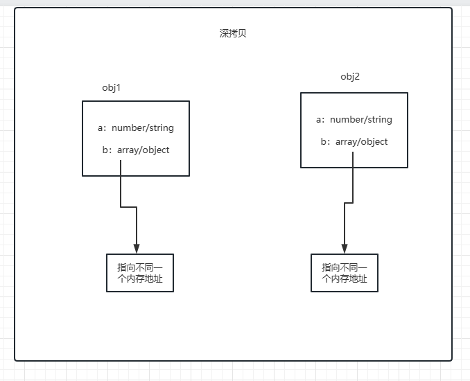

# 一、直接赋值=


# 二、浅拷贝

## 含义

看个例子

```js
//shallowClone 浅拷贝+hasOwnProperty判断是为了不继承属性
const shallowClone = function (target) {
	//判断类型是引用类型会相互影响，基本数据类型不会相互影响
	if (typeof target === "object" && target !== null) {
		const cloneTarget = Array.isArray(target) ? [] : {};
		for (let prop in target) {
			if (target.hasOwnProperty(prop)) cloneTarget[prop] = target[prop];
		}
		return cloneTarget;
	} else {
		return target;
	}
};

let obj1 = {
	name: "1",
	arr: [1, [22, 33], 2],
};

let obj2 = shallowClone(obj1);
let obj3 = obj1;
console.log(obj1); //{ name: '1', arr: [ 1, [ 22, 33 ], 2 ] }
obj2.name = "2";
obj2.arr[1] = [1]; //要是引用属性才行
console.log(obj1); //{ name: '1', arr: [ 1, [ 1 ], 2 ] }
console.log(obj2); //{ name: '2', arr: [ 1, [ 1 ], 2 ] }
console.log(obj3); //{ name: '1', arr: [ 1, [ 1 ], 2 ] }

obj3.name = 3;
console.log(obj1); //{ name: 3, arr: [ 1, [ 1 ], 2 ] }
console.log(obj3); //{ name: 3, arr: [ 1, [ 1 ], 2 ] }
```


## 手撕

只要遍历对象属性，赋值过去就行

```js
const shallowClone(target){
   if(typeof target==='object'&&target!=null){
    let clone=Array.isArray(target)?[]:{}
     for(let pro in target){
        if(obj.hasOwnProperty(pro)){
            clone[pro]=target[pro]
        }
        return pro
    }
   }else{
    return target
   }
}
```

## javascript 里面的应用

- Object.assign
- Array.prototype.slice(),Array.prototype.concat()
- 使用...实现复制

举个例子

```js
let arr = [1, [2], 3, [4, 5]];
let arr2 = arr.slice(0);
let arr3 = arr;

arr[0] = "a";
arr[1] = ["b", "c"];
arr[3][1] = "d";
console.log(arr); //[ 'a', [ 'b', 'c' ], 3, [ 4, d] ]
console.log(arr2); //[ 1, [ 2 ], 3, [ 4, 'd' ] ]
console.log(arr3); //[ 'a', [ 'b', 'c' ], 3, [ 4, d ] ]
```

# 三、深拷贝

深拷贝开辟一个新的栈，两个对象的属性完全相同，但是对应两个不同的地址，修改一个对象的属性，不会改变另一个对象的属性

常见的深拷贝方式有：

- \_.cloneDeep()

- jQuery.extend()

- JSON.stringify()

- 手写循环递归

  ## 含义

  

## 手撕

借由 map 来保存克隆过的属性

```js
function deepClone(obj, hash = new WeakMap()) {
	if (obj == null) return obj;
	if (obj instanceof Date) return obj;
	if (obj instanceof RegExp) return obj;
	if (typeof obj !== "object") return obj;
	//属性是对象，拷贝过了
	if (hash.get(obj)) return obj;
	// 找到的是所属类原型上的constructor,而原型上的 constructor指向的是当前类本身
	let cloneObj = new obj.constructor();

	//证明以及遍历过该属性
	hash.set(obj, cloneObj);
	for (let pro in obj) {
		if (obj.hasOwnProperty(pro)) {
			cloneObj[pro] = deepClone(obj[pro], hash);
		}
	}
	return cloneObj;
}
```
