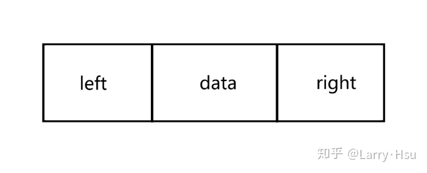

# 二叉树

二叉树是一种特殊的树，表现在它的子节点不超过两个。且二叉树的子树有左右之分，其次序不能任意颠倒。


在二叉树，节点结构至少有三个域:数据域 data，左指针域 left，右指针域 right

```js
class Node {
	constructor(data, left, right) {
		this.data = data;
		this.left = left;
		this.right = right;
		this.count = 1;
	}
}
```

与图 1 不同之处在于多了一个 count 变量，这个变量的作用在于，在向二叉排序树中插入节点时，如果发现有已经有相同的节点值了，就放弃插入，但是将该节点的 count 变量加一，这是为了后面实现统计文本中不同的单词数量而设计的。

# 二叉排序树

> 二叉排序树或者是一棵空树、或者是具有下列性质的二叉树

1. 若左子树不空，则左子树上所有节点的值均小于它的根结点的值
2. 若右子树不空，则右子树所有节点的值均大于它的根结点的值
3. 左、右子树也分别为二叉排序树
4. 没有键值相等的节点

```js
class BSTree {
	constructor() {
		this.root = null;
	}
	//删除一个节点
	_removeNode(node, data) {}
	//删除给定的数据结点
	remove(data) {
		this.root = this._removeNode(this.root, data);
	}
	//向二叉树中插入节点
	insert(data) {}
	//寻找给定数据的节点
	find(data) {}
	//获得最小值的节点
	getMiniNode(node = this.root) {}
	//获得最大值的节点
	getMaxNode(node = this.root) {}
}
```

## insert 插入操作 newNode

是叫迭代吗

1. 先创建节点

2. 找合适位置插入
   - 如果 root==null，新插入的节点就是 root
   - 如果 newNode 大于 cur，在右子树;
     - 一直找下去，同时记录 parentNode 更新 cur
     - cur 节点为空的时候，parentNode.right=newNode
   - 如果 newNode 小于 cur，在左子树
     - 一直找下去，同时记录 parentNode 更新 cur
     - cur 节点为空的时候，parentNode.left=newNode

```js
insert(data){
   let newNode = new Node(data, null, null);
		if (!this.root) {
			this.root = newNode;
		} else {
			let cur = this.root;
			let parent = null;
			while (true) {
				if (newNode.data > cur.data) {
					parent = cur;
					cur = cur.right;
					if (!cur) {
						parent.right = newNode;
						break;
					}
				}
				if (newNode.data < cur.data) {
					parent = cur;
					cur = cur.left;
					if (!cur) {
						parent.left = newNode;
						break;
					}
				}
			}
		}
}

```

## 找最大值 or 找最小值

- 最大值，一直找下去，直到找最右的节点，返回

```js
getMaxNode(node=this.root){
    let cur=node
    while(cur.right){
        cur=cur.right
    }
    return cur
}

```

- 最小值，一直找下去，直到找到最左的节点，返回

```js
getMiniNode(node=this.root){
    let cur=node
    while(cur.left){
        cur=cur.left
    }
    return cur
}

```

## 寻找节点

```js

find(data){
    let cur=this.root
    while(cur){
        if(cur.data===data){
            return cur
        }else if(cur.data>data){
            cur=cur.left
        }else{
            cur=cur.right
        }
    }
    return null
}

```

## 删除节点 removeNode

- 删除的是叶子节点，node 直接赋为 null
- 删除没有左子树，或者没有右子树
  - if(cur.left==null) cur=cur.right
  - if(cur.right==null) cur=cur.left
- 删除的左右节点都有
  - 在 node 的右子树找到最小节点
  - node.right=找到最小复制过去，还要把最小节点之前所在位置删除

```js
_removeNode(node,data){
    if(node==null) return null
    if(data==node.data){
    if(node.left==null&&node.right==null){
        return null
    }
    if(node.left==null) node=node.right
    if(node.right==null) node=node.left

    let tmpNode=this.getMiniNode(node)
    node.data=tmpNode.data
    node.right=this._removeNode(node.right,data)
    return node

    }else if(data<node.left){//在左子树
        node.left=this._removeNode(node.left)
    }else{
        node.right=this._removeNode(node.right)
    }
}
```
