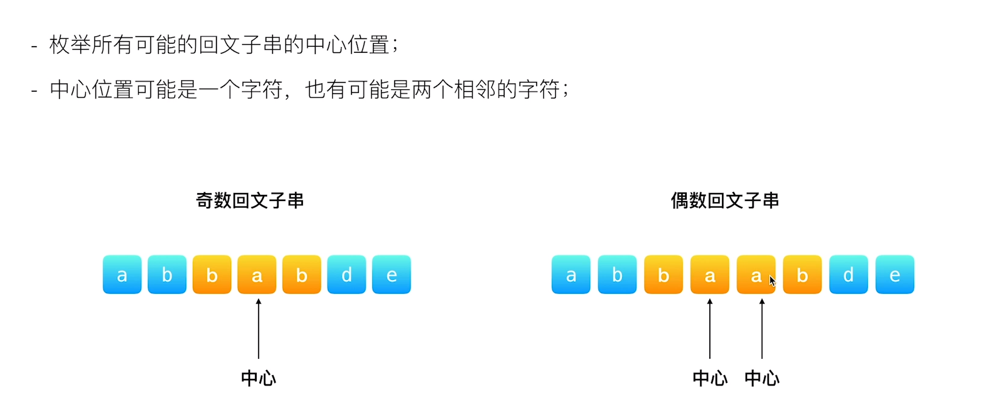

## 最长回文串

给你一个字符串 s，找到 s 中最长的回文子串。

如果字符串的反序与原始字符串相同，则该字符串称为回文字符串。


- 输入:s='babad'
- 输出:'bab'
- 解释:'aba'符合题意


## 思路
### 暴露解法
两次循环i，j=i+1，
- i正常遍历，j是从i开始，
-- j结尾去获取子串，每次获取一定长度就判断是否回文是否大于maxLen，是就更新maxLen和起始位置


### 中心扩展
分奇数扩散和偶数扩散,是中心点是奇数个，还是偶数个


```js
/**
 * @param {string} s
 * @return {string}
 */
var longestPalindrome = function(s) {
 if(s.length<=1) return s
  let maxLeft=0,maxLen=0,curLen=0
  for(let i=0;i<s.length-1;i++){
   let oddLen=expandAroundCenter(i,i)
   let evenLen=expandAroundCenter(i,i+1)
   curLen=Math.max(oddLen,evenLen)
   if(curLen>maxLen){
    maxLen=curLen
    maxLeft=i-Math.floor((maxLen-1)/2)
   }

  }
  function expandAroundCenter(left,right){
    let len=s.length
    while(left>=0&&right<len&&s.charAt(left)==s.charAt(right)){
     
        left--
        right++

      }
      return right-left-1
    }
  
  return s.substring(maxLeft,maxLeft+maxLen)
};

```


### 最长回文串

- 状态:dp[i][j]表示子串s[i...j]是否为回文子串
- 得到状态转移方程:dp[i][j]=(s[i]==s[j] &&dp[i+1][j-1])

