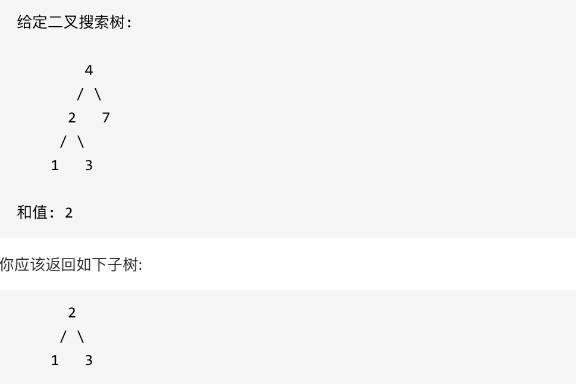

## 700.二叉搜索树

给定二叉搜索树（BST）的根节点和一个值。 你需要在 BST 中找到节点值等于给定值的节点。 返回以该节点为根的子树。 如果节点不存在，则返回 NULL。



## 思路递归

前序递归

1. 确定参数和返回值:参数 root，val;返回值:root
2. 终止条件:空值,找到合适值

```js
if (root == null) return root;
if (root.val == val) return root;
```

3. 单层遍历:val 比 root 大遍历右子树;val 比 root 小遍历左子树

```js
if (root.val > val) {
}
if (root.val < val) {
}
```

```js
/**
 * Definition for a binary tree node.
 * function TreeNode(val, left, right) {
 *     this.val = (val===undefined ? 0 : val)
 *     this.left = (left===undefined ? null : left)
 *     this.right = (right===undefined ? null : right)
 * }
 */
/**
 * @param {TreeNode} root
 * @param {number} val
 * @return {TreeNode}
 */
var searchBST = function (root, val) {
  if (root === null || root.val === val) return root;
  if (root.val < val) return searchBST(root.right, val);
  if (root.val > val) return searchBST(root.left, val);
  return null;
};
```
