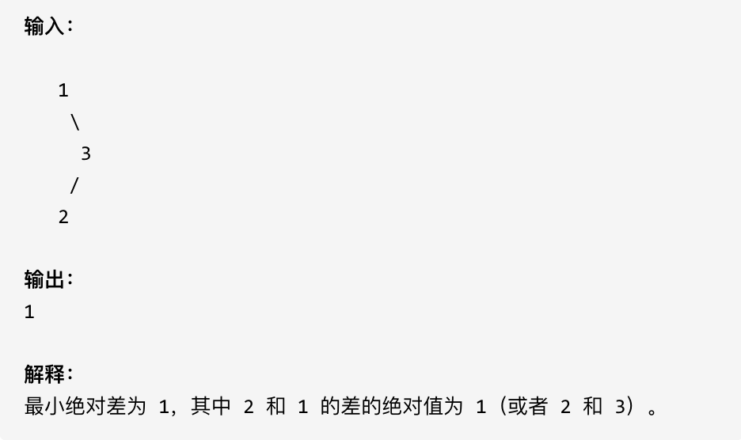

## 530 二叉搜索树的最小绝对差

给你一棵所有节点为非负值的二叉搜索树，请你计算树中任意两节点的差的绝对值的最小值。


## 只要是二叉搜索树要考虑中序遍历

可以把二叉树转化为有序数组算差值

```c++
class Solution {
private:
vector<int> vec;
void traversal(TreeNode* root) {
    if (root == NULL) return;
    traversal(root->left);
    vec.push_back(root->val); // 将二叉搜索树转换为有序数组
    traversal(root->right);
}
public:
    int getMinimumDifference(TreeNode* root) {
        vec.clear();
        traversal(root);
        if (vec.size() < 2) return 0;
        int result = INT_MAX;
        for (int i = 1; i < vec.size(); i++) { // 统计有序数组的最小差值
            result = min(result, vec[i] - vec[i-1]);
        }
        return result;
    }
};
```

在二叉树遍历，就计算需要 pre 记录上一个节点

递归三部曲

- 参数和返回值:记录整个树怎么样，就需要返回值，但是这个不需要;参数 root

- 终止条件:root==null

- 单层遍历
  左;中比较 pre-root 的大小;右

```js
/**
 * Definition for a binary tree node.
 * function TreeNode(val, left, right) {
 *     this.val = (val===undefined ? 0 : val)
 *     this.left = (left===undefined ? null : left)
 *     this.right = (right===undefined ? null : right)
 * }
 */
/**
 * @param {TreeNode} root
 * @return {number}
 */
var getMinimumDifference = function (root) {
  let pre = null,
    result = Infinity;
  function inOrder(root) {
    if (root == null) return;
    //左
    inOrder(root.left);
    if (pre != null && pre.val <= root.val) {
      result = Math.min(result, Math.abs(pre.val - root.val));
    }
    pre = root;
    inOrder(root.right);
  }
  inOrder(root);
  return result;
};
```
