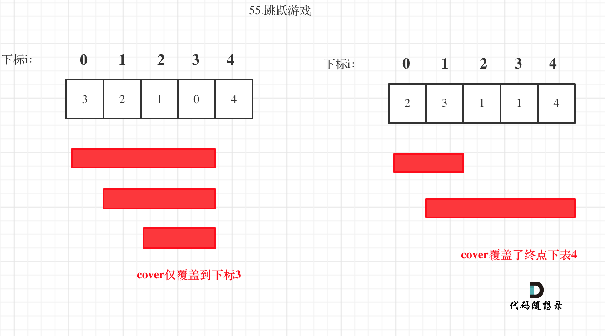

## 跳跃游戏-示例 1:

输入: [2,3,1,1,4]
输出: true
解释: 我们可以先跳 1 步，从位置 0 到达 位置 1, 然后再从位置 1 跳 3 步到达最后一个位置。
示例 2:

输入: [3,2,1,0,4]
输出: false
解释: 无论怎样，你总会到达索引为 3 的位置。但该位置的最大跳跃长度是 0 ， 所以你永远不可能到达最后一个位置。

## 思路

刚看到本题一开始可能想：当前位置元素如果是 3，我究竟是跳一步呢，还是两步呢，还是三步呢，究竟跳几步才是最优呢？

其实跳几步无所谓，关键在于可跳的覆盖范围！

不一定非要明确一次究竟跳几步，每次取最大的跳跃步数，这个就是可以跳跃的覆盖范围。

这个范围内，别管是怎么跳的，反正一定可以跳过来。

那么这个问题就转化为跳跃覆盖范围究竟可不可以覆盖到终点！

每次移动取最大跳跃步数（得到最大的覆盖范围），每移动一个单位，就更新最大覆盖范围。

贪心算法局部最优解：每次取最大跳跃步数（取最大覆盖范围），整体最优解：最后得到整体最大覆盖范围，看是否能到终点。

局部最优推出全局最优，找不出反例，试试贪心！



```js
/**
 * @param {number[]} nums
 * @return {boolean}
 */
var canJump = function (nums) {
  if (nums.length == 1) return true;
  let cover = 0; //覆盖的范围
  for (let i = 0; i <= cover; i++) {
    cover = Math.max(nums[i] + i, cover);
    if (cover >= nums.length - 1) {
      return true;
    }
  }
  return false;
};
```
