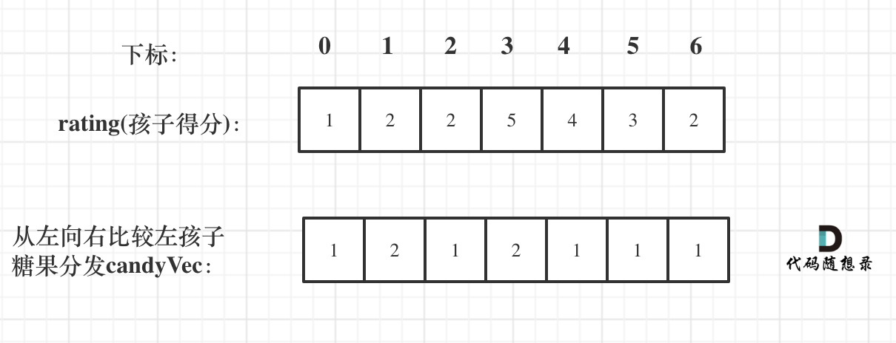

## 135.分发糖果

老师想给孩子们分发糖果，有 N 个孩子站成了一条直线，老师会根据每个孩子的表现，预先给他们评分。

你需要按照以下要求，帮助老师给这些孩子分发糖果：

每个孩子至少分配到 1 个糖果。
相邻的孩子中，评分高的孩子必须获得更多的糖果。
那么这样下来，老师至少需要准备多少颗糖果呢？

示例 1:

输入: [1,0,2]
输出: 5
解释: 你可以分别给这三个孩子分发 2、1、2 颗糖果。
示例 2:

输入: [1,2,2]
输出: 4
解释: 你可以分别给这三个孩子分发 1、2、1 颗糖果。第三个孩子只得到 1 颗糖果，这已满足上述两个条件。

## 思路

1. 假设先确定从规定一个规则:从前到后的比较评分
   此时局部最优：只要右边评分比左边大，右边的孩子就多一个糖果，全局最优：相邻的孩子中，评分高的右孩子获得比左边孩子更多的糖果

局部最优可以推出全局最优。
如果 ratings[i] > ratings[i - 1] 那么[i]的糖 一定要比[i - 1]的糖多一个，所以贪心：candyVec[i] = candyVec[i - 1] + 1

```js
for (let i = 1; i < ratings.length; i++) {
  if (ratings[i] > ratings[i - 1]) candyVec[i] = candyVec[i - 1] + 1;
}
```

2. 还要从右向左比较，因为 rate[5]>rate[6]，但是糖果为 1，没有满足条件



3. **如果 ratings[i] > ratings[i + 1]，此时 candyVec[i]（第 i 个小孩的糖果数量）就有两个选择了，一个是 candyVec[i + 1] + 1（从右边这个加 1 得到的糖果数量），一个是 candyVec[i]（之前比较右孩子大于左孩子得到的糖果数量）。**


```js
/**
 * @param {number[]} ratings
 * @return {number}
 */
var candy = function (ratings) {
  let can = new Array(ratings.length).fill(1);
  let res = 0;
  //从左到右
  for (let i = 1; i < ratings.length; i++) {
    if (ratings[i - 1] < ratings[i]) {
      can[i] = can[i - 1] + 1;
    }
  }
  //从右到左
  for (let i = ratings.length - 2; i >= 0; i--) {
    if (ratings[i] > ratings[i + 1]) {
      can[i] = Math.max(can[i + 1] + 1, can[i]);
    }
  }
  for (item of can) {
    res += item;
  }
  return res;
};
```
