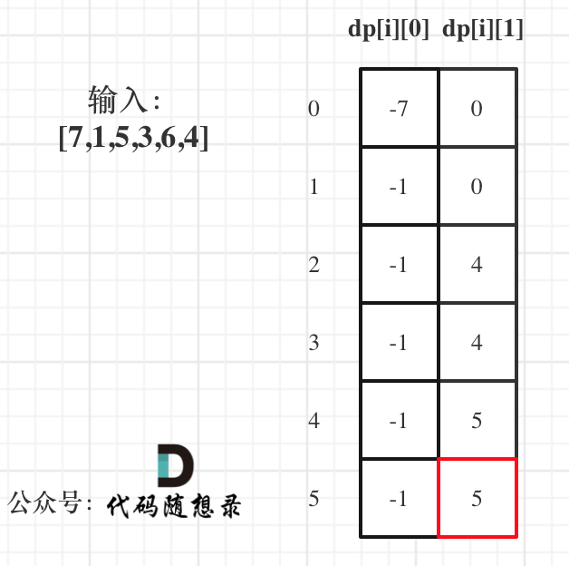

## 121.买卖股票的最佳时间

给定一个数组 prices ，它的第 i 个元素 prices[i] 表示一支给定股票第 i 天的价格。

你只能选择 某一天 买入这只股票，并选择在 未来的某一个不同的日子 卖出该股票。设计一个算法来计算你所能获取的最大利润。

返回你可以从这笔交易中获取的最大利润。如果你不能获取任何利润，返回 0 。

示例 1：
输入：[7,1,5,3,6,4]
输出：5
解释：在第 2 天（股票价格 = 1）的时候买入，在第 5 天（股票价格 = 6）的时候卖出，最大利润 = 6-1 = 5 。注意利润不能是 7-1 = 6, 因为卖出价格需要大于买入价格；同时，你不能在买入前卖出股票。

示例 2：
输入：prices = [7,6,4,3,1]
输出：0
解释：在这种情况下, 没有交易完成, 所以最大利润为 0。

## 思路

### 暴力

这道题目最直观的想法，就是暴力,找最优间距
两层遍历直接找最大

```js
function maxProfit(prices){
  let res=0
  for(let i=0;i<prices.length;i++){
    for(let j=i+1;j<prices.length;j++){
      result=Math.max(result,prices[j]-prices{i})
    }
  }
  return result
}
```

### 动态规划

1. 确定 dp 数组(dp table)以及下标的含义
   **dp[i][0]表示第 i 天持有股票所得最多现金**，持有股票之后哪有的现金
   其实一开始现金是 0，啊、那么加入第 i 天买入的股票现金就是-prices[i]，这是一个负数
   **dp[i][1]表示第 i 天不持有股票所得最多现金**

2. 确定递推公式

**[0]表示持有股票最大的现金，[1]表示不持有股票最大现金数**

- 如果第 i 天持有股票即 dp[i][0],那么可以由两个状态推出了

  - 第 i-1 天就持有股票,那么就保持现状，所得现金就是昨天持有股票所得现金即：dp[i-1][0]
  - 第 i 天买入股票，所得现金就是买入今天的股票所得现金即:-prices[i]

dp[i][0]应该选所得现金最大的。所以 dp[i][0]=Math.max(dp[i-1][0],-prcies[i])

如果第 i 天不持有股票即 dp[i][1]，所以 dp[i][0]=Math.max(dp[i-1][0],-prices[i])

- 如果第 i 天不持有股票即 dp[i][1]，也可以由两个状态推出
  - 第 i-1 天持有股票,那么就保持现状就是昨天不持有股票所得现金即:dp[i-1][1]
  - 第 i 天卖出股票，所得现金就是按照今天股票卖出后所得现金即:price[i]+dp[i-1]
    同样 dp[i][1]取最大的，dp[i][1]=Math.max(dp[i-1][1],prices[i]+dp[i-1])[0]

3. dp 数组如何初始化
   由递推公式 dp[i][0]=Math.max(dp[i-1][0],-prices[i])和 dp[i][1]=Math.max(dp[i - 1][1], prices[i] + dp[i - 1][0])

   dp[0][0]表示 0 天持有股票，此时持有股票一定是买入股票，因为不可能由前一天推出，
   dp[0][0]=-prices[0]
   dp[0][1]表示第 0 天不持有股票，不持有股票那么现金就是 0，所有 dp[0][1]=0

4. 确定遍历顺序，从递推公式来看 dp[i]都是由 dp[i-1]推导出来，一定是从前向后

5. 举例推导 dp 数组
   

```js
function maxProfit(prices) {
  let len = prices.length;
  if (len == 0) return 0;
  let dp = new Array(len).map(() => new Array(2).fill(0));
  dp[0][0] = -prices[0];
  dp[0][1] = 0;
  for (let i = 1; i < len; i++) {
    dp[i][0] = Math.max(dp[i - 1][0], -prices[i]);
    dp[i][1] = Math.max(dp[i - 1][1], prices[i] + dp[i - 1][0]);
  }
  return dp[len - 1][1];
}
```
