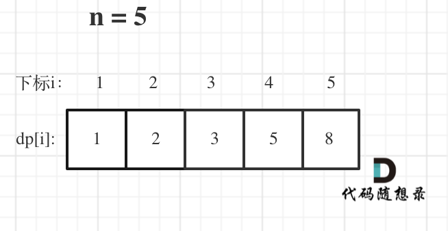

## 70.爬楼梯

假设你正在爬楼梯。需要 n 阶你才能到达楼顶。

每次你可以爬 1 或 2 个台阶。你有多少种不同的方法可以爬到楼顶呢？

注意：给定 n 是一个正整数。

示例 1：

输入： 2
输出： 2
解释： 有两种方法可以爬到楼顶。
1 阶 + 1 阶
2 阶
示例 2：

输入： 3
输出： 3
解释： 有三种方法可以爬到楼顶。
1 阶 + 1 阶 + 1 阶
1 阶 + 2 阶
2 阶 + 1 阶

## 思路

动态规划五部曲

1. 确定 dp 数组以及下标的含义
   dp[i]:爬到第 i 层楼梯，有 dp[i]种方法
2. 确定递推公式
   dp[i]=dp[i-1]+dp[i-2]
3. dp 数组如何初始化:不考虑 dp[0]如何初始化，只初始化 dp[1] = 1，dp[2] = 2，然后从 i = 3 开始递推，这样才符合 dp[i]的定义。
4. 确定遍历顺序:遍历顺序一定是从前向后
5. 举例推导 dp 数组
   

## 代码

只需要维护两个数据就好了

```js
/**
 * @param {number} n
 * @return {number}
 */
var climbStairs = function (n) {
  if (n <= 1) return 1;
  let dp = [];
  (dp[1] = 1), (dp[2] = 2);
  for (let i = 3; i <= n; i++) {
    let sum = dp[1] + dp[2];
    dp[1] = dp[2];
    dp[2] = sum;
  }
  return dp[2];
};
```
