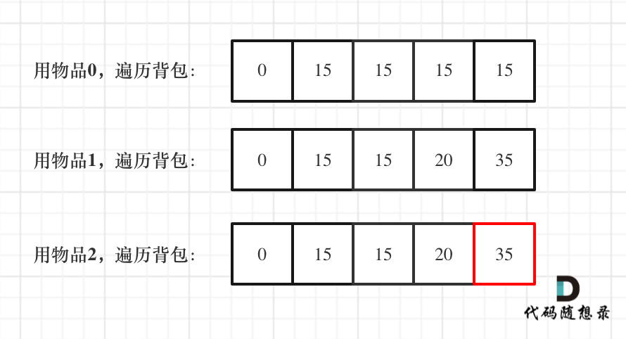

## 一维 dp 数组(滚动数组)

对于背包问题其实状态是可以压缩的

在使用二维数组的时候，递推公式:dp[i][j]=Math.max(dp[i][j],dp[i]j - weight[i]] + value[i])

**其实可以发现如果把 dp[i-1]那一层拷贝到 dp[i]，表达式完全可以是:dp[i][j]=Math.max(dp[i[j],
dp[i]j-weight[i]]+value[i])**

**与其把 dp[i-1]这层拷贝到 dp[i]，不如只用一个一维数组，只用 dp[j](一维数组，也可以理解是一个滚动数组)**
**dp[i][j]表示从下标为[0-i]的物品里任意取，放进容量为 j 的背包，价值的总和是多少**

这就是滚动数组的由来，需要满足的条件是上一层可以重复利用，直接拷贝到当前层

## 动规五部曲

1. 确定 dp 数组的定义
   在一维数组中，dp[j]表示：容量为 j 的背包，所背的物品价值可以最大 dp[j]

2. 一维 dp 数组的递推公式
   dp[j]容量为 j 的背包所背的最大价值，那么如何推导 dp[j]呢？

```js
dp[j] = Math.max(dp[j], dp[j - weight[i]] + value[i]);
```

3. 一维数组如何初始化
   j=0 时候，所背的价值当然为 0，假设物品价值都是大于 0，所以的 dp 数组初始化的时候，都初始化为 0

4. 一维 dp 数组遍历顺序倒序
   **倒序遍历为了保证物品 i 只被放入一次**

物品 0 的重量 weight[0]=1,价值 value[0]=15

如果正序遍历
dp[1]=dp[1-weight[0]]+value[0]=15
dp[2]=dp[2-weight[0]]+value[0]=30

如果倒序，之前 dp 数组已经全部初始化为 0,当前正在遍历物品 0
dp[2]=dp[2-weight[0]]+value[0]=15
dp[1]=dp[1-weight[0]]+value[0]=15

每遍历一个物品，dp[j]就会又更新一次，带着上个物品遍历留下来的 dp[j]

5. 举例推导 dp 数组
   

```js
function test() {
  let weight = [1, 3, 4];
  let value = [15, 20, 30];
  let bagWeight = 4;
  let dp = new Array(4 + 1).fill(0);
  for (let i = 0; i < weight.length; i++) {
    for (let j = bagWeight; j >= weight[i]; j--) {
      dp[j] = Math.max(dp[j], dp[j - weigh[i]] + value[i]);
    }
  }
}
```
