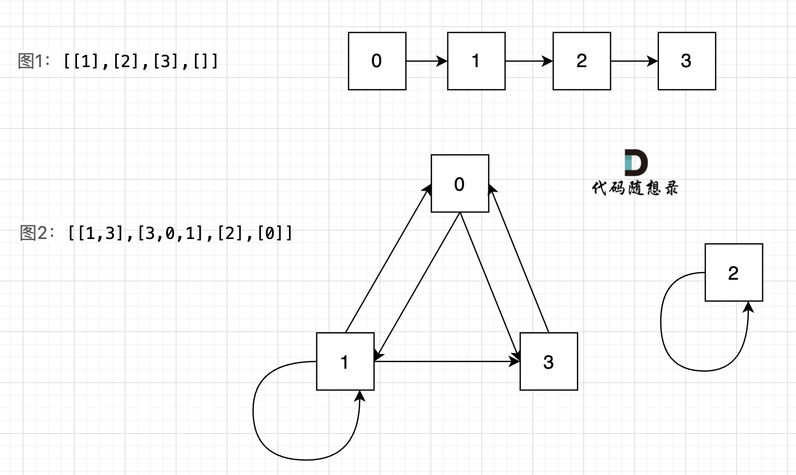

[i]表示房间
[i][j]表示房建里面的钥匙

## 思路



深搜三部曲

1. 确认递归函数，参数
   - 参数:需要知道当前我们拿到的 key，key 是当前遍历的房间，才能去下一个房间
     同时还需要一个数组 visted，用来记录我们走过哪些房间
2. 确认终止条件

   - 如果当前房间已经访问过 visted[key]==true，就返回。

3. 单层遍历的逻辑
   - 当前房间赋值为 true，拿到当前房间的 key，遍历到一层

```js
/**
 * @param {number[][]} rooms
 * @return {boolean}
 */
var canVisitAllRooms = function (rooms) {
	let visited = new Array(rooms.length).fill(false);

	function dfs(key, visited) {
		if (visited[key]) {
			return;
		}
		visited[key] = true;
		let keys = rooms[key];
		// console.log(keys);
		// console.log(typeof keys);
		for (i of keys) {
			dfs(i, visited);
		}
	}
	dfs(0, visited);
	for (v of visited) {
		if (v == false) {
			return false;
		}
	}
	return true;
};

console.log(canVisitAllRooms([[1], [2], [3], []]));
```
