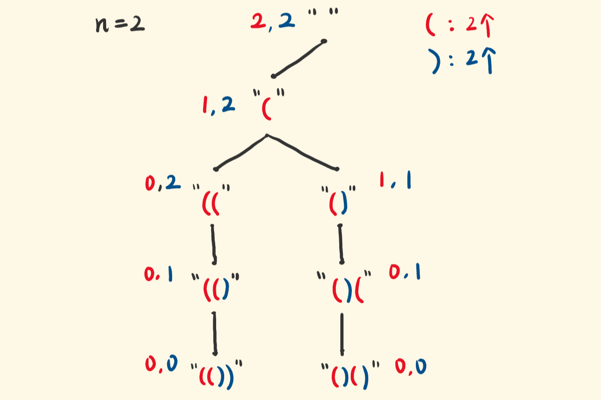

## 22.括号

## 要真的好好画图




## 思路回溯

1. 确定参数和返回值：参数是left(左括号剩余)，right(右括号剩余)；返回值无
2. 确定终止条件:当path路径的长度等于2n说明到叶子节点
3. 当层遍历的逻辑
    - 先放置左括号，左括号剩余减少，开始递归，
      当右括号的剩余>左括号就可以放置右括号，这也是为什么括号有效的原因

```js
/**
 * @param {number} n
 * @return {string[]}
 */
var generateParenthesis = function(n) {
//回溯算法
let res=[],path=[]

function backtracing(left,right){
    if(path.length==2*n){
        res.push(path.join(''))
        return
    }
    if(left>0){
        path.push('(')
        backtracing(left-1,right)
        path.pop()
    }
    if(right>left){//右括号比左括号有声才能选
        path.push(')')
        backtracing(left,right-1)
        path.pop()
    }
}
backtracing(n,n)
return res
};

```