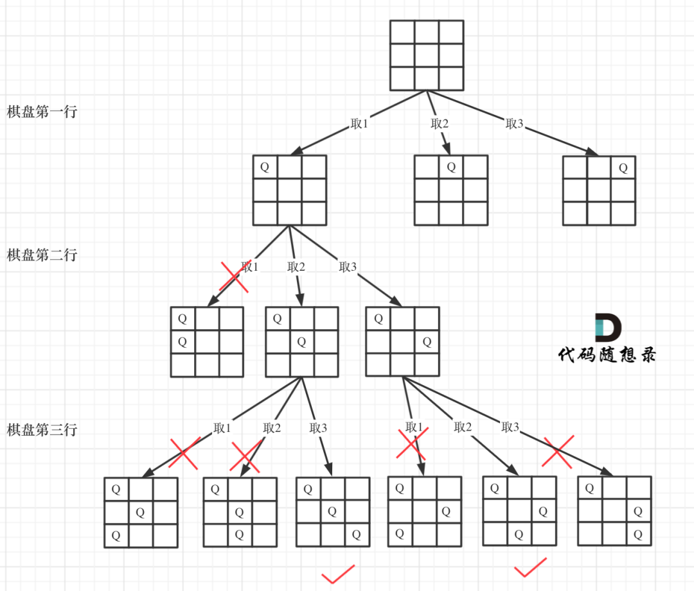

## 52.N 皇后 II

深度遍历行，横向是遍历列



## 回顾回溯算法

**模板**

```js
function backtracing(参数){
    if(终止条件){
        存放结果;
        return;
    }
    for(选择:本层集合中元素(树中节点孩子的数量就是集合的大小)){
        处理节点
        backtracing(路径，选择列表)//递归
        回溯，撤销处理结果
    }
}

```

- 递归函数参数:参数 n 是棋盘的大小，然后 row 来记录当前遍历到棋盘的第几层了
- 递归终止条件:row==n,row 是从 0 开始了，当 row==n 证明溢出不在这个范围里面
- 单层遍历，每一层就是每一行 queen 要摆放在哪个 col 里面，遍历 col 还要验证是否能摆放在此位置

## 代码

45 度和 135 度都是基于上层，一直到最 0 层；还要同一列没有，
为什么不要验证不是同一行本身就在遍历，同一行

**每次递归都是纵向加深**

```js
/**
 * @param {number} n
 * @return {number}
 */
var totalNQueens = function (n) {
	//行遍历，列遍历
	let chess = new Array(n).fill([]).map(() => new Array(n).fill("."));
	let count = 0;

	//回溯算法
	function backtracing(row, n) {
		if (row == n) {
			count++;
			return;
		}

		for (let col = 0; col < n; col++) {
			if (isVaild(n, row, col)) {
				chess[row][col] = "Q";
				backtracing(row + 1, n);
				chess[row][col] = ".";
			}
		}
	}
	function isVaild(n, row, col) {
		for (let i = row - 1; i >= 0; i--) {
			if (chess[i][col] == "Q") {
				return false;
			}
		}
		//45度
		for (let i = row - 1, j = col - 1; i >= 0 && j >= 0; i--, j--) {
			if (chess[i][j] == "Q") {
				return false;
			}
		}
		//135
		for (let i = row - 1, j = col + 1; i >= 0 && j < n; i--, j++)
			if (chess[i][j] == "Q") {
				return false;
			}
		return true;
	}
	backtracing(0, n);

	return count;
};
```
