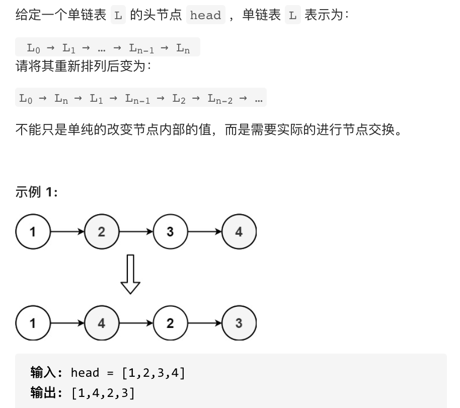

## 143 重排链表



## 思路

- 数组双指针，交替赋值

```js
/**
 * Definition for singly-linked list.
 * function ListNode(val, next) {
 *     this.val = (val===undefined ? 0 : val)
 *     this.next = (next===undefined ? null : next)
 * }
 */
/**
 * @param {ListNode} head
 * @return {void} Do not return anything, modify head in-place instead.
 */
var reorderList = function (head) {
	//双指针
	//数组保存是ListNode节点
	let cur = head;
	let list = [];
	while (cur) {
		list.push(cur);
		cur = cur.next;
	}
	cur = head;
	let left = 1,
		right = list.length - 1;
	let count = 0;
	while (left <= right) {
		if (count % 2 == 0) {
			//evne
			cur.next = list[right];
			right--;
		} else {
			cur.next = list[left];
			left++;
		}
		count++;
		cur = cur.next;
	}
	cur.next = null;
	return head;
};
```

- 利用队列奇数取前面的，偶数取后面的

```js
function reorderList() {
	let cur = head;
	let list = [];
	while (cur) {
		list.push(cur);
		cur = cur.next;
	}
	cur = head;
	let count = 1;
	while (list.length) {
		if (count % 2 == 0) {
			//evne
			cur.next = list.pop();
		} else {
			cur.next = list.shift();
		}
		count++;
		cur = cur.next;
	}
	cur.next = null;
	return head;
}
```
