尝试过不借用 vue-cli，初始化一个项目，下载 webpack 来构建一个项目

webpack 本质上是一个函数，接收一个配置信息作为参数，执行后返回一个
**complier 对象**，调用 complier 对象中的 run 方法会启动编译。run 方法接收一个回调，可以查看编译过程中错误信息和编译信息

debugger.js

```js
const { webpack } = require("webpack");
const webpackOptions = require("./webpack.config.js");
const complier = webpack(webpackOptions);

//开始编译
compiler.run((err, stats) => {
	console.log(err);
	console.log(
		stats.toJson({
			assets: true, //打印本次编译产出的资源
			chuncks: true, //打印本次编译产出的代码块
			modules: true, //打印本次编译产出的模块
		})
	);
});
```

执行打包命令

```js
node ./debugger.js

```

# 三、核心思想

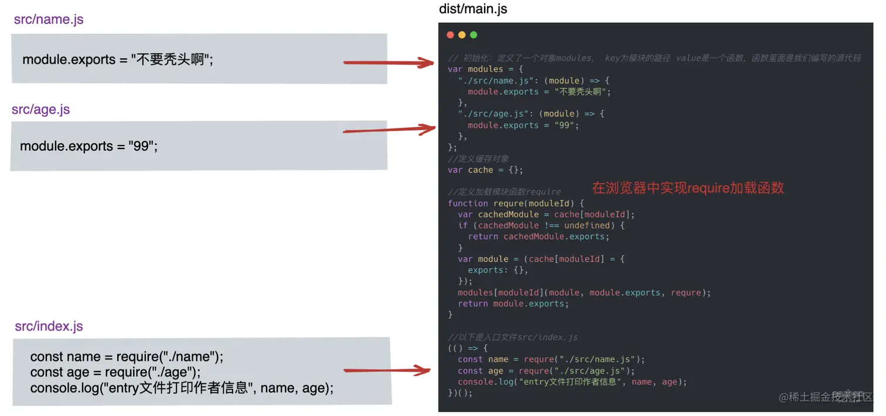

入口文件(src/index.js)被包裹在最后立即执行函数中，而它所依赖的模块（src/name.js、src/age.js）则被放进了 modules 对象中（modules 用于存放入口文件的依赖模块，key 值为依赖模块路径，value 值为依赖模块源代码）。

## 步骤

1. 首先，根据配置信息(webpack.config.js)找到入口文件(src/index.js)

2. 找到入口文件依赖的模块，收集关键信息：比如路径、源代码、它所依赖的模块等

```js
var modules = [
	{
		id: "./src/name.js", //路径
		dependencies: [], //所依赖的模块
		source: 'module.exports = "不要秃头啊";', //源代码
	},
	{
		id: "./src/age.js",
		dependencies: [],
		source: 'module.exports = "99";',
	},
	{
		id: "./src/index.js",
		dependencies: ["./src/name.js", "./src/age.js"],
		source:
			'const name = require("./src/name.js");\n' +
			'const age = require("./src/age.js");\n' +
			'console.log("entry文件打印作者信息", name, age);',
	},
];
```

3. 根据上一步得到的信息，生成最终输出到硬盘中文件(dist)

在这个过程中，浏览器并不认识 html、css、jd 以外的格式，所有还需要对源文件进行转化-Loader 系统

**Loader 系统** 本质上就是接收资源文件，并对其进行转换，最终输出转换后的文件：
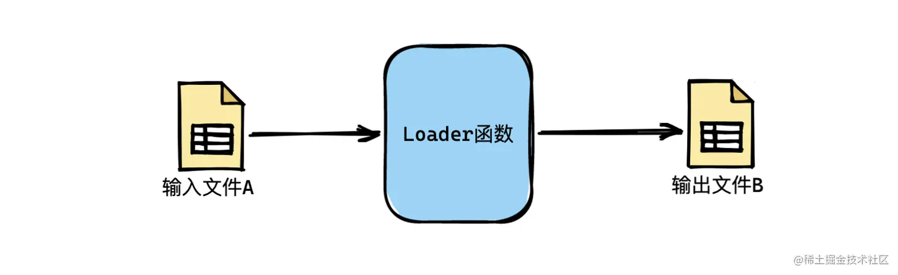

**Plugin 系统**:本质上就是一种事件流的机制，到了固定的时间节点就广播特定的时间，用户可以在事件内执行特定的逻辑，类似与生命周期

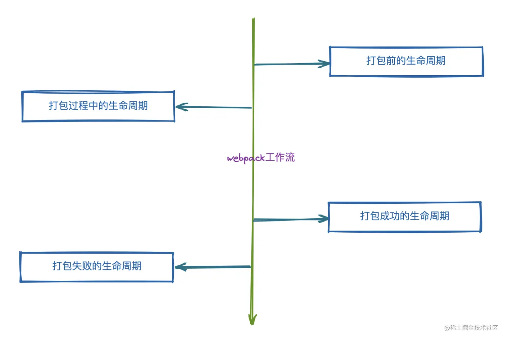

# 四、架构设计

整个打包过程，大致可以分为三个阶段

- 打包开始前的准备工作
- 打包过程(也就是编译阶段)
- 打包结束后(包含打包成功和打包失败)

**将打包过程单独解耦出来**就是 compilation

complier 就像是一个大管家，它就代表上面说的三个阶段，在它上面挂载着各种生命周期函数，而 compilation 就像专管伙食的厨师，专门负责编译相关的工作，也就是打包过程中这个阶段。

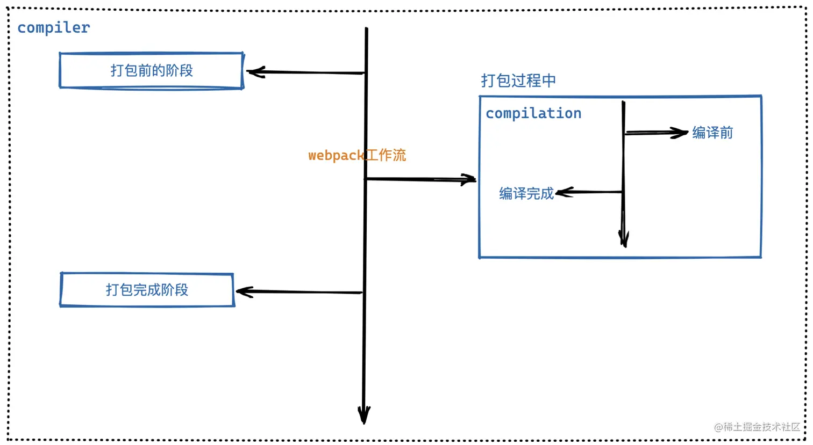

# 五、具体实现

整个过程大致分为以下步骤

1. 搭建结构、读取配置参数
2. 用配置参数对象初始化 Compiler 对象
3. 挂载配置文件中的插件
4. 执行 Complier 对象的 run 方法开始执行编译
5. 根据配置文件中 entry 配置找到所有的入口
6. 从入口文件出发，调用配置的 loader 规则，对模块进行编译
7. 找出此模块所依赖的模块，再对依赖模块进行编译
8. 等所有模块都编译完成后，根据模块之间的依赖关系，组装代码块 chunck
9. 把各个代码块 chunck 转换成一个个文件加入到输出列表中
10. 确定好输出内容之后，根据配置的输出路径和文件名，将文件写入文件系统中

## 5.1 搭建结构、读取配置参数

手动实现下简单 webpack

```js
class Compiler {
	constructor() {}
	run(callback) {}
}
function webpack(webpackOptions) {
	const compiler = new Compiler(webpackOptions);
	return compiler;
}
```


## 5.2 用配置参数对象初始化 Complier 对象

初始化化就是把 constructor 里面赋值好

```js
class Compiler {
	constructor(webpackOptions) {
		this.options = webpackOptions; //存储配置信息
		//它内部提供很多钩子
		this.hooks = {
			run: new SyncHook(), //会在编译刚开始的时候触发此run
			done: new SyncHook(), //会在编译结束时候触发done钩子
		};
	}
	run(callback) {}
}
function webpack(webpackOptions) {
	const compiler = new Compiler(webpackOptions);
	return compiler;
}
```

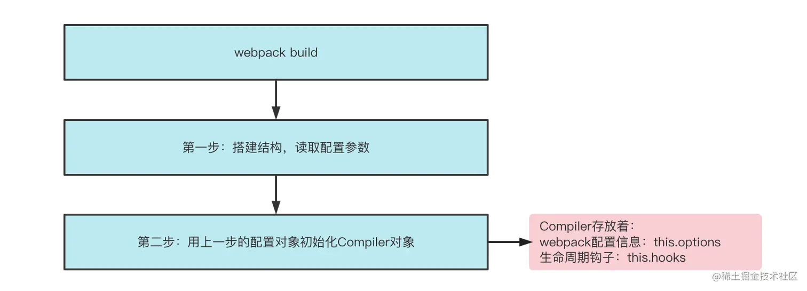

## 5.3 挂载配置文件中的插件

先写两个自定义插件配置到 webpack.config.js 中:一个在开始打包的时候执行，一个在打包完成后执行
**webpackPlugin 其实就是一个普通函数，在该函数中需要定制一个 apply 方法**，当 webpack 内部插入挂载时候会执行 apply 方法，在 apply 方法中订阅各种生命周期函数，到达对应的时间会执行

webpack.js

```js
//自定义插件WebpackRunPlugin
class WebpackRunPlugin {
	apply(compiler) {
		compiler.hooks.run.tap("WebpackRunPlugin", () => {
			console.log("开始编译");
		});
	}
}

class WebpackDonePlugin {
	apply(compiler) {
		compiler.hooks.tap.done("WebpackDonePlugin", () => {
			console.log("结束编译");
		});
	}
}
```

webpack.config.js

```js
const { WebpackRunPlugin, WebpackDonePlugin } = require("./webpack");
module.exports = {
	mode: "development",
	plugins: [new WebpackRunPlugin(), new WebpackDonePlugin()],
	devtool: "source-map", //防止干扰文件
};
```

要执行 apply 方法

```js
function webpack(webpackOptions) {
	const compiler = new Compiler(webpackOptions);
	//从webpackOptions结构出来插件
	const { plugins } = webpackOptions;
	for (let plugin of plugins) {
		plugin.apply(compiler);
	}
	return compiler;
}
```

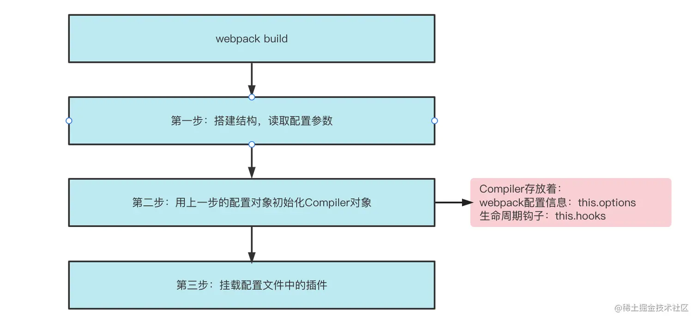

## 5.4 执行 Complier 对象的 run 方法开始执行编译

```js
function webpack(webpackOptions) {
	const compiler = new Compiler(webpackOptions);
	//从webpackOptions结构出来插件
	const { plugins } = webpackOptions;
	for (let plugin of plugins) {
		plugin.apply(compiler);
	}
	return compiler;
}
```

**compile 重头戏来了**

```js
class Compiler {
  //省略其他
  run(callback) {
    //省略
  }

  compile(callback) {
    //虽然webpack只有一个Compiler，但是每次编译都会产出一个新的Compilation，
    //这里主要是为了考虑到watch模式，它会在启动时先编译一次，然后监听文件变化，如果发生变化会重新开始编译
    //每次编译都会产出一个新的Compilation，代表每次的编译结果
+   let compilation = new Compilation(this.options);
+   compilation.build(callback); //执行compilation的build方法进行编译，编译成功之后执行回调
  }
}

+ class Compilation {
+   constructor(webpackOptions) {
+     this.options = webpackOptions;
+     this.modules = []; //本次编译所有生成出来的模块
+     this.chunks = []; //本次编译产出的所有代码块，入口模块和依赖的模块打包在一起为代码块
+     this.assets = {}; //本次编译产出的资源文件
+     this.fileDependencies = []; //本次打包涉及到的文件，这里主要是为了实现watch模式下监听文件的变化，文件发生变化后会重新编译
+   }

+   build(callback) {
+    //这里开始做编译工作，编译成功执行callback
+    callback()
+   }
+ }

```

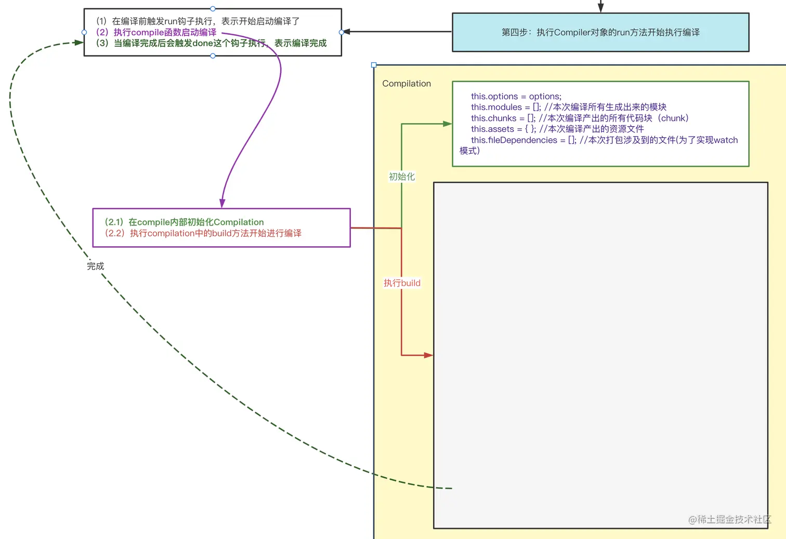

## 5.5 根据配置文件中 entry 配置项找到所有文件

逻辑均在**Compilation**

```js
class Compilation {
	constructor(webpackOptions) {
		this.options = webpackOptions;
		this.modules = []; //本次编译所有生成出来的模块
		this.chunks = []; //本次编译产出的所有代码块，入口模块和依赖的模块打包在一起为代码块
		this.assets = {}; //本次编译产出的资源文件
		this.fileDependencies = []; //本次打包涉及到的文件，这里主要是为了实现watch模式下监听文件的变化，文件发生变化后会重新编译
	}

	build(callback) {
		//第五步：根据配置文件中的`entry`配置项找到所有的入口
		let entry = {};
		if (typeof this.options.entry === "string") {
			entry.main = this.options.entry; //如果是单入口，将entry:"xx"变成{main:"xx"}，这里需要做兼容
		} else {
			entry = this.options.entry;
		}

		//编译成功执行callback
		callback();
	}
}
```

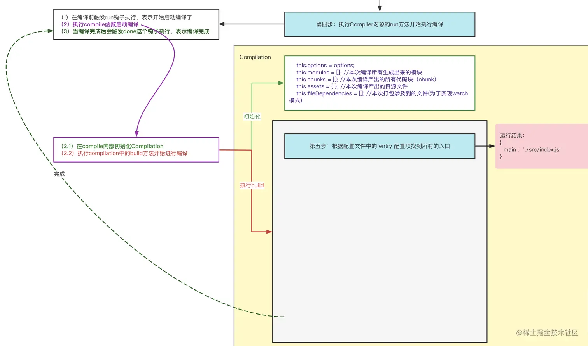

## 5.6 从入口文件出发，调用配置 loader 规则，对模块进行编译

loader 本质就是一个函数，接受资源文件或者上一个 Loader 产生结果作为参数，最终你输出转换后的结果

写两个自定义 Loader 配置到 webpack.config.js

```js
const loader1 = (source) => {
	return source + "//给你的代码加点注释：loader1";
};

const loader2 = (source) => {
	return source + "//给你的代码加点注释：loader2";
};
```

webpack.config.js

```js
const { loader1, loader2 } = require("./webpack");
module.exports = {
	//省略其他
	module: {
		rules: [
			{
				test: /\.js$/,
				use: [loader1, loader2],
			},
		],
	},
};
```

这一步骤从入口文件出发，然后查找出对应的 Loader 对源代码进行翻译和替换

- 把入口文件的绝对路径添加到依赖数组(this.fileDependencies)中，记录此次编译依赖的模块
- 得到入口模块 module 对象(里面放着模块的路径、依赖模块、源代码)
  - 读取模块内容，获取代码
  - 创建模块对象
  - 找到对应的 loader 对源代码进行翻译和替换
- 将生成 module 对象 push 进 this.modules

> 1.把入口文件的绝对路径添加到依赖数组中，记录此次编译依赖的模块

```js
unction toUnixPath(filePath){
    return filePath.replace(/\\g/,"/")
}
const baseDir=toUnixPath(process.cwd())//获取工作目录
class Compilation{
    constructor(webpackOptions){
        this.**options**=webpackOptions
        this.modules=[];//本层编译所有生成的模块
        this.chunks=[];//本次编译产出的所有代码块，入口模块和依赖模块打包在一起为代码块
        this.assets={};//本次编译产出的资源文件
        this.fileDependencies=[];//本次打包涉及到的文件，这里主要是为了实现watch模式下监听文件的变化，文件发生变化后会重新编译
    }
    build(callback){
        //这里开始编译工作，编译成功执行callback
        //
        let entry={}
        if(typeof this.options.entry==='string'){
            entry.main=this.options.entry//如果是单入口，将entry:'xx'变成{main;"xx"}
        }else{
            entry=this.options.entry
        }
          //第六步：从入口文件出发，调用配置的 `loader` 规则，对各模块进行编译
        for (let entryName in entry) {
            //entryName="main" entryName就是entry的属性名，也将会成为代码块的名称
            let entryFilePath = path.posix.join(baseDir, entry[entryName]); //path.posix为了解决不同操作系统的路径分隔符,这里拿到的就是入口文件的绝对路径
            //6.1 把入口文件的绝对路径添加到依赖数组（`this.fileDependencies`）中，记录此次编译依赖的模块
            this.fileDependencies.push(entryFilePath);
        }
        //编译成功执行callback
        callback()

    }
}
```

> 2.1 读取模块内容，获取源代码

```js

class Compilation {
  constructor(webpackOptions) {
    this.options = webpackOptions;
    this.modules = []; //本次编译所有生成出来的模块
    this.chunks = []; //本次编译产出的所有代码块，入口模块和依赖的模块打包在一起为代码块
    this.assets = {}; //本次编译产出的资源文件
    this.fileDependencies = []; //本次打包涉及到的文件，这里主要是为了实现watch模式下监听文件的变化，文件发生变化后会重新编译
  }

+ //当编译模块的时候，name：这个模块是属于哪个代码块chunk的，modulePath：模块绝对路径
+ buildModule(name, modulePath) {
+   //6.2.1 读取模块内容，获取源代码
+   let sourceCode = fs.readFileSync(modulePath, "utf8");
+
+   return {};
+ }

  build(callback) {
    //第五步：根据配置文件中的`entry`配置项找到所有的入口
    //代码省略...
    //第六步：从入口文件出发，调用配置的 `loader` 规则，对各模块进行编译
    for (let entryName in entry) {
      //entryName="main" entryName就是entry的属性名，也将会成为代码块的名称
      let entryFilePath = path.posix.join(baseDir, entry[entryName]); //path.posix为了解决不同操作系统的路径分隔符,这里拿到的就是入口文件的绝对路径
      //6.1 把入口文件的绝对路径添加到依赖数组（`this.fileDependencies`）中，记录此次编译依赖的模块
      this.fileDependencies.push(entryFilePath);
      //6.2 得到入口模块的的 `module` 对象 （里面放着该模块的路径、依赖模块、源代码等）
+     let entryModule = this.buildModule(entryName, entryFilePath);
    }

    //编译成功执行callback
    callback()
  }
}

```

> 2.2 创建模块对象

```js
  //当编译模块的时候，name：这个模块是属于哪个代码块chunk的，modulePath：模块绝对路径
  buildModule(name, modulePath) {
    //6.2.1 读取模块内容，获取源代码
    let sourceCode = fs.readFileSync(modulePath, "utf8");
    //buildModule最终会返回一个modules模块对象，每个模块都会有一个id,id是相对于根目录的相对路径
+   let moduleId = "./" + path.posix.relative(baseDir, modulePath); //模块id:从根目录出发，找到与该模块的相对路径（./src/index.js）
+   //6.2.2 创建模块对象
+   let module = {
+     id: moduleId,
+     names: [name], //names设计成数组是因为代表的是此模块属于哪个代码块，可能属于多个代码块
+     dependencies: [], //它依赖的模块
+     _source: "", //该模块的代码信息
+   };
+   return module;
  }

```

> 2.3 找到对应的 Loader 对源代码进行翻译和替换

```js
class Compilation {
  //省略其他

  //当编译模块的时候，name：这个模块是属于哪个代码块chunk的，modulePath：模块绝对路径
  buildModule(name, modulePath) {
    //6.2.1 读取模块内容，获取源代码
    let sourceCode = fs.readFileSync(modulePath, "utf8");
    //buildModule最终会返回一个modules模块对象，每个模块都会有一个id,id是相对于根目录的相对路径
    let moduleId = "./" + path.posix.relative(baseDir, modulePath); //模块id:从根目录出发，找到与该模块的相对路径（./src/index.js）
    //6.2.2 创建模块对象
    let module = {
      id: moduleId,
      names: [name], //names设计成数组是因为代表的是此模块属于哪个代码块，可能属于多个代码块
      dependencies: [], //它依赖的模块
      _source: "", //该模块的代码信息
    };
    //6.2.3 找到对应的 `Loader` 对源代码进行翻译和替换
+   let loaders = [];
+   let { rules = [] } = this.options.module;
+   rules.forEach((rule) => {
+     let { test } = rule;
+     //如果模块的路径和正则匹配，就把此规则对应的loader添加到loader数组中
+     if (modulePath.match(test)) {
+       loaders.push(...rule.use);
+     }
+   });

+   //自右向左对模块进行转译
+   sourceCode = loaders.reduceRight((code, loader) => {
+     return loader(code);
+   }, sourceCode);

    return module;
  }

  build(callback) {
    //省略
  }
}


```

> 3 将生成的入口文件 module 对象 push 进 this.modules 中

```js
class Compilation {
	constructor(webpackOptions) {
		this.options = webpackOptions;
		this.modules = []; //本次编译所有生成出来的模块
		this.chunks = []; //本次编译产出的所有代码块，入口模块和依赖的模块打包在一起为代码块
		this.assets = {}; //本次编译产出的资源文件
		this.fileDependencies = []; //本次打包涉及到的文件，这里主要是为了实现watch模式下监听文件的变化，文件发生变化后会重新编译
	}

	buildModule(name, modulePath) {
		//省略其他
	}

	build(callback) {
		//第五步：根据配置文件中的`entry`配置项找到所有的入口
		//省略其他
		//第六步：从入口文件出发，调用配置的 `loader` 规则，对各模块进行编译
		for (let entryName in entry) {
			//entryName="main" entryName就是entry的属性名，也将会成为代码块的名称
			let entryFilePath = path.posix.join(baseDir, entry[entryName]); //path.posix为了解决不同操作系统的路径分隔符,这里拿到的就是入口文件的绝对路径
			//6.1 把入口文件的绝对路径添加到依赖数组（`this.fileDependencies`）中，记录此次编译依赖的模块
			this.fileDependencies.push(entryFilePath);
			//6.2 得到入口模块的的 `module` 对象 （里面放着该模块的路径、依赖模块、源代码等）
			let entryModule = this.buildModule(entryName, entryFilePath);
			+(
				//6.3 将生成的入口文件 `module` 对象 push 进 `this.modules` 中
				(+this.modules.push(entryModule))
			);
		}
		//编译成功执行callback
		callback();
	}
}
```

运行流程图

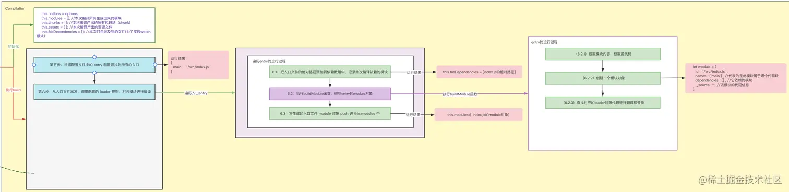

## 5.7、找出此模块所依赖的模块，再对依赖模块进行编译

将步骤经过细化可以将其拆分十个步骤

- 7.1:先把源代码编译成 AST
- 7.2:在 AST 中查找 require 语句，找出依赖模块
- 7.3:将依赖模块的绝对路径 push 到 this.fileDenpendencies 中
- 7.4:生成依赖模块的模块 id
- 7.5:修改语法结构，把依赖的模块改为依赖模块 id
- 7.6:将依赖模块的信息 push 到该模块的 dependncies 属性中
- 7.7:生成新的代码，并将转移后的源代码放到 module.\_source 属性上
- 7.8 对依赖模块进行编译(对 module 对象中的 dependencies 进行递归执行 buildModule)
- 7.9 对依赖模块编译完成后得到依赖模块的 module 对象，push 到 this.modules 中
- 7.10:等依赖模块全部编译完成后，返回入口模块的 module 对象

```js
+ const parser = require("@babel/parser");
+ let types = require("@babel/types"); //用来生成或者判断节点的AST语法树的节点
+ const traverse = require("@babel/traverse").default;
+ const generator = require("@babel/generator").default;

//获取文件路径
+ function tryExtensions(modulePath, extensions) {
+   if (fs.existsSync(modulePath)) {
+     return modulePath;
+   }
+   for (let i = 0; i < extensions?.length; i++) {
+     let filePath = modulePath + extensions[i];
+     if (fs.existsSync(filePath)) {
+       return filePath;
+     }
+   }
+   throw new Error(`无法找到${modulePath}`);
+ }

class Compilation {
  constructor(webpackOptions) {
    this.options = webpackOptions;
    this.modules = []; //本次编译所有生成出来的模块
    this.chunks = []; //本次编译产出的所有代码块，入口模块和依赖的模块打包在一起为代码块
    this.assets = {}; //本次编译产出的资源文件
    this.fileDependencies = []; //本次打包涉及到的文件，这里主要是为了实现watch模式下监听文件的变化，文件发生变化后会重新编译
  }

  //当编译模块的时候，name：这个模块是属于哪个代码块chunk的，modulePath：模块绝对路径
  buildModule(name, modulePath) {
    //省略其他
    //6.2.1 读取模块内容，获取源代码
    //6.2.2 创建模块对象
    //6.2.3 找到对应的 `Loader` 对源代码进行翻译和替换

    //自右向左对模块进行转译
    sourceCode = loaders.reduceRight((code, loader) => {
      return loader(code);
    }, sourceCode);

    //通过loader翻译后的内容一定得是js内容，因为最后得走我们babel-parse，只有js才能成编译AST
    //第七步：找出此模块所依赖的模块，再对依赖模块进行编译
+     //7.1：先把源代码编译成 [AST](https://astexplorer.net/)
+     let ast = parser.parse(sourceCode, { sourceType: "module" });
+     traverse(ast, {
+       CallExpression: (nodePath) => {
+         const { node } = nodePath;
+         //7.2：在 `AST` 中查找 `require` 语句，找出依赖的模块名称和绝对路径
+         if (node.callee.name === "require") {
+           let depModuleName = node.arguments[0].value; //获取依赖的模块
+           let dirname = path.posix.dirname(modulePath); //获取当前正在编译的模所在的目录
+           let depModulePath = path.posix.join(dirname, depModuleName); //获取依赖模块的绝对路径
+           let extensions = this.options.resolve?.extensions || [ ".js" ]; //获取配置中的extensions
+           depModulePath = tryExtensions(depModulePath, extensions); //尝试添加后缀，找到一个真实在硬盘上存在的文件
+           //7.3：将依赖模块的绝对路径 push 到 `this.fileDependencies` 中
+           this.fileDependencies.push(depModulePath);
+           //7.4：生成依赖模块的`模块 id`
+           let depModuleId = "./" + path.posix.relative(baseDir, depModulePath);
+           //7.5：修改语法结构，把依赖的模块改为依赖`模块 id` require("./name")=>require("./src/name.js")
+           node.arguments = [types.stringLiteral(depModuleId)];
+           //7.6：将依赖模块的信息 push 到该模块的 `dependencies` 属性中
+           module.dependencies.push({ depModuleId, depModulePath });
+         }
+       },
+     });

+     //7.7：生成新代码，并把转译后的源代码放到 `module._source` 属性上
+     let { code } = generator(ast);
+     module._source = code;
+     //7.8：对依赖模块进行编译（对 `module 对象`中的 `dependencies` 进行递归执行 `buildModule` ）
+     module.dependencies.forEach(({ depModuleId, depModulePath }) => {
+       //考虑到多入口打包 ：一个模块被多个其他模块引用，不需要重复打包
+       let existModule = this.modules.find((item) => item.id === depModuleId);
+       //如果modules里已经存在这个将要编译的依赖模块了，那么就不需要编译了，直接把此代码块的名称添加到对应模块的names字段里就可以
+       if (existModule) {
+         //names指的是它属于哪个代码块chunk
+         existModule.names.push(name);
+       } else {
+         //7.9：对依赖模块编译完成后得到依赖模块的 `module 对象`，push 到 `this.modules` 中
+         let depModule = this.buildModule(name, depModulePath);
+         this.modules.push(depModule);
+       }
+     });
+     //7.10：等依赖模块全部编译完成后，返回入口模块的 `module` 对象
+     return module;
   }
  //省略其他
}

```

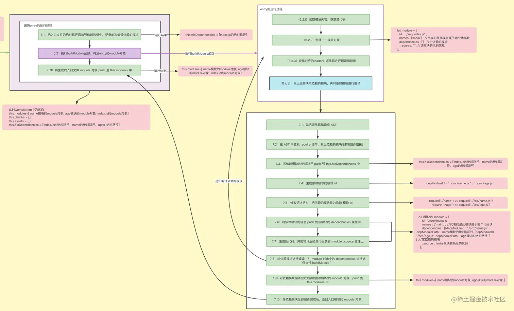

## 5.8 、等所有模块都编译完成后，根据模块之间的依赖关系，组装代码块 chunk

```js
class Compilation {
  constructor(webpackOptions) {
    this.options = webpackOptions;
    this.modules = []; //本次编译所有生成出来的模块
    this.chunks = []; //本次编译产出的所有代码块，入口模块和依赖的模块打包在一起为代码块
    this.assets = {}; //本次编译产出的资源文件
    this.fileDependencies = []; //本次打包涉及到的文件，这里主要是为了实现watch模式下监听文件的变化，文件发生变化后会重新编译
  }

  buildModule(name, modulePath) {
   //省略其他
  }

  build(callback) {
    //第五步：根据配置文件中的`entry`配置项找到所有的入口
    //省略其他
    //第六步：从入口文件出发，调用配置的 `loader` 规则，对各模块进行编译
    for (let entryName in entry) {
      //entryName="main" entryName就是entry的属性名，也将会成为代码块的名称
      let entryFilePath = path.posix.join(baseDir, entry[entryName]); //path.posix为了解决不同操作系统的路径分隔符,这里拿到的就是入口文件的绝对路径
      //6.1 把入口文件的绝对路径添加到依赖数组（`this.fileDependencies`）中，记录此次编译依赖的模块
      this.fileDependencies.push(entryFilePath);
      //6.2 得到入口模块的的 `module` 对象 （里面放着该模块的路径、依赖模块、源代码等）
      let entryModule = this.buildModule(entryName, entryFilePath);
      //6.3 将生成的入口文件 `module` 对象 push 进 `this.modules` 中
      this.modules.push(entryModule);
      //第八步：等所有模块都编译完成后，根据模块之间的依赖关系，组装代码块 `chunk`（一般来说，每个入口文件会对应一个代码块`chunk`，每个代码块`chunk`里面会放着本入口模块和它依赖的模块）
+     let chunk = {
+       name: entryName, //entryName="main" 代码块的名称
+       entryModule, //此代码块对应的module的对象,这里就是src/index.js 的module对象
+       modules: this.modules.filter((item) => item.names.includes(entryName)), //找出属于该代码块的模块
+     };
+     this.chunks.push(chunk);
    }
    //编译成功执行callback
    callback()
  }
}


```

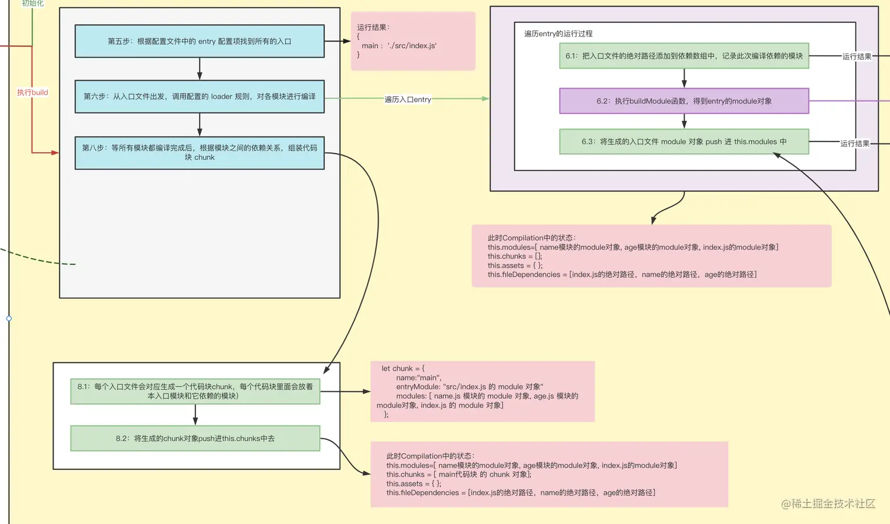

## 5.9、把各个代码块 chunk 转换成一个一个文件加入到输出列表

这一步需要结合配置文件中 output.filename 去生成输出文件名称，同时还需要生成运行时代码

```js
//生成运行时代码
+ function getSource(chunk) {
+   return `
+    (() => {
+     var modules = {
+       ${chunk.modules.map(
+         (module) => `
+         "${module.id}": (module) => {
+           ${module._source}
+         }
+       `
+       )}
+     };
+     var cache = {};
+     function require(moduleId) {
+       var cachedModule = cache[moduleId];
+       if (cachedModule !== undefined) {
+         return cachedModule.exports;
+       }
+       var module = (cache[moduleId] = {
+         exports: {},
+       });
+       modules[moduleId](module, module.exports, require);
+       return module.exports;
+     }
+     var exports ={};
+     ${chunk.entryModule._source}
+   })();
+    `;
+ }

class Compilation {
  constructor(webpackOptions) {
    this.options = webpackOptions;
    this.modules = []; //本次编译所有生成出来的模块
    this.chunks = []; //本次编译产出的所有代码块，入口模块和依赖的模块打包在一起为代码块
    this.assets = {}; //本次编译产出的资源文件
    this.fileDependencies = []; //本次打包涉及到的文件，这里主要是为了实现watch模式下监听文件的变化，文件发生变化后会重新编译
  }

  //当编译模块的时候，name：这个模块是属于哪个代码块chunk的，modulePath：模块绝对路径
  buildModule(name, modulePath) {
    //省略
  }

  build(callback) {
    //第五步：根据配置文件中的`entry`配置项找到所有的入口
    //第六步：从入口文件出发，调用配置的 `loader` 规则，对各模块进行编译
    for (let entryName in entry) {
      //省略
      //6.1 把入口文件的绝对路径添加到依赖数组（`this.fileDependencies`）中，记录此次编译依赖的模块
      //6.2 得到入口模块的的 `module` 对象 （里面放着该模块的路径、依赖模块、源代码等）
      //6.3 将生成的入口文件 `module` 对象 push 进 `this.modules` 中
      //第八步：等所有模块都编译完成后，根据模块之间的依赖关系，组装代码块 `chunk`（一般来说，每个入口文件会对应一个代码块`chunk`，每个代码块`chunk`里面会放着本入口模块和它依赖的模块）
    }

    //第九步：把各个代码块 `chunk` 转换成一个一个文件加入到输出列表
+    this.chunks.forEach((chunk) => {
+      let filename = this.options.output.filename.replace("[name]", chunk.name);
+      this.assets[filename] = getSource(chunk);
+    });

+     callback(
+       null,
+       {
+         chunks: this.chunks,
+         modules: this.modules,
+         assets: this.assets,
+       },
+       this.fileDependencies
+     );
  }
}


作者：不要秃头啊
链接：https://juejin.cn/post/7170852747749621791
来源：稀土掘金
著作权归作者所有。商业转载请联系作者获得授权，非商业转载请注明出处。
```

## 5.10 确定好输出内容之后，根据配置的输出路径和文件名，将文件内容写入硬盘

```js
class Compiler {
  constructor(webpackOptions) {
    this.options = webpackOptions; //存储配置信息
    //它内部提供了很多钩子
    this.hooks = {
      run: new SyncHook(), //会在编译刚开始的时候触发此run钩子
      done: new SyncHook(), //会在编译结束的时候触发此done钩子
    };
  }

  compile(callback) {
    //省略
  }

  //第四步：执行`Compiler`对象的`run`方法开始执行编译
  run(callback) {
    this.hooks.run.call(); //在编译前触发run钩子执行，表示开始启动编译了
    const onCompiled = (err, stats, fileDependencies) => {
+     //第十步：确定好输出内容之后，根据配置的输出路径和文件名，将文件内容写入到文件系统（这里就是硬盘）
+     for (let filename in stats.assets) {
+       let filePath = path.join(this.options.output.path, filename);
+       fs.writeFileSync(filePath, stats.assets[filename], "utf8");
+     }

+     callback(err, {
+       toJson: () => stats,
+     });

      this.hooks.done.call(); //当编译成功后会触发done这个钩子执行
    };
    this.compile(onCompiled); //开始编译，成功之后调用onCompiled
  }
}


```

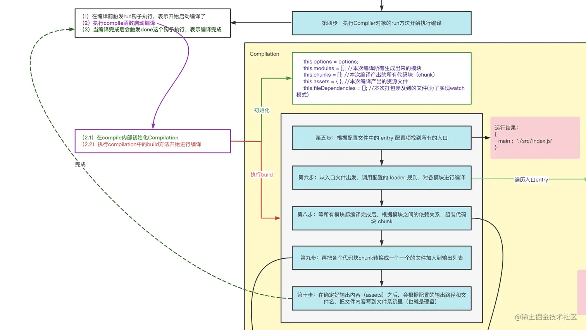

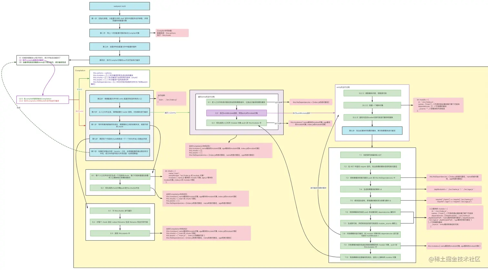

# 六、实现 watch 模式

看完上面的实现，有些小伙伴可能有疑问了：Compilation 中的 this.fileDependencies（本次打包涉及到的文件）是用来做什么的？为什么没有地方用到该属性？
这里其实是为了实现 Webpack 的 watch 模式：当文件发生变更时将重新编译。
思路：对 this.fileDependencies 里面的文件进行监听，当文件发生变化时，重新执行 compile 函数。

```js

class Compiler {
  constructor(webpackOptions) {
   //省略
  }

  compile(callback) {
    //虽然webpack只有一个Compiler，但是每次编译都会产出一个新的Compilation，
    //这里主要是为了考虑到watch模式，它会在启动时先编译一次，然后监听文件变化，如果发生变化会重新开始编译
    //每次编译都会产出一个新的Compilation，代表每次的编译结果
    let compilation = new Compilation(this.options);
    compilation.build(callback); //执行compilation的build方法进行编译，编译成功之后执行回调
  }

  //第四步：执行`Compiler`对象的`run`方法开始执行编译
  run(callback) {
    this.hooks.run.call(); //在编译前触发run钩子执行，表示开始启动编译了
    const onCompiled = (err, stats, fileDependencies) => {
      //第十步：确定好输出内容之后，根据配置的输出路径和文件名，将文件内容写入到文件系统（这里就是硬盘）
      for (let filename in stats.assets) {
        let filePath = path.join(this.options.output.path, filename);
        fs.writeFileSync(filePath, stats.assets[filename], "utf8");
      }

      callback(err, {
        toJson: () => stats,
      });

+     fileDependencies.forEach((fileDependencie) => {
+       fs.watch(fileDependencie, () => this.compile(onCompiled));
+     });

      this.hooks.done.call(); //当编译成功后会触发done这个钩子执行
    };
    this.compile(onCompiled); //开始编译，成功之后调用onCompiled
  }
}

作者：不要秃头啊
链接：https://juejin.cn/post/7170852747749621791
来源：稀土掘金
著作权归作者所有。商业转载请联系作者获得授权，非商业转载请注明出处。
```
