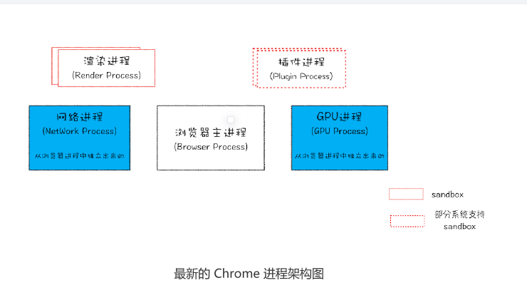

从图中可以看出来，最新的Chrome浏览器包括:1个浏览器(Browser)主进程、1个GPU进程
1个网络(NetWork)进程、多个渲染进程和多个插件进程。

逐个分析进程的功能

- 浏览器进程：主要负责界面显示、用户交换、子进程管理，同时提供存储功能。
- 渲染进程:核心任务是将HTML、CSS和JavaScript转换为用户可以与之交互的网页，排版引擎Blink
  和JavaScript引擎V8都是运行在该进程中，渲染进程都是运行在沙箱模式下。

- GPU进程：Chrome的UI界面都选择采用GPU来绘制，这使得GPU成为浏览器普遍需求。
- 网络进程：主要负责页面的网络资源加载，之前作为一个模块运行在浏览器进程，直至最近才独立出来，为    个单独的进程。
- 插件进程:主要负责插件的运行，因插件容易崩溃，所以需要通过插件进程来隔离

讲到这里，现在你应该就可以回答文章开头提到的问题了：仅仅打开了 1 个页面，为什么
有 4 个进程？因为打开 1 个页面至少需要 1 个网络进程、1 个浏览器进程、1 个 GPU 进程
以及 1 个渲染进程，共 4 个；如果打开的页面有运行插件的话，还需要再加上 1 个插件进
程。