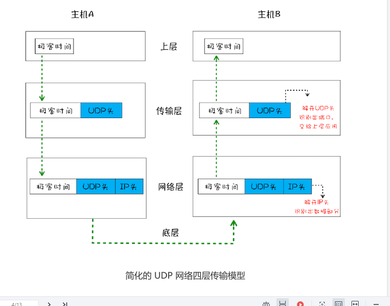
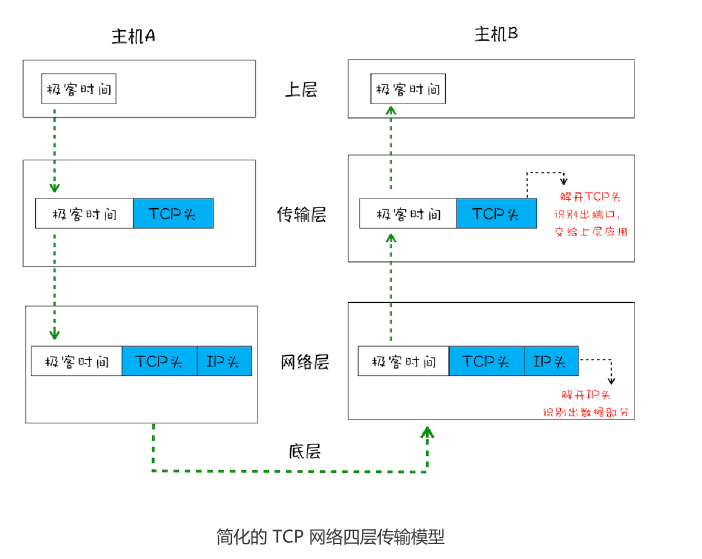
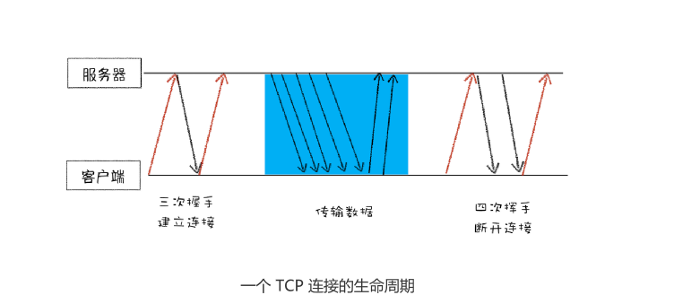

在衡量Web页面性能的时候有一个重要的指标**“FP（Frist Paint）”**，
是指从**页面加载到首次开始绘制的时长**，这个指标直接影响了用户的跳出率，‘更快
的页面响应意味着更多PV、更高的参与度，以及更高的转化率。那么什么影响FP？其中一个重要的因素
是**网络加载速度**

想要优化web页面的加载速度，你需要对网络有充分的了解，而理解网络的关键是要对网
络协议有深刻的认识，不管你是使用 HTTP，还是使用 WebSocket，它们都是基于
TCP/IP 的，如果你对这些原理有足够了解，也就清楚如何去优化 Web 性能，或者能更轻
松地定位 Web 问题了。此外，TCP/IP 的设计思想还有助于拓宽你的知识边界，从而在整
体上提升你对项目的理解和解决问题的能力。

**那么如何保证页面文件能被完整地送达浏览器**？

# 一个数据包的旅程

分别从“数据包如何送达主机”，“主机如何将数据包转交给应用”和“数据是如何被完整地送达应用程序”
这三个角度为你讲述数据的传输过程。

## 1. IP:把数据包送达目的主机

数据包要在互联网进行传输，就要符合**网际协议**（Internet Protocol，简称IP)标准。
互联网不同的在线设备都有唯一的地址，地址只是一个数字，这和大部分收件地址类似，
只需要知道一个家庭的具体地址，就可以往这个地址发送包裹，这样物流系统就能把物品送达目的地。

**计算机的地址称为IP地址，访问任何网站实际上只是你的计算机向另外一台计算机请求信息**。

数据经过IP地址，会添加一个IP头。IP头是IP数据包开头的信息，包含IP版本、源IP地址、目标IP地址、
生存时间等信息。

看一个数据包从主机A到主机B的旅程:
- 上层将含有“极客时间”的数据包交给网络层；
- 网络层再将IP头附加到数据包上，组成新的**IP数据包**，并交给底层；
- 底层通过物理网络将数据包传输给主机B；
- 数据包将传输到主机B的网络层，在主机B拆开数据包的IP头信息，并将拆开来的数据部分交给上层；
- 最终，含有“极客时间”信息的数据包就到达主机B的上层。

## 2.UDP:把数据包送达应用程序（通过端口号绑定程序）

对方电脑并不知道把数据包交给哪个程序，是交给浏览器还是交给王者荣耀？因此，需要基于IP之上开发能和应用
打交道的协议，最常见的是**用户数据包协议**，简称**UDP**

UDp中一个最重要的信息**端口号**，端口号其实一个数字，每个想访问网络的程序需要
绑定一个端口号。通过端口号UDP就能把指定的数据包发送给指定的程序了，所有
**IP通过IP地址信息把数据包发送给指定的电脑，而UDP通过端口号把数据包分发给正确的程序**。
和IP头一样，端口号会被装进UDP里面，UDP头再和原始数据并组成新的UDP数据包。UDP数据包。
UDP头除了目的端口，还有源端口等信息。

为了支持UDP协议，前面的三层扩充为四层结构，在网路层和上层增加了传输层。

- 上层将含有“极客时间”的数据包交给传输层；
- 传输层会在数据包前面附加上UDP 头，组成新的 UDP 数据包，再将新的 UDP 数据包交
给网络层；
- 网络层再将 IP 头附加到数据包上，组成新的 IP 数据包，并交给底层；
- 数据包被传输到主机 B 的网络层，在这里主机 B 拆开 IP 头信息，并将拆开来的数据部分
交给传输层；
- 在传输层，数据包中的 UDP 头会被拆开，并根据 UDP 中所提供的端口号，把数据部分
交给上层的应用程序；
- 最终，含有“极客时间”信息的数据包就旅行到了主机 B 上层应用程序这里。

在使用UDP发送数据时，有各种因素会导致数据包出错，虽然UDP可以校验正确，
但是对于错误的数据包，UDP并不提供重发机制，只是丢弃当前的包，而且UDP在发送
之后无法知道是否能到达目的地。

虽说**UDP不能保证数据可靠性，但是传输速度非常快**，所以 UDP 会应用在一些关注速
度、但不那么严格要求数据完整性的领域，如在线视频、互动游戏等。

## 3.TCP：把数据完整地送达应用程序

如果使用UDP来传输会存在**两个问题**：
- 数据包在传输过程中容易丢失
- 大文件会被拆分很多小的数据包来传输，这些小的数据包会经过不同的路由
  并在不同的路由，并在不同的时间到达接收端，而UDP协议并不知道如何
  组装这些数据包，从而这些数据包还原成完整地文件。

基于这两个问题，引入TCP。**TCP（Transmission Control Protocol，传输控制协议）**
是一种面向连接的、可靠的、基于字节流的传输层通信协议。相对于UDP，TCP有下面两个特点

- 对于数据包丢失的情况，TCP提供方重传机制
- 对于乱序问题，TCP引入数据包排序机制，用来保证把乱序的数据包组合成一个完整的文件。
  和UDP头一样，TCP头除了包含目标端口和本机端口号外，还提供用于排序的序列号，以便接收端通过序号来重排数据包。

下面看看TCP的单个数据包的传输流程：

下面可以看出，一个完整的TCP连接的生命周期包括了**建立连接** **传输数据** **断开连接**
三个阶段。

**首先，建立连接阶段**。这个阶段是通过“三次握手”来建立客户端和服务器之间的连接。TCP提供
面向连接的通信传输。面向连接是指在数据通信开水之前先做好两端之间的准备工作。所谓**三次握手**，是指建立一个TCP连接是，客户端和服务器总共要发送三个数据包以确认连接的建立。

**其次，传输数据的阶段**。在该阶段，**接收端需要对每个数据包进行确认操作**，也就是接收端在接收到数据包之后，需要发送确认数据包给发送端。所以当发送端发送一个数据包之后，在规定时间内没有接收到接收端的确认消息，则判断为数据包丢失，并触发重发机制。同样，一个大的文件在传输过程中会被拆分很多小的数据包，这些数据包达到接收端后，接收端会按照TCP头中序号为其排序，从而保证组成完整的数据。

**最后，断开连接阶段**。数据传输完毕之后，就要终止连接了，涉及到最后一个阶段“四次挥手”来保证双方都断开连接。

TCP为了保证数据传输的可靠性，牺牲了数据包的传输速度，因为“三次握手”和“数据包校验机制”等把传输过程中数据包的数量提高了一倍。

# 总结
互联网中的数据是通过数据包来传输的，数据包在传输过程中容易丢失或出错
IP负责把数据包送达目的主机
UDP负责把数据包送达具体应用
而TCP保证数据完整地传输，它的连接分为三个阶段：建立连接、传输数据和断开连接。

