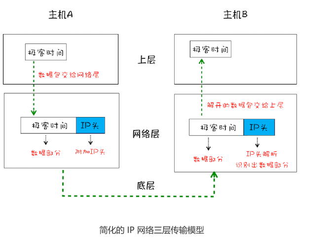

在衡量Web页面性能的时候有一个重要的指标**“FP（Frist Paint）”**，
是指从**页面加载到首次开始绘制的时长**，这个指标直接影响了用户的跳出率，‘更快
的页面响应意味着更多PV、更高的参与度，以及更高的转化率。那么什么影响FP？其中一个重要的因素
是**网络加载速度**

想要优化web页面的加载速度，你需要对网络有充分的了解，而理解网络的关键是要对网
络协议有深刻的认识，不管你是使用 HTTP，还是使用 WebSocket，它们都是基于
TCP/IP 的，如果你对这些原理有足够了解，也就清楚如何去优化 Web 性能，或者能更轻
松地定位 Web 问题了。此外，TCP/IP 的设计思想还有助于拓宽你的知识边界，从而在整
体上提升你对项目的理解和解决问题的能力。

**那么如何保证页面文件能被完整地送达浏览器**？

# 一个数据包的旅程

分别从“数据包如何送达主机”，“主机如何将数据包转交给应用”和“数据是如何被完整地送达应用程序”
这三个角度为你讲述数据的传输过程。

## 1. IP:把数据包送达目的主机

数据包要在互联网进行传输，就要符合**网际协议**（Internet Protocol，简称IP)标准。
互联网不同的在线设备都有唯一的地址，地址只是一个数字，这和大部分收件地址类似，
只需要知道一个家庭的具体地址，就可以往这个地址发送包裹，这样物流系统就能把物品送达目的地。

**计算机的地址称为IP地址，访问任何网站实际上只是你的计算机向另外一台计算机请求信息**。

数据经过IP地址，会添加一个IP头。IP头是IP数据包开头的信息，包含IP版本、源IP地址、目标IP地址、
生存时间等信息。

看一个数据包从主机A到主机B的旅程:
- 上层将含有“极客时间”的数据包交给网络层；
- 网络层再将IP头附加到数据包上，组成新的**IP数据包**，并交给底层；
- 底层通过物理网络将数据包传输给主机B；
- 数据包将传输到主机B的网络层，在主机B拆开数据包的IP头信息，并将拆开来的数据部分交给上层；
- 最终，含有“极客时间”信息的数据包就到达主机B的上层。

## 2.UDP:把数据包送达应用程序（通过端口号绑定程序）

对方电脑并不知道把数据包交给哪个程序，是交给浏览器还是交给王者荣耀？因此，需要基于IP之上开发能和应用
打交道的协议，最常见的是**用户数据包协议**，简称**UDP**

