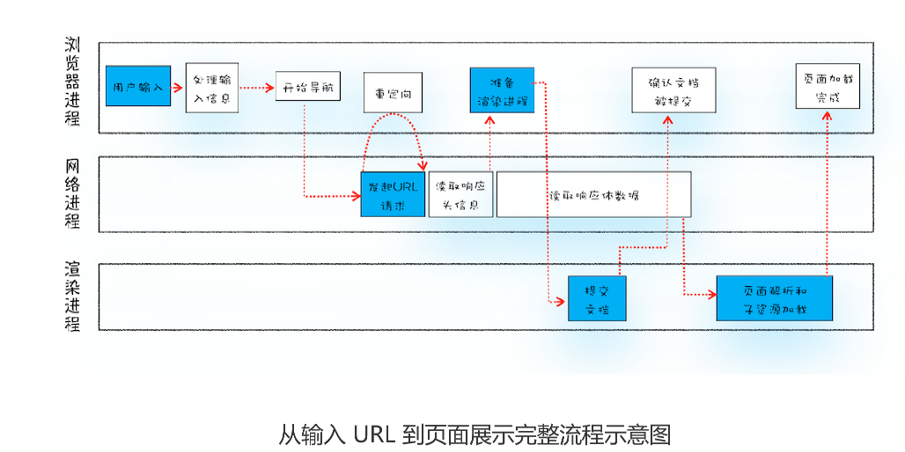
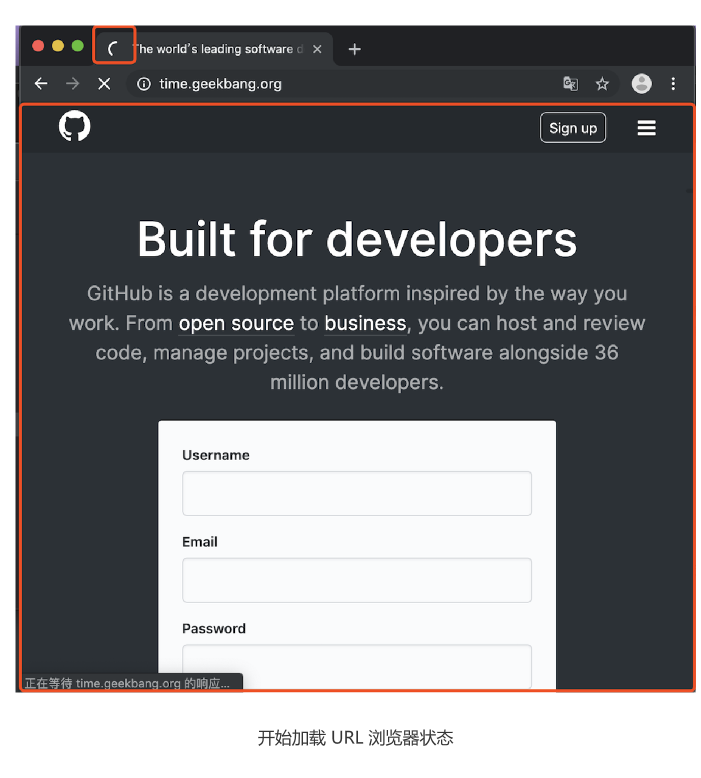

# 04|导航流程：从输入URL到页面展示，中间发送了什么

“在浏览器里，从输入URL到页面展示，这中间发生了什么？”这是一道经典的面试题，能比较全面地考察知识的掌握程度，其中涉及到了网络、操作系统、Web等一系列的知识。

这里重点不是请求过程，而是渲染过程

从图中可以看出，**整个过程需要各个进程之间的配合**，所以我们还是
先快速回顾下浏览器进程、渲染进程和网络进程的主要职责。

- 浏览器进程主要负责用户交互，子进程管理和文件存储等功能。
- 网络进程是面向渲染进程和浏览器进程等提供网络下载功能。
- 渲染进程的主要职责是把从网络下载的HTML、JavaScript、CSS、图片等资源解析
    为可以显示的交互的页面。因为渲染进程所有的内容都是可以通过网络获取，会存在
    一些恶意代码利用浏览器漏洞对系统进行攻击，所以运行在渲染进程里面的代码是
    不被信任的。这也是为什么Chrome会让渲染进程运行在安全沙箱里，就是为了保证
    系统的安全。

大致描述为如下:
- 首先，用户从浏览器进程中**输入请求信息**；
- 然后，网络进程**发起URL进程**；
- 服务器响应URL请求之后，浏览器进程又要开始**准备渲染进程**了；
- 渲染进程准备好之后，需要先向渲染进程提交页面数据，我们称之为**提交文档**阶段
- 渲染进程接收文档信息之后，便开始**解析页面和加载子资源**，完成页面的渲染

这其中，**用户发出URL请求到页面开始解析的这个过程，就叫做导航**。

## 从输入URL到页面展示

### 1.用户输入

当用户在地址栏输入一个查询关键字时，地址栏会判断输入的关键字是**搜索内容**，还是**请求的URL**

如果是搜索内容，地址栏会使用浏览器默认的搜索引擎，来合成的带搜索关键字的URL。
如果判断输入内容符合URL规则，比如输入time.geekbang.org,那么根据地址规则，把这段内容加上协议，合成完整地URL，如https://time.geekbang.org。

当用户输入关键字并键入回车之后，浏览器进入下图的状态

从图中可以看出，当浏览器刚开始加载一个地址之后，标签页上的图标进入加载状态。此时页面
依然是之前打开的页面内容，并没立即替换为极客时间的页面。因为需要等待提交文档内容，页面才会被替换。

### 2.URL请求过程
接下来，便进入了页面资源请求过程。这时，浏览器会通过进程间通信（IPC)把URL请求发送至网络进程，网络进程接收到URL请求后，会在这里发起真的URL请求流程，那具体流程是怎么的呢？
首先，网络进程会查找本地缓存是否缓存该资源。如果有缓存资源，那么直接返回资源给浏览器进程；如果在缓存中没有查到资源，那么直接进入网络请求流程。请求前的第一步进行DNS解析，以获取请求域名的服务器IP地址。如果请求协议是HTTPS，那么还要建立TLS连接。

接下来利用IP地址和服务器建立TCP连接。连接建立之后，浏览器会构建请求行、请求头等信息，并把和该域名相关的Cookie等数据附加到请求头中，然后向服务器发送构建的请求信息。

服务器接收到请求信息后，会根据请求信息生成响应数据（包括响应行、响应头和响应体等），并发给网络进程。等网络进程接收响应行和响应头之后，就开始解析响应头的内容。

1. 重定向
   在接收到服务器返回的响应头后，网络进程开始解析响应头，如果发现返回的状态码是301或者302，那么说明服务器需要重定向到其他URL

