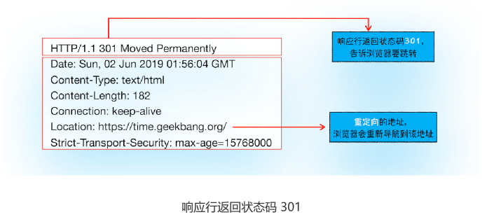

# 04|导航流程：从输入URL到页面展示，中间发送了什么

“在浏览器里，从输入URL到页面展示，这中间发生了什么？”这是一道经典的面试题，能比较全面地考察知识的掌握程度，其中涉及到了网络、操作系统、Web等一系列的知识。


这里重点不是请求过程，而是渲染过程


从图中可以看出，**整个过程需要各个进程之间的配合**，所以我们还是
先快速回顾下浏览器进程、渲染进程和网络进程的主要职责。

- 浏览器进程主要负责用户交互，子进程管理和文件存储等功能。
- 网络进程是面向渲染进程和浏览器进程等提供网络下载功能。
- 渲染进程的主要职责是把从网络下载的HTML、JavaScript、CSS、图片等资源解析
    为可以显示的交互的页面。因为渲染进程所有的内容都是可以通过网络获取，会存在
    一些恶意代码利用浏览器漏洞对系统进行攻击，所以运行在渲染进程里面的代码是
    不被信任的。这也是为什么Chrome会让渲染进程运行在安全沙箱里，就是为了保证
    系统的安全。

大致描述为如下:
- 首先，用户从浏览器进程中**输入请求信息**；
- 然后，网络进程**发起URL进程**；
- 服务器响应URL请求之后，浏览器进程又要开始**准备渲染进程**了；
- 渲染进程准备好之后，需要先向渲染进程提交页面数据，我们称之为**提交文档**阶段
- 渲染进程接收文档信息之后，便开始**解析页面和加载子资源**，完成页面的渲染

这其中，**用户发出URL请求到页面开始解析的这个过程，就叫做导航**。

## 从输入URL到页面展示

### 1.用户输入

当用户在地址栏输入一个查询关键字时，地址栏会判断输入的关键字是**搜索内容**，还是**请求的URL**

如果是搜索内容，地址栏会使用浏览器默认的搜索引擎，来合成的带搜索关键字的URL。
如果判断输入内容符合URL规则，比如输入time.geekbang.org,那么根据地址规则，把这段内容加上协议，合成完整地URL，如https://time.geekbang.org。

当用户输入关键字并键入回车之后，浏览器进入下图的状态

从图中可以看出，当浏览器刚开始加载一个地址之后，标签页上的图标进入加载状态。此时页面
依然是之前打开的页面内容，并没立即替换为极客时间的页面。因为需要等待提交文档内容，页面才会被替换。


### 2.URL请求过程
接下来，便进入了页面资源请求过程。这时，浏览器会通过进程间通信（IPC)把URL请求发送至网络进程，网络进程接收到URL请求后，会在这里发起真的URL请求流程，那具体流程是怎么的呢？
首先，网络进程会查找本地缓存是否缓存该资源。如果有缓存资源，那么直接返回资源给浏览器进程；如果在缓存中没有查到资源，那么直接进入网络请求流程。请求前的第一步进行DNS解析，以获取请求域名的服务器IP地址。如果请求协议是HTTPS，那么还要建立TLS连接。

接下来利用IP地址和服务器建立TCP连接。连接建立之后，浏览器会构建请求行、请求头等信息，并把和该域名相关的Cookie等数据附加到请求头中，然后向服务器发送构建的请求信息。

服务器接收到请求信息后，会根据请求信息生成响应数据（包括响应行、响应头和响应体等），并发给网络进程。等网络进程接收响应行和响应头之后，就开始解析响应头的内容。

1. 重定向
   在接收到服务器返回的响应头后，网络进程开始解析响应头，如果发现返回的状态码是301或者302，那么说明服务器需要重定向到其他URL。这时网络进程会从响应头的Location字段里面重定向的地址，然后再发起新的HTTP或者HTTPS请求，一起又重头开始。

   比如，在终端输入以下命令
   ```cmd
   curl -I http://time.geekbang.org/
   ```


curl -I+URL的命令是接收服务器返回的响应头的信息。执行命令后，我们看到服务器返回响应头的信息如下：


从图中可以看出，极客时间服务器会通过重定向的方式把所有HTTP请求换成HTTPS请求。
也就是说你使用 HTTP 向极客时间服务器请求时，服务器会返回一个包含有 301 或者
302 状态码响应头，并把响应头的 Location 字段中填上 HTTPS 的地址，这就是告诉了浏
览器要重新导航到新的地址上。

HTTPS协议对极客时间发送请求，看看服务器的响应头是什么样子的
```cmd
curl -I https://time.geekbang.org/

```

查看服务器返回信息


好了，以上重定向内容的介绍。**在导航过程中，如果服务器响应行的状态包含301、302这类跳转的信息，浏览器会跳转到新的地址继续导航；如果响应行是200，那么表示浏览器可以继续处理该请求**


2. 响应数据类型处理
   URL请求的数据类型，有时候是一个下载类型，有时候是正常的HTML页面，那么浏览器如何区分它们呢？
答案是**Content-Type是HTTP头中一个非常重要的字段，它告诉浏览器服务器返回的响应体数据是什么类型** 然后浏览器会根据Content-Type的值来决定如何显示响应体的内容。

```cmd
curl -I https://time.geekbang.org/
```

返回信息入下图


Content-type字段的值是text/html

```cmd
curl -I https://res001.geekbang.org/apps/geektime/android/2.3.1/official/geektime_2.3.1
```
请求后返回的响应头如下
！[这是图片](6.png)

从返回的响应头信息来看，其Content-Type的值是application/octet-stream,显示数据是**字节流类型**，通常情况下，浏览器会按照**下载类型**来处理请求
需要注意的是，如果服务器配置 Content-Type 不正确，比如将 text/html 类型配置成
application/octet-stream 类型，那么浏览器可能会曲解文件内容，比如会将一个本来是
用来展示的页面，变成了一个下载文件。
所以，不同 Content-Type 的后续处理流程也截然不同。如果 Content-Type 字段的值被
浏览器判断为**下载类型，那么该请求会被提交给浏览器的下载管理器，同时该 URL 请求的
导航流程就此结束。但如果是HTML，那么浏览器则会继续进行导航流程。**由于 Chrome
的页面渲染是运行在渲染进程中的，所以接下来就需要准备渲染进程了。


3. 准备渲染进程

默认情况下，Chrome会为每个页面分配一个渲染进程，也就是说，每打开一个新的页面就会配套创建一个新的渲染进程。但是，也有一些例如，在某些情况下，浏览器会让多个页面直接运行在同一个渲染进程中。

查看进程


**那什么情况下多个页面会同时运行一个渲染进程中呢？**

**同一个站点**
要解决这个问题，我们就需要先了解下什么是同一站点（same-site）。具体地讲，我们
将“同一站点”定义为根域名（例如，geekbang.org）加上协议（例如，https:// 或者
http://），还包含了该根域名下的所有子域名和不同的端口，比如下面这三个：

```md

https://time.geekbang.org
https://www.geekbang.org
https://www.geekbang.org:8080
```
它们都是属于**同一站点**，因为它们的协议都是HTTPS，而且根域名也都是geekbang.org


Chrome的默认策略是，每个标签对应一个渲染进程。但**如果从一个页面打开了另外一个页面，而新页面和当前页面属于同一站的话，那么新页面会复用父页面的渲染进程。**官方把这个
默认策略加process-per-site-instance


如果打开一个不同的站点会怎么样

从图中任务管理器可以看出：由于极客邦和极客时间的标签页拥有相同的协议和根域名，所
以它们属于同一站点，并运行在同一个渲染进程中；而 infoq.cn 的根域名不同于
geekbang.org，也就是说 InfoQ 和极客邦不属于同一站点，因此它们会运行在两个不同的
渲染进程之中。

总结来说，打开一个新页面采用**渲染进程策略**就是：
通常情况下，打开新的页面都会使用单独的渲染进程；
如果从A页面打开B页面，且A和B都属于**同一站点**，那么B页面复用A页面的渲染进程；荣誉感是其他情况，浏览器进程则会为B创建一个新的渲染进程。

渲染进程准备好之后，还不能立即进入文档解析状态，因为此时的文档数据还在网络进程，没有提交到渲染进程，所以下一步进入提交文档阶段。

4. 提交文档

首先要明确一点，这里的“文档”是指URL请求的响应体数据。

“提交文档”的消息由浏览器进程发出的，渲染进程收到“提交文档”的消息后，会和网络进程建立传输数据的“**管道**”

等文档数据传输完成之后，渲染进程会返回“**确认提交**”的消息给浏览器进程。
浏览器进程在收到“确认提交”的消息后，会**更新浏览器界面状态**，包括安全状态、地址的URL、前进后退的历史状态，并更新web页面。


到这里，一个完整的导航流程就“走”完了，这之后就要进入渲染阶段。


5. 渲染阶段
    一旦文档被提交，渲染进程就开始页面解析和子资源加载，关于这个阶段的完整过。渲染进程会发送一个消息给浏览器进程，浏览器接收到消息后，会停止标签图标上的加载动画。

# 总结
服务器可以根据响应头来控制浏览器的行为，如跳转、网络数据类型判断。
Chrome 默认采用每个标签对应一个渲染进程，但是如果两个页面属于同一站点，那这
两个标签会使用同一个渲染进程。
浏览器的导航过程涵盖了从用户发起请求到提交文档给渲染进程的中间所有阶段。
导航流程很重要，它是网络加载流程和渲染流程之间的一座桥梁，如果你理解了导航流程，
那么你就能完整串起来整个页面显示流程，这对于你理解浏览器的工作原理起到了点睛的作
用。

# 思考，面试说出来？
    1. 用户输入URL，浏览器会根据用户输入的信息判断是搜索还是网址，如果是搜索内容，就将搜索内容+默认搜索引擎合成新的URL；如果用户输入的内容符合URL规则，浏览器就会根据URL协议，在这段内容上加上协议合成合法的URL
2. 用户输入完内容，按下回车键，浏览器导航栏显示loading状态，但是页面还是呈现前一个页面，这是因为新页面的响应数据还没有获得
3. 浏览器进程浏览器构建请求行信息，会通过进程间通信（IPC）将URL请求发送给网络进程
GET /index.html HTTP1.1
4. 网络进程获取到URL，先去本地缓存中查找是否有缓存文件，如果有，拦截请求，直接200返回；否则，进入网络请求过程
5. 网络进程请求DNS返回域名对应的IP和端口号，如果之前DNS数据缓存服务缓存过当前域名信息，就会直接返回缓存信息；否则，发起请求获取根据域名解析出来的IP和端口号，如果没有端口号，http默认80，https默认443。如果是https请求，还需要建立TLS连接。
6. Chrome 有个机制，同一个域名同时最多只能建立 6 个TCP 连接，如果在同一个域名下同时有 10 个请求发生，那么其中 4 个请求会进入排队等待状态，直至进行中的请求完成。如果当前请求数量少于6个，会直接建立TCP连接。
7. TCP三次握手建立连接，http请求加上TCP头部——包括源端口号、目的程序端口号和用于校验数据完整性的序号，向下传输
8. 网络层在数据包上加上IP头部——包括源IP地址和目的IP地址，继续向下传输到底层
9. 底层通过物理网络传输给目的服务器主机
10. 目的服务器主机网络层接收到数据包，解析出IP头部，识别出数据部分，将解开的数据包向上传输到传输层
11. 目的服务器主机传输层获取到数据包，解析出TCP头部，识别端口，将解开的数据包向上传输到应用层
12. 应用层HTTP解析请求头和请求体，如果需要重定向，HTTP直接返回HTTP响应数据的状态code301或者302，同时在请求头的Location字段中附上重定向地址，浏览器会根据code和Location进行重定向操作；如果不是重定向，首先服务器会根据 请求头中的If-None-Match 的值来判断请求的资源是否被更新，如果没有更新，就返回304状态码，相当于告诉浏览器之前的缓存还可以使用，就不返回新数据了；否则，返回新数据，200的状态码，并且如果想要浏览器缓存数据的话，就在相应头中加入字段：
Cache-Control:Max-age=2000
响应数据又顺着应用层——传输层——网络层——网络层——传输层——应用层的顺序返回到网络进程
13. 数据传输完成，TCP四次挥手断开连接。如果，浏览器或者服务器在HTTP头部加上如下信息，TCP就一直保持连接。保持TCP连接可以省下下次需要建立连接的时间，提示资源加载速度
Connection:Keep-Alive 
14. 网络进程将获取到的数据包进行解析，根据响应头中的Content-type来判断响应数据的类型，如果是字节流类型，就将该请求交给下载管理器，该导航流程结束，不再进行；如果是text/html类型，就通知浏览器进程获取到文档准备渲染
15. 浏览器进程获取到通知，根据当前页面B是否是从页面A打开的并且和页面A是否是同一个站点（根域名和协议一样就被认为是同一个站点），如果满足上述条件，就复用之前网页的进程，否则，新创建一个单独的渲染进程
16. 浏览器会发出“提交文档”的消息给渲染进程，渲染进程收到消息后，会和网络进程建立传输数据的“管道”，文档数据传输完成后，渲染进程会返回“确认提交”的消息给浏览器进程
17. 浏览器收到“确认提交”的消息后，会更新浏览器的页面状态，包括了安全状态、地址栏的 URL、前进后退的历史状态，并更新web页面，此时的web页面是空白页
18. 渲染进程对文档进行页面解析和子资源加载，HTML 通过HTM 解析器转成DOM Tree（二叉树类似结构的东西），CSS按照CSS 规则和CSS解释器转成CSSOM TREE，两个tree结合，形成render tree（不包含HTML的具体元素和元素要画的具体位置），通过Layout可以计算出每个元素具体的宽高颜色位置，结合起来，开始绘制，最后显示在屏幕中新页面显示出来