# 05|HTML、CSS和JavaScript，是如何变成页面的？

导航相关的流程，那导航被提交又会怎么样呢？进入渲染阶段，这个阶段很重要，了解其相关的流程能让你“看透”页面如何工作，有这些知识，可以解决一系列相关的问题，比如能熟练使用开发者工具，因为能理解开发者工具里面大部分项目的含义，能优化页面卡顿问题，使用JavaScript优化动画流程，通过优化样式表来防止强制同步布局，等等。

**渲染流程**

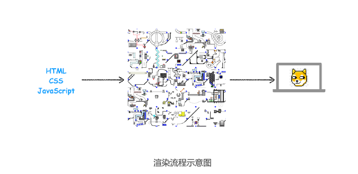

从图中可以看出，左边输入的是 HTML、CSS、JavaScript 数据，这些数据经过中间渲染
模块的处理，最终输出为屏幕上的像素。
这中间的渲染模块就是我们今天要讨论的主题。为了能更好地理解下文，你可以先结合下图
快速抓住 HTML、CSS 和 JavaScript 的含义

快速抓住HTML、CSS和JavaScript的含义

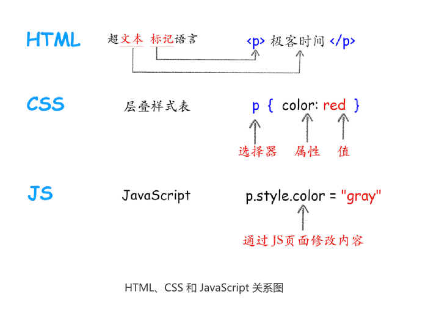


从上图可以看出，HTML 的内容是由标记和文本组成。标记也称为标签，每个标签都有它
自己的语意，浏览器会根据标签的语意来正确展示 HTML 内容。比如上面的<p>标签是告
诉浏览器在这里的内容需要创建一个新段落，中间的文本就是段落中需要显示的内容。

如果需要改变 HTML 的字体颜色、大小等信息，就需要用到 CSS。CSS 又称为层叠样式
表，是由选择器和属性组成，比如图中的 p 选择器，它会把 HTML 里面<p>标签的内容选
择出来，然后再把选择器的属性值应用到<p>标签内容上。选择器里面有个 color 属性，它
的值是 red，这是告诉渲染引擎把<p>标签的内容显示为红色。

至于JavaScript（简称为 JS），使用它可以使网页的内容“动”起来，比如上图中，可以
通过 JavaScript 来修改 CSS 样式值，从而达到修改文本颜色的目的。
搞清楚 HTML、CSS 和 JavaScript 的含义后，那么接下来我们就正式开始分析渲染模块
了。
由于渲染机制过于复杂，所以渲染模块在执行过程中会被划分为很多子阶段，输入的
HTML 经过这些子阶段，最后输出像素。我们把这样的一个处理流程叫做渲染流水线，其
大致流程如下图所示：


渲染流水线
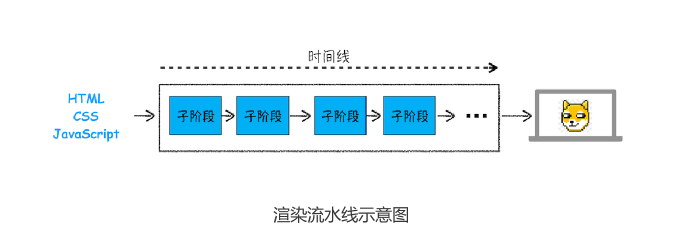
重点关注以下三点内容:
- 开始每个子阶段都有其**输入的内容**
- 然后每个阶段有其**处理过程**
- 最终每个子阶段会生成**输出内容**

## 构建DOM树

为什么要构建DOM树呢？**这是因为浏览器无法直接理解和使用HTML，所以需要将HTML转化为浏览器能够理解的结构——DOM树**

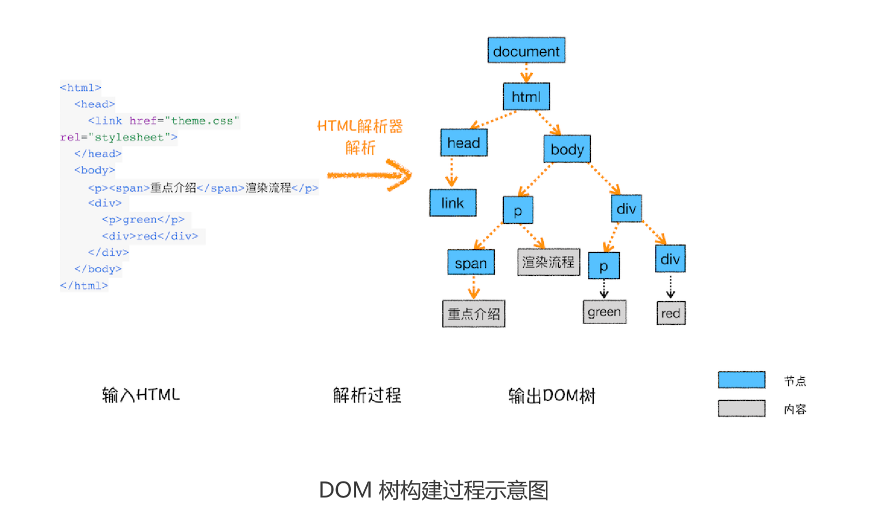

构建DOM树的**输入内容**是一个非常简单的HTML文件，然后经由HTML解析，最终输出树桩结构的DOM。

在console.输入document就能获得dom树
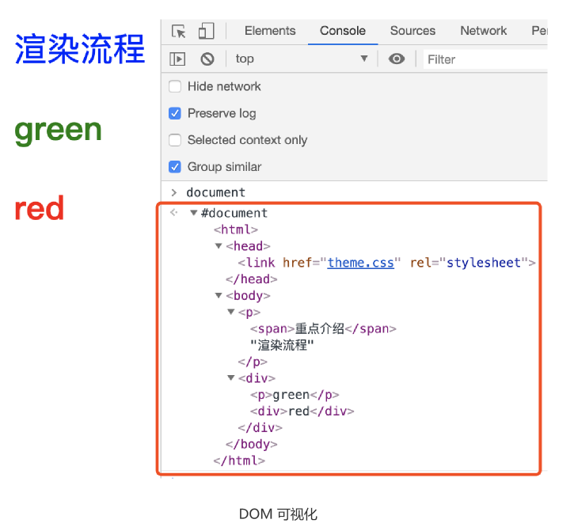


## 样式计算(Recalculate Style)

样式计算的目的为了计算出DOM节点每个元素的具体样式，这阶段可分为三步

### 1.把CSS转换为浏览器能够理解的结构

那CSS样式的来源主要有哪些呢？
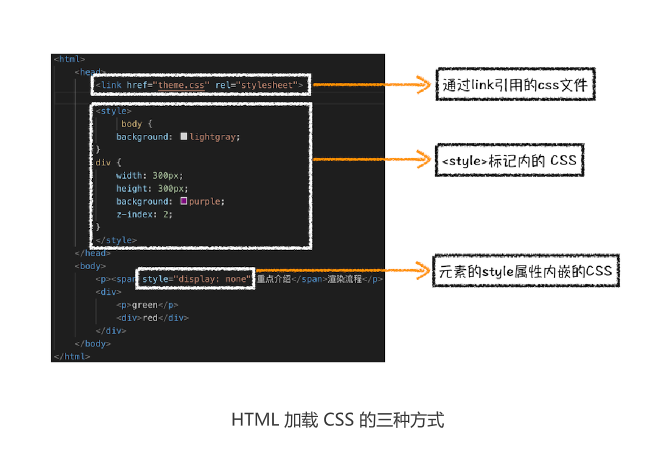

- 通过link引用的外部css文件
- <style>标记内的CSS
- 元素的style属性内嵌的css
  
  和HTML文件一样，浏览器也无法直接理解这些纯文本的CSS样式，所以**渲染引擎接收到CSS文本时，会执行一个转化操作，将CSS文本转换位浏览器可以理解的结构styleSheets**


  为了加深理解，可以在Chrome控制台查看其结构，只需要在控制台输入document.styleSheets,然后就能看到如下图所示结构

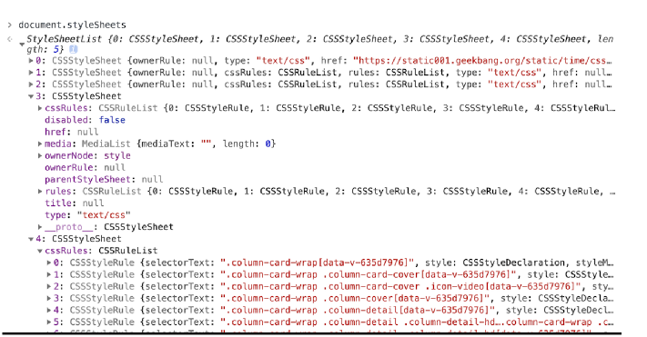
从图中可以看出，这个样式表包含了很多种样式，已经把那三种来源的样式都包含进去了。
当然样式表的具体结构不是我们今天讨论的重点，你只需要知道渲染引擎会把获取到的
CSS 文本全部转换为 styleSheets 结构中的数据，并且该结构同时具备了查询和修改功
能，这会为后面的样式操作提供基础。


### 2.转换样式表中的属性值，使其标准化

现在把现有CSS文本转化为浏览器可以理解的结构，那么**接下来就要对其进行属性的标准化操作**
```css
body{font-size:2em}
p{color:bule}
span{dislay:none}
div p{ color:green}
div{color:red}

```

CSS文本很多属性值，如2em、blue、bold，这些类型数值不容易被渲染引擎理解，所以**需要将所有值转换为渲染引擎容易理解的、标准化的计算值**，这个过程就是属性值标准化。

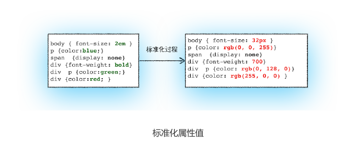


从图中可以看到，2em 被解析成了 32px，red 被解析成了 rgb(255,0,0)，bold 被解析成
了 700……


### 3.计算出DOM树中每个节点的具体样式
现在样式的属性已被标准化了，接下来就需要计算 DOM 树中每个节点的样式属性了，如
何计算呢？

**这就涉及到CSS的继承规则和层叠规则了**

首先是Css继承。**Css继承就是每个DOM节点都包含有父节点的样式**，这么说有点抽象，我们可以结合具体例子。
看下面这样一张样式表样式表如何应用到DOM节点上的。

```css
body{font-size:20px}
p{color:blue};
span{display:none}
div{font-weight:bold;color:red}
div p{color:green}
```

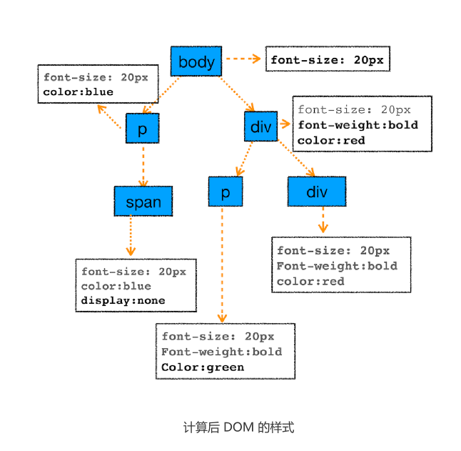

为了加深CSS继承的理解，可以打开Chrome的"开发者工具"，选择第一个
“element”标签，再选择“style”子标签，你会看到如下界面

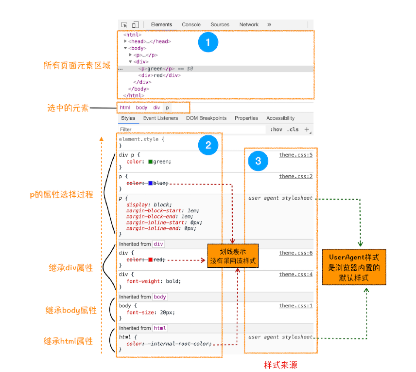

这个界面展示的信息很丰富，大致可描述为如下。
首先，可以选择要查看的元素的样式（位于图中的区域 2 中），在图中的第 1 个区域中
点击对应的元素元素，就可以了下面的区域查看该元素的样式了。比如这里我们选择的元
素是<p>标签，位于 html.body.div. 这个路径下面。
其次，可以从样式来源（位于图中的区域 3 中）中查看样式的具体来源信息，看看是来
源于样式文件，还是来源于 UserAgent 样式表。这里需要特别提下 UserAgent 样式，
它是浏览器提供的一组默认样式，如果你不提供任何样式，默认使用的就是 UserAgent
样式。
最后，可以通过区域 2 和区域 3 来查看样式继承的具体过程。
以上就是 CSS 继承的一些特性，样式计算过程中，会根据 DOM 节点的继承关系来合理计
算节点样式。

样式计算过程中第二个规则是样式层叠。**层叠是CSS的一个基本特征，它是一个定义为如何合并多个源的属性值的算法。它在Css处于核心地位，Css的全称“层叠样式”**


总之，样式计算阶段的目的是为了计算出 DOM 节点中每个元素的具体样式，在计算过程
中需要遵守 CSS 的继承和层叠两个规则。这个阶段最终输出的内容是每个 DOM 节点的样
式，并被保存在 ComputedStyle 的结构内。
如果你想了解每个 DOM 元素最终的计算样式，可以打开 Chrome 的“开发者工具”，选
择第一个“element”标签，然后再选择“Computed”子标签，如下图所示：

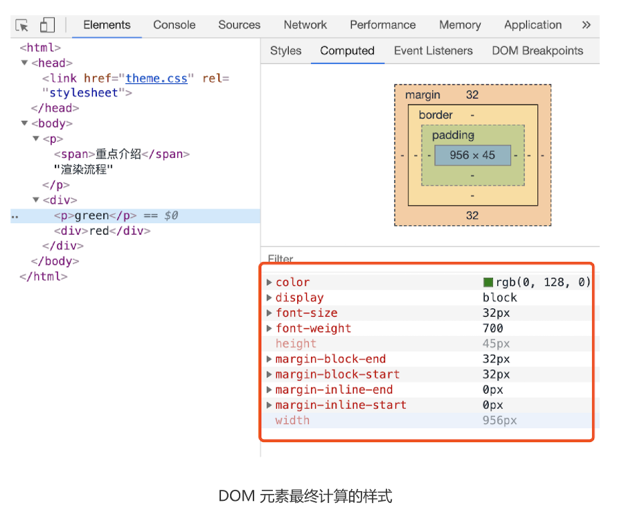


## 布局阶段


有DOM树和DOM树中元素的样式，但这还不族显示页面，因为不知道DOM元素的几何位置信息。**那么接下来需要计算出DOM树中可见元素的几何位置，我们把这个计算过程叫做布局。**

### 1.创建布局树
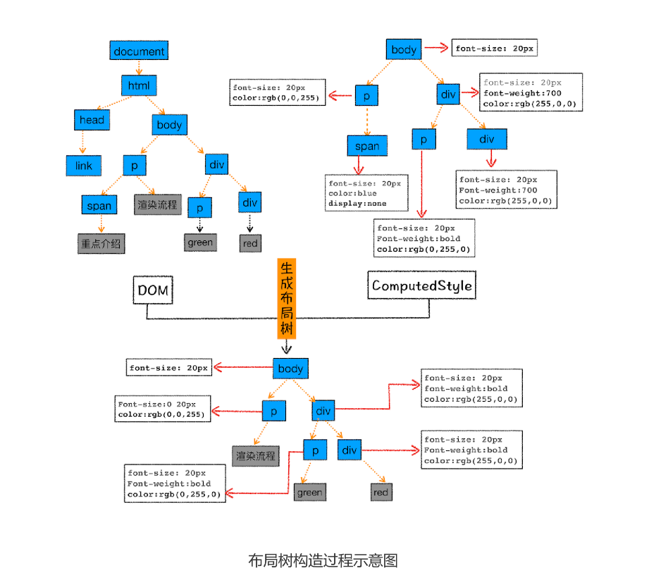
为了构建布局树，浏览器大体上完成了下面这些工作：

遍历 DOM 树中的所有可见节点，并把这些节点加到布局中；

而不可见的节点会被布局树忽略掉，如 head 标签下面的全部内容，再比如

body.p.span 这个元素，因为它的属性包含 dispaly:none，所以这个元素也没有被包进
布局树。

### 2.布局计算

现在我们有了一棵完整的布局树。那么接下来，就要计算布局树节点的坐标位置了。布局的
计算过程非常复杂，我们这里先跳过不讲，等到后面章节中我再做详细的介绍。
在执行布局操作的时候，会把布局运算的结果重新写回布局树中，所以布局树既是输入内容
也是输出内容，这是布局阶段一个不合理的地方，因为在布局阶段并没有清晰地将输入内容
和输出内容区分开来。针对这个问题，Chrome 团队正在重构布局代码，下一代布局系统
叫 LayoutNG，试图更清晰地分离输入和输出，从而让新设计的布局算法更加简单。


## 总结

浏览器不能直接理解 HTML 数据，所以第一步需要将其转换为浏览器能够理解的 DOM
树结构；

生成 DOM 树后，还需要根据 CSS 样式表，来计算出 DOM 树所有节点的样式；

最后计算 DOM 元素的布局信息，使其都保存在布局树中。