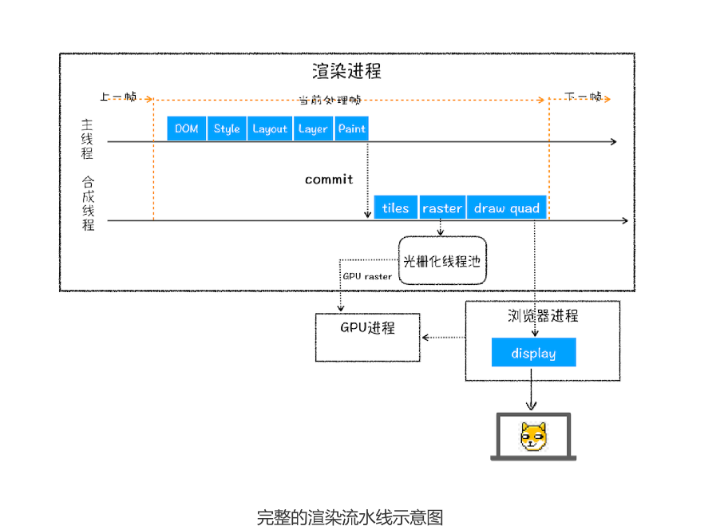

# 06 | 渲染流程（下）：HTML、CSS和JavaScript，是如何变成页面的？

这里还是先简单回顾下上节前三个阶段的主要内容：在 HTML 页面内容被提交给渲染引擎
之后，渲染引擎首先将 HTML 解析为浏览器可以理解的 DOM；然后根据 CSS 样式表，计
算出 DOM 树所有节点的样式；接着又计算每个元素的几何坐标位置，并将这些信息保存
在布局树中。


## 分层


因为页面中很多复杂的效果，如一些复杂的3D变化、页面滚动，或者使用z-indexing做z轴排序等，为了更加方便实现这些效果，**渲染引擎还需要为特定的节点生成专用的图层，并生成一棵对应的图层树**。如果熟悉PS，相信会容易理解图层的概念，正是这些图层叠加在一起构成了最终的页面图像。

并不是所有节点都有单独的图层，需要满足下面两个条件之一就行：

1. 拥有层叠下上文属性的元素会被提升为单独的一层：
   
页面是个二维平面，但是层叠上下文能够让 HTML 元素具有三维概念，这些 HTML 元素按
照自身属性的优先级分布在垂直于这个二维平面的 z 轴上。你可以结合下图来直观感受
下：


2. 需要裁剪(clip)的地方也会创建为图层

```html
<style>
 div {
 } 
</style>
<body>
 <div >
 <p> 所以元素有了层叠上下文的属性或者需要被剪裁，那么就会被提升成为单独一层，你可以参看下
 <p> 从上图我们可以看到，document 层上有 A 和 B 层，而 B 层之上又有两个图层。这些图层组
 <p> 图层树是基于布局树来创建的，为了找出哪些元素需要在哪些层中，渲染引擎会遍历布局树来创
 </div>
</body>

```

在这里我们把 div 的大小限定为 200 * 200 像素，而 div 里面的文字内容比较多，文字所
显示的区域肯定会超出 200 * 200 的面积，这时候就产生了剪裁，渲染引擎会把裁剪文字
内容的一部分用于显示在 div 区域，下图是运行时的执行结果：


## 图层绘制

看渲染引擎是怎么实现图层绘制的？

试想一下，如果给你一张纸，让你先把纸的背景涂成蓝色，然后在中间位置画一个红色的
圆，最后再在圆上画个绿色三角形。你会怎么操作呢？

通常，你会把你的绘制操作分解为三步：
1. 绘制蓝色背景；
2. 在中间绘制一个红色的圆；
3. 再在圆上绘制绿色三角形。


渲染引擎实现图层的绘制与之类似，会把一个图层的绘制拆分成很多小的绘制指令，然后再
把这些指令按照顺序组成一个待绘制列表，如下图所示：


从图中可以看出，绘制列表中的指令其实非常简单，就是让其执行一个简单的绘制操作，比
如绘制粉色矩形或者黑色的线等。而绘制一个元素通常需要好几条绘制指令，因为每个元素
的背景、前景、边框都需要单独的指令去绘制。所以在图层绘制阶段，输出的内容就是这些
待绘制列表。

在该图中，区域 1 就是 document 的绘制列表，拖动区域 2 中的进度条可以重现列表的绘制过程。

## 栅格化(raster)操作
绘制列表只是用来记录绘制顺序和绘制指令的列表，而实际上绘制操作是由渲染引擎中的合
成线程来完成的。你可以结合下图来看下渲染主线程和合成线程之间的关系：


上图所示，当图层的绘制列表准备好之后，主线程会把该绘制列表提交（commit）给合
成线程，那么接下来合成线程是怎么工作的呢？
那我们得先来看看什么是视口，你可以参看下图：


通常一个页面可能很大，但是用户只能看到其中一部分，我们把用户可以看到这个部分
叫做**视口(viewport)**

有些情况下，有的图层可以很大，比如有的页面你使用滚动条要滚动好久才能滚动到底
部，但是通过视口，用户只能看到页面的很小一部分，所以在这种情况下，要绘制出所有图
层内容的话，就会产生太大的开销，而且也没有必要。

基于这个原因，合成线程会将图层划分为图块（tile），这些图块的大小通常是 256x256
或者 512x512，如下图所示：


**所谓lange化,是指将图块转化为位图。**而图块是栅格化来执行的最小单位。渲染进程维护了一个栅格化的线程池，所有的图块栅格化都在线程池内。


从图中可以看出，渲染进程把生成图块的指令发送给 GPU，然后在 GPU 中执行生成图块
的位图，并保存在 GPU 的内存中。
## 合成显示

浏览器进程里面有一个叫 viz 的组件，用来接收合成线程发过来的 DrawQuad 命令，然后
根据 DrawQuad 命令，将其页面内容绘制到内存中，最后再将内存显示在屏幕上。


# 渲染流水线大总结
我们现在已经分析完整个渲染流程，从HTML到DOM、样式计算、布局、图层、绘制、栅格化、合成和显示。


一个渲染流程大致总结为：
1. 渲染进程将HTML内容转化为能读懂**DOM树**结构
2. 渲染引擎将CSS样式表转化为浏览器可以理解**styleSheets**，计算出DOM节点的样式
3. 创建**布局树**，并计算元素的布局信息
4. 对布局树进行分层，并生产**分层树**
5. 为每个图层生成**绘制列表**，并提交到合成线程。
6. 合成线程将图层分成**图块**，并在**光栅化线程池**中将图块转换成位图。
7. 合成线程发送绘制图块命令**DrawQuad**给浏览器进程。
8. 浏览器进程根据 DrawQuad 消息**生成页面**，并显示到显示器上。


# 相关概念
我们再来看看三个和渲染流水线相关的概念——**“重排”****“重绘”和“合成”**。理解了这三个概念对于你后续 Web 的性能优化会有很大帮助

## 1.更新元素的几何属性（重排）


触发style后面的流程

从上图可以看出，如果通过JavaScript或者CSS修改元素的几何位置属性，例如改变元素宽度、高度等，那么浏览器会触发重新布局，解析之后的一系列子阶段，这个过程叫**重排**。无疑，**重排需要更新完整的渲染流水线，所以开销也是最大**


## 2.更新元素的绘制属性(重绘)


触发layout后面的流程

如果修改了元素的背景颜色，那么布局阶段不会执行，因为并没有引起几何位置的变化，所以就直接进入绘制阶段，然后执行之后的一系列子阶段，然后执行之后的一系列子阶段，这个就叫**重绘**。相较于重排操作，**重绘省去布局和分层阶段，所以执行效率和重排操作要高些**

## 3.直接合成阶段

更改一个既不要布局也不要绘制的属性，会发生什么变化呢？渲染引擎将跳过布局和绘制，
只执行后续的合成操作，我们把这个过程**合成**


避开重排和重绘


使用CSS的transform来实现动画效果，就能避开重排和重绘阶段，直接在非主线程上执行合成动画操作。这样的效率最高的,因为是在非主线程上合成，并没有占用主线程的资源，另外也避开了布局和绘制两个子阶段，所以**相对于重绘和重排，合成能大大提升绘制效率**

# 总结

通过本文的分析，应该可以看到，Chrome的渲染流水线还是相当复杂晦涩，且难以理解，不过Chrome团队不断添加新功能的同时，也在不断地重构一些子阶段，目的就是**让整体渲染架构变得更加简单和高效**，所谓大道至简。

无论做架构设计、产品设计，还是具体到代码的实现，能把复杂问题简单化都是具有大智慧。练就抓住问题本质的能力