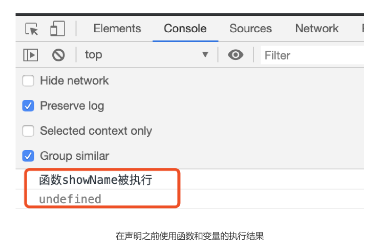
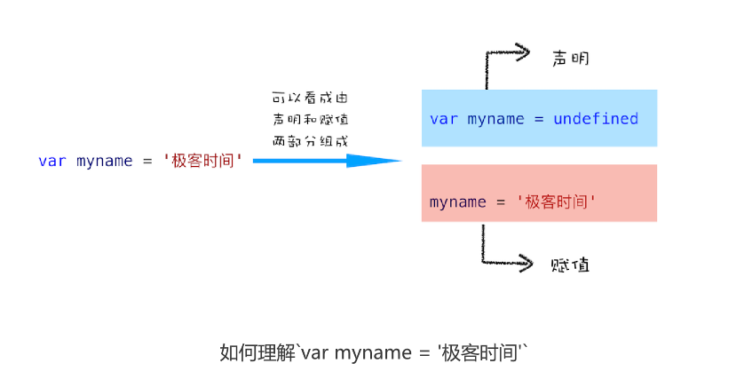
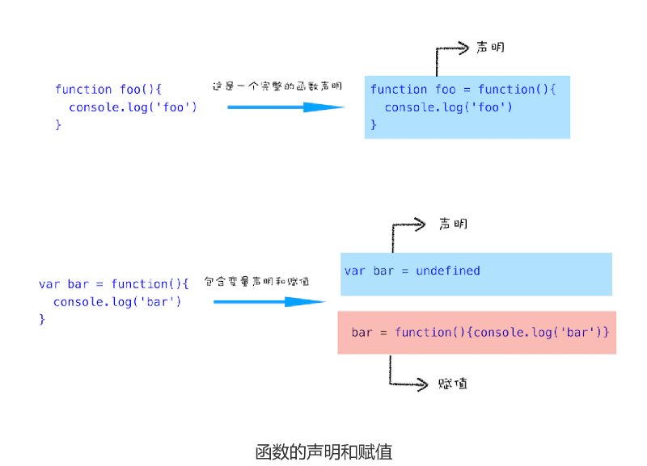
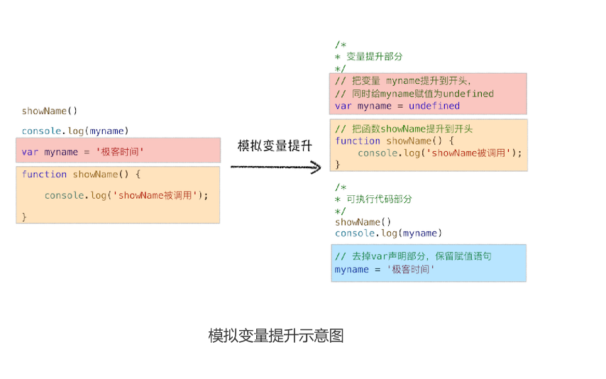
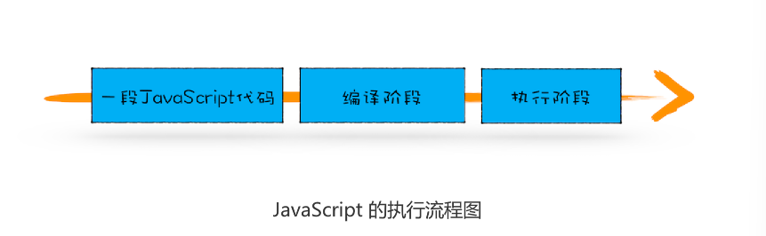
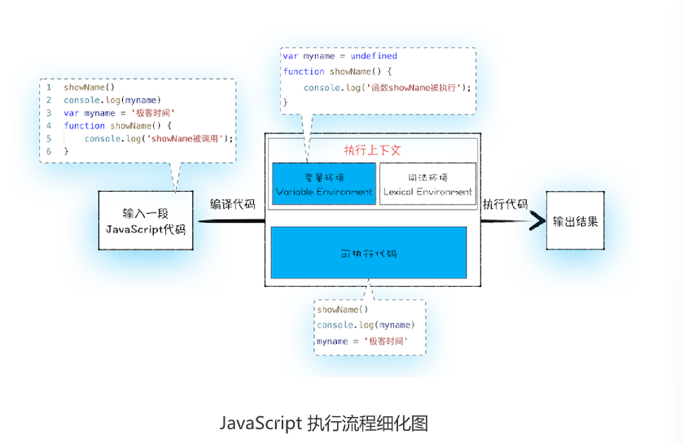

# 07|变量提升:JavaScript代码是按顺序执行的吗？

主要讲解**执行上下文**相关的内容，那为什么先讲执行上下文呢？它那么重要吗？
可以这么说，**只有理解了JavaScript的执行上下文，才能更好地理解JavaScript语言本身**，比如变量提升、作用域和闭包等

先看段代码
```js
showName()
console.log(myname)
var myname=‘极客时间’
function showName(){
    console.log('函数showName被执行')
}
```
实际执行结果


1. 在执行过程中，若使用了未声明的变量，那么 JavaScript 执行会报错。
2. 在一个变量定义之前使用它，不会出错，但是该变量的值会为 undefined，而不是定义
时的值。
3. 在一个函数定义之前使用它，不会出错，且函数能正确执行。


上面的执行结果，提前使用的
showName 函数能打印出来完整结果，但是提前使用的 myname 变量值却是
undefined，而不是定义时使用的“极客时间”这个值。

## 变量提升(Hoisting)

需要了解下什么是变量提升

在介绍变量提升之前，来看看什么是JavaScript中的**声明和赋值**

### 变量声明


```js
var myname="极客时间"

```

这段代码可以把它看成是两行代码组成

```js
var myname //声明部分
myname=‘极客时间’//赋值部分
```



再来看看**函数**的声明和赋值
```js
function foo(){
    console.log('foo')
}

var bar=function(){
    console.log('bar')
}
```

上面**变量**的声明和赋值，那接下来看看**函数**的声明和赋值

```js
function foo(){
    console.log('foo')
}
var bar=fuunction(){
    console.log('bar')
}

```
第一个函数foo是一个完整的函数声明，也就是没有涉及到赋值操作；第二个函数是最先
声明变量bar，再把function(){console.log('bar')}赋值给bar。
对了一个步骤赋值




**所谓的变量提升，是指在JavaScript代码执行过程中，JavaScript引擎把变量的声明部分和**
**函数的声明部分提升到代码开头的“行为”.变量被提升后，会给变量设置默认值，这个默认值就是熟悉的undefined。**

```js
/**
 * 变量提升部分
*/
//同时给myname赋值为undefined
var myname=undefined
//把函数 showName提升到开头

function showName(){
    console.log('showName被调用了')
}

/**
 * 可执行代码部分
*/
showName()
console.log(myname)
//去掉var声明部分，保留赋值语句
myname='极客时间’
```

为了模拟变量提升的效果，我们对代码做以下调整，如图：


从图中可以看出，对原来的代码做了两处调整

- 第一处是把声明的部分都提升到代码开头，如变量myname和函数showName，并设置变量的默认值
  undefined

- 第二处是移除原本声明的函数和声明，如var myname=“极客时间”的语句，移除了var声明，整个移除showName的函数声明
  

  通过这两步，就可以实现变量提升的效果。

  得出一个结论**函数和变量在执行之前都提升到代码开头**。


  ## JavaScrip 代码的执行流程

  “变量提升”意味着变量和函数的声明会在物理层面移动到代码的最前面
  **实际上变量和函数声明在代码里位置是不会改变的，而且是在编译阶段被JavaScript引擎放入引擎放入内存中。**

  一段代码JavaScript代码在执行之前需要被JavaScript引擎编译，**编译**完成之后，才会进入**执行**阶段。





### 1.编译阶段

那么编译阶段和变量提升存在什么关系呢？

**第一部分：变量提升部分的代码**

```js
var myname=undefined
function showName(){
    console.log('函数showName被执行')
}
```
**第二部分：执行部分的代码**

```js
showName()
console.log(myname)
myname='极客时间’
```
就可以把JavaScript的执行流程细化



输入一段代码，经过编译后，会生成两部分代码:**执行上下文(Execution context)和可执行代码**
**执行上下文是JavaScript执行一段代码时的运行环境**，比如调用一个函数，就会进入这个函数的执行上下文，确定该函数在执行期间用到诸如this、变量、对象以及函数等。

在执行上下文中存在一个**变量环境的对象（Viriable Environment）**，该对象中保存了变量提升的内容，比如上面代码中变量myname和函数showName,都保存在该对象中。

```js
VariableEnvironment:
 myname -> undefined, 
 showName ->function : {console.log(myname)

```

了解完变量环境对象的结构后，接下来，我们再结合下面这段代码来分析如何生成变量环境对象的。

```js
showname()
console.log(myname)
var myname='极客时间'
function showName(){
    console.log('函数 showName 被执行')
}
```

可以一行一行分析上述代码：
- 第1行和第2行，由于这两行代码不是声明操作，所以JavaScript引擎不会做任何处理；
- 第3行，由于这行经过var声明，因此JavaScript引擎将在**变量环境对象**中创建myname的属性，并使用undefined对其初始化
- 第4行，JavaScript引擎发现一个通过function定义函数，所以它将函数定义存储在堆(HEAP)中，并在**环境对象**中创建一个showName属性，然后将该属性值指向堆中函数位置。

这样就生成了变量环境对象。接下来JavaScript引擎会把声明以外的代码编译成字节码

```js
showName()
console.log(myname)
myname='极客时间'
```

好了，现在有了执行上下文和可执行代码了，那么接下来就到了执行阶段了。


### 2.执行阶段

JavaScript引擎开始执行"可执行代码"，按照顺序一行一行地执行下去。下面我们就来一行一行分析这个执行过程：
```js
showName()
console.log(myname)
myname='极客时间'
```

当执行到showName函数时，JavaScript引擎便开始在变量环境对象中查找该函数，由于变量环境对象中
存在该函数的引用，所有JavaScript引擎开始执行该函数，并输出“函数showName被执行”结果

接下来打印“myname”信息，JavaScript引擎继续在变量环境对象中查找该对象，由于变量环境存在myname变量，并且其值为undefined，所以这时候输出undefined

接下来执行第3行，把“极客时间”赋给myname变量，赋值后变量环境中myname属性值“极客时间”，变量环境如下所示

```js
VariableEnvironment:
    myname->"极客时间"，
    showName->function：{console.log(myname)}

```

实际上，编译阶段和执行阶段都是非常复杂的，包括词法分析、语法解析、代码优化、代码生成。


## 代码中出现相同的变量或者函数怎么办？

```js
function showName(){
    console.log('极客邦')
}

showName()

function showName(){
    console.log("极客时间")
}

showName()
```

在上面代码中，我们先定义了一个 showName 的函数，该函数打印出来“极客邦”；然后
调用 showName，并定义了一个 showName 函数，这个 showName 函数打印出来的
是“极客时间”；最后接着继续调用 showName。那么你能分析出来这两次调用打印出来
的值是什么吗？


分析其完整执行流程:
- **首先是编译阶段。**遇到第一个showName函数，会将函数体存放到变量环境中。接下来第二个  
  showName函数，继续存放至变量环境中，但是变量环境中已经存放一个showName函数，此时**第二**
  **showName函数会将第一个showName函数覆盖掉**这样变量环境中就存在第二个showName函数。

- **接下来是执行阶段。**先执行第一个showName函数，但由于从变量环境中查找showName函数，而变 
  量环境只保存第二个showName函数，所以最终调用的是第二个函数，打印的内容是“极客时间”。第二次执行showName函数也是走同样的流程，所以输出的结果也是“极客时间。” 

综上所述，**一段代码如果定义两个相同名字的函数，那么最终生效是最后一个函数。**


## 总结

  - JavaScript代码执行过程中，需要先做**变量提升**，而之所以需要实现变量提升，是因为      JavaScript代码在执行之前需要先**编译**
  - 在**编译阶段**，变量和函数会被存放在**变量环境**中，变量的默认值会被设置为undefined；在代码**执行阶段**，JavaScript引擎会从变量环境中去查找自定义的变量和函数。
  - 如果在编译阶段，存在相同的函数，那么最终存放在变量环境中是最后定义的那个，这是因为后定义会覆盖之前定义的。

主要目的让清除JavaScript的执行机制：**先编译，再执行。**

## 思考时间

```js
showName()

var showName=function(){
    console.log(2)
}
function showName(){
    console.log(1)
}
```

打印：1

作者回复: 对 是这样的，下面是关于同名变量和函数的两点处理原则：
1:如果是同名的函数，JavaScript编译阶段会选择最后声明的那个。
2:如果变量和函数同名，那么在编译阶段，变量的声明会被忽略。

这种情况下，当解析到JavaScript的时候，会先暂停DOM解析，并下载foo.js文件，下载完成之后
执行该段JS文件，然后再继续往下解析DOM。这就是JavaScript文件为什么会阻塞DOM渲染