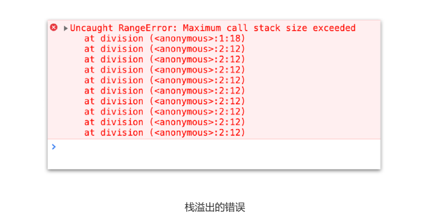
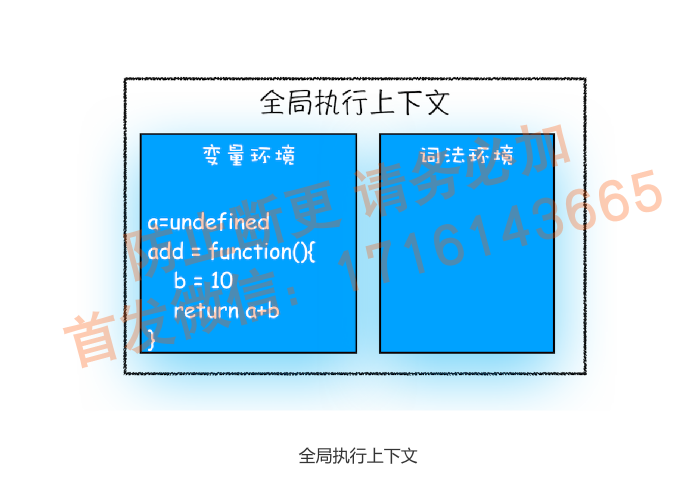
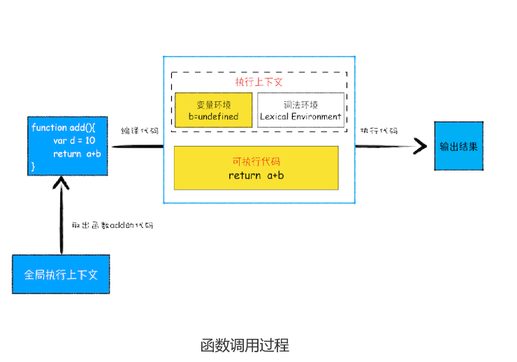

# 08|调用栈:为什么JavaScript代码会出现栈溢出？

哪些情况下代码才算是"一段“代码，才会在执行之前进行编译并创建执行上下文，一般说，有这三种情况：

1. 当JavaScript执行全局代码的时候，会编译全局代码并创建全局执行上下文，而且在整个页面的生存周期内，全局执行上下文只有一份。
2. 当调用一个函数的时候，函数体内的代码会被编译，并创建函数执行上下文，一般情况下，函数执行结束之后，创建的函数执行上下文会被销毁。
3. 当使用eval函数的时候，eval的代码也会被编译，并创建执行上下文
   
又进一步理解执行上下文，那本节我们就在这基础之上继续深入，聊聊**调用栈**。学习调用栈至少三点好处:
1. 可以帮助了解JavaScript引擎背后的工作原理；
2. 让你有调试JavaScript代码的能力
3. 调用栈面试




这就涉及到**调用栈**的内容。你应该知道JavaScript中很多函数，经常会出现一个函数调用另外一个函数的情况，**调用栈就是管理函数调用关系的一种数据结构。**因此要讲清楚调用栈，还要弄明白**函数调用**和**栈结构**。

## 什么是函数调用

函数调用就是运行一个函数，具体使用方式使用函数名称跟着一对小括号。

```js
var a=2
function add(){
    var b=10
    return a+b
}

add()

```
先是创建一个add函数，接着在代码的最下面又调用该函数

执行到add()之前，JavaScript引擎为上面代码创建全局执行上下文，包含声明的函数和变量


从图中可以看出，代码中全局变量和函数都保存在全局上下文的变量环境中
执行上下文准备好了之后，便开始执行全局代码，当执行到add这儿是，JavaScript判断这是一个函数调用，那么执行以下操作:

首先，从**全局执行上下文**，取出add函数代码
其次，对add函数的这段代码进行编译，并创造**该函数的执行上下文**和**可执行代码**。
最后，执行代码，输出结果。


当执行到add函数的时候，我们就有两个执行上下文了——全局执行上下文和add函数的执行上下文

在执行JavaScript时，可能会存在多个执行上下文，那么JavaScript引擎如何管理这些执行上下文？

答案是**通过一种叫栈的数据结构来管理。**那什么是栈呢?它又是如何管理这些执行上下文呢？


## 什么是栈

## 什么是JavaScript的调用栈

JavaScript引擎正是利用栈这种结构来管理执行上下文。执行上下文创建后，JavaScript引擎会将执行上下文压入栈中，通常这种用来管理执行上下文的栈称为**执行上下栈**，又称**调用栈**