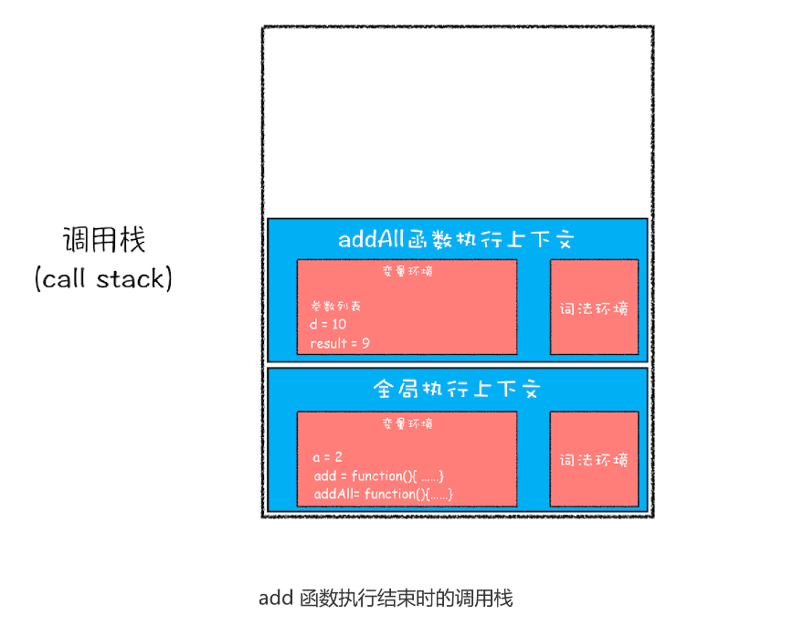

# 08|调用栈:为什么JavaScript代码会出现栈溢出？

哪些情况下代码才算是"一段“代码，才会在执行之前进行编译并创建执行上下文，一般说，有这三种情况：

1. 当JavaScript执行全局代码的时候，会编译全局代码并创建全局执行上下文，而且在整个页面的生存周期内，全局执行上下文只有一份。
2. 当调用一个函数的时候，函数体内的代码会被编译，并创建函数执行上下文，一般情况下，函数执行结束之后，创建的函数执行上下文会被销毁。
3. 当使用eval函数的时候，eval的代码也会被编译，并创建执行上下文
   
又进一步理解执行上下文，那本节我们就在这基础之上继续深入，聊聊**调用栈**。学习调用栈至少三点好处:
1. 可以帮助了解JavaScript引擎背后的工作原理；
2. 让你有调试JavaScript代码的能力
3. 调用栈面试


这就涉及到**调用栈**的内容。你应该知道JavaScript中很多函数，经常会出现一个函数调用另外一个函数的情况，**调用栈就是管理函数调用关系的一种数据结构。**因此要讲清楚调用栈，还要弄明白**函数调用**和**栈结构**。

## 什么是函数调用

函数调用就是运行一个函数，具体使用方式使用函数名称跟着一对小括号。

```js
var a=2
function add(){
    var b=10
    return a+b
}

add()

```
先是创建一个add函数，接着在代码的最下面又调用该函数

执行到add()之前，JavaScript引擎为上面代码创建全局执行上下文，包含声明的函数和变量


从图中可以看出，代码中全局变量和函数都保存在全局上下文的变量环境中
执行上下文准备好了之后，便开始执行全局代码，当执行到add这儿是，JavaScript判断这是一个函数调用，那么执行以下操作:

首先，从**全局执行上下文**，取出add函数代码
其次，对add函数的这段代码进行编译，并创造**该函数的执行上下文**和**可执行代码**。
最后，执行代码，输出结果。


当执行到add函数的时候，我们就有两个执行上下文了——全局执行上下文和add函数的执行上下文

在执行JavaScript时，可能会存在多个执行上下文，那么JavaScript引擎如何管理这些执行上下文？

答案是**通过一种叫栈的数据结构来管理。**那什么是栈呢?它又是如何管理这些执行上下文呢？


## 什么是栈

## 什么是JavaScript的调用栈

JavaScript引擎正是利用栈这种结构来管理执行上下文。执行上下文创建后，JavaScript引擎会将执行上下文压入栈中，通常这种用来管理执行上下文的栈称为**执行上下栈**，又称**调用栈**

```js
var  a=2
function add(b,c){
    return b+c
}

function addAll(b,c){
    var d=10
    result=add(b,c)
    return a+result+d
}
addAll(3,6)
```

可以看到它是在addAll函数调用add函数，那在整个代码的代码过程中，调用栈是怎么变化呢？

1. 第一步，创建全局上下文，并将其压入栈底，如图所示:
   
   
从图中，变量a、函数add和addAll都保存到全局上下文的变量环境对象中。
全局执行上下文压入调用栈，JavaScript引擎便开始执行全局代码了。首先会执行a=2的赋值操作，
执行该语句会将全局上下变量环境中a的值设置为2.设置后的全局上下文的状态如下:


2. 第二部调用addAll函数。调用该函数时，JavaScript引擎会编译该函数，并创建一个执行上下文，
   最后还将该函数的执行上下文压入栈中


addAll函数的执行上下文创建好之后，便进入函数代码的执行阶段，这里执行d=10的赋值操作，执行语句会将addAll函数执行,执行语句会将 addAll 函数执行上下文中的 d 由 undefined 变成了10.

3. 执行到add函数，同样会其创建执行上下文，并将其压入调用栈


当add函数返回时，该函数的执行上下文就会从栈顶弹出，并将result的值设置为add函数的返回值，也就是9。




紧接着 addAll 执行最后一个相加操作后并返回，addAll 的执行上下文也会从栈顶部弹
出，此时调用栈中就只剩下全局上下文了。最终如下图所示：


整个流程结束。

总结一下**函数调用栈是JavaScript引擎追踪函数执行的一个机制**，当一次有多
个函数被调用时，通过调用栈就能够追踪到哪个函数正在被执行以及各函数之间的调用关
系。

## 在开发中，如何利用好调用栈


### 1.如何利用浏览器查看调用栈的信息

鉴于调用栈的重要性和实用性，一起看看实际工作中，如何查看和利用调用栈。

这么说可能有点抽象，这里我们拿上面的那段代码做个演示，你可以打开“开发者工具”，
点击“Source”标签，选择 JavaScript 代码的页面，然后在第 3 行加上断点，并刷新页
面。你可以看到执行到 add 函数时，执行流程就暂停了，这时可以通过右边“call
stack”来查看当前的调用栈的情况，如下图：


从图中可以看出，右边的“call stack”下面显示函数的调用关系：栈的最底部是anonymous，也就是
全局的函数入口；中间是addAll函数；顶部是add函数。这就清晰地反映函数的调用关系，所以**在**
**分析复杂结构代码，或者检查Bug时，调用栈都是非常有用的**。

还可以使用console.trace()来输出当前的函数调用关系


### 2.栈溢出(stack Overflows)

知道调用栈也是一种用来管理执行下上文的数据结构，符合后进先出的规则。不过还有一点注意
**调用栈是有大小的**，当入栈的执行上下文超过一定数目，JavaScript引擎会报错，我们吧这种错误叫做**栈溢出**。


```js
function division(a,b){
    return divsion(a,b)
}
console.log(divison(1,2))
```


抛出的错误信息为：超过最大栈调用大小(Maximum call stack size exceeded)

那为什么这个问题?这是因为JavaScript引擎开始执行这段代码，首先调用division，

并创建执行上下文，压入栈中；然而，这个函数是**递归的，并且没有任何终止条件**，
所以它会一直创建新的函数执行上下文，并反复将其压入栈的，但是栈是有容量限制，超过最大
数量就会出现栈溢出的错误。


理解了栈溢出原因，就可以使用一些方法来避免或者解决栈溢出的问题，比如递归调用的形式改造造成其他形式，或者使用加入定时器的方法来把当前任务拆分其他很多小任务。

## 总结

每调用一个函数，JavaScript引擎会其创建执行上下文，并把执行上下文压入调用栈，然后JavaScript引擎开始执行函数代码。
如果在一个函数A中调用另外一个函数B，那么JavaScrip引擎会为B函数创建执行赏析文，并将B函数的执行上下文压入栈顶。
当前函数执行完毕后，JavaScript 引擎会将该函数的执行上下文弹出栈。
当分配的调用栈空间被占满时，会引发“堆栈溢出”问题。
