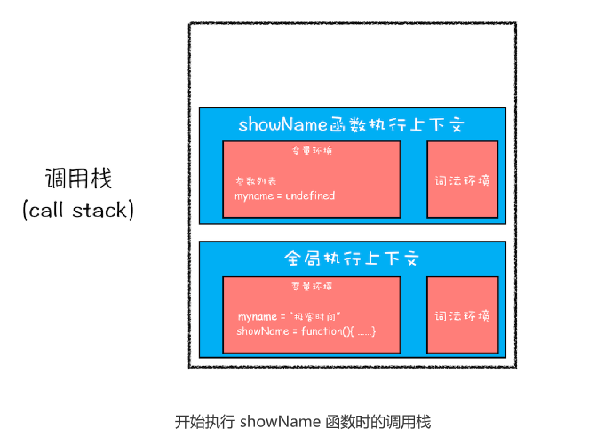
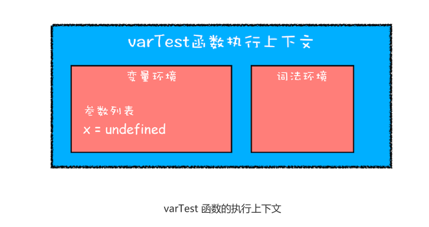
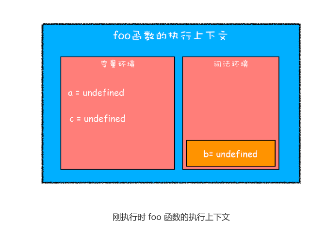
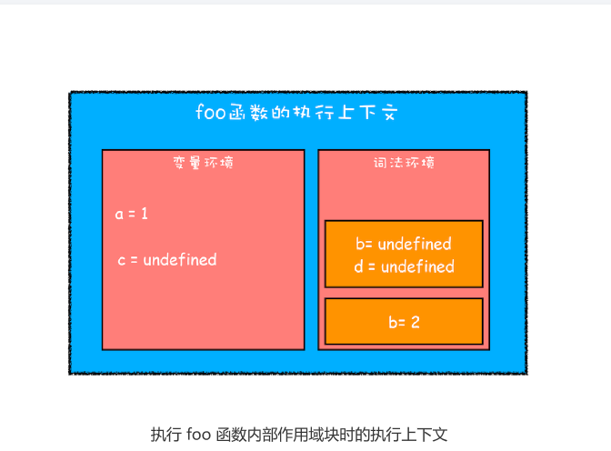
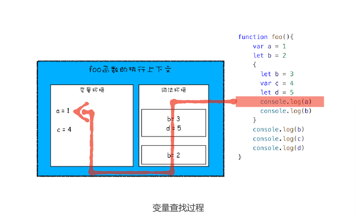
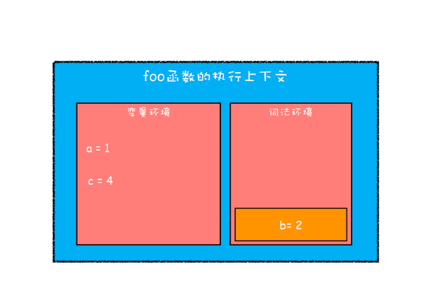

# 09|块级作用域：var缺陷以及为什么要引入let和const?


**正是由于JavaScript存在变量提升这种特性，从而导致很多与直觉不符合的代码，这也是JavaScript的一个重要设计缺陷**

分析为什么——介绍如何通过**开药房**——介绍如何通过**块级作用域并配合let和const关键字**来修复这种缺陷。


## 作用域(scope)

为什么JavaScript中会存在变量提升这个特性，其他语言似乎没有这个特性，作用域讲起。


**作用域是指在程序中定义变量的区域，该位置决定了变量的声明周期。通俗地理解，作用域就是变量与可访问范围，即作用域控制得变量和函数的可见性和生命周期**


在ES6之前，ES的作用域只有两种：全局作用域和函数作用域


**全局作用域**中的对象在代码中的任何地方都能访问，其生命周期伴随着页面的生命周期。


**函数作用域**就是在函数内部定义的变量或者函数，并且定义的变量或者函数只能在函数内部被访问。函数执行结束之后，函数内部定义的变量会被销毁。


现在支持**块级作用域**。块级作用域就是一对大括号包括的一段代码，比如函数、判断语句、循环语句
甚至单独的一个{}都可以看坐一个块级作用域。

```js
//if块
if(1){}

//while块
while(1){}

//函数块
function foo(){}

//for 循环块
for(let i=0;i<100;i++){}

//单独一个快
{}
```


## 变量提升所带来的问题

### 1.变量容易在不被察觉的情况下被覆盖掉

由于变量提升作用，使用JavaScript来编写和其他语言相同逻辑的代码，都可能会导致不一样的执行结果。那为什么会出现这种情况？主要以下两种原因？

```js
var myname="极客时间"

function showName(){
    console.log(myname)//undefined
    if(0){
        var myname="极客邦"//块级作用域
    }
    console.log(myname)//undefined
}

showName()
```

当刚执行到showName函数调用时，执行上文和调用栈的状态是怎样的状态？




showName函数的执行上下文创建后，JavaScript引擎便开始执行showName函数内部的代码，首先执行

```js
console.log(myname)
```
执行这段代码需要使用变量myname，结合上面的调用栈状态图，可以两个myname变量；一个在全局执行上下文中，其值是“极客时间”；另外一个在showName函数的执行上下文中，其值是undefined。。那么应该使用哪个？

“当然**先使用函数执行上下文里面的变量**”的确是这样，这是因为在函数执行过程中，JavaScript会有优先从当前的执行上下文查找变量，由于变量提升，当前的执行上下文就包含变量myname，而值是undefined，所以获取到myname的值就是undefined。


### 2.本应销毁的变量没有被销毁

在创建执行上下文阶段，变量 i 就已经被提升了，var变量提升。

```js
function foo(){
    for(var i=0;i<7;i++){
    }
    console.log(i)
}
foo()
```
如果使用C语言或者其他部分的实现类似代码，i的值并未被销毁，所以最后打印出来的是7。

这同样也是由变量提升而导致的，在创建执行上下文阶段，变量i就已经提升了，所以当for循环结束之后，变量i并没有被销毁。

## ES6是如何解决变量提升带来的缺陷

**ES6引入let和const关键字**，从而使JavaScript其他语言一样拥有块级作用域

```js
let x=5
const y=6
x=7
y=9//报错，const声明变量不可修改
```

ES6如何通过块级作用域来解决上面的问题

```js
function varTest(){
    var x=1;
    if(true){
        var x=2;
        console.log(x)//2
    }
    console.log(x)//2
}
```

在这段代码中，有两个地方都定义了变x，第一个地方在函数块的顶部，第二个地方的在if块的内部，
由于var的作用范围是整个函数，所以在编译阶段，会生成如下执行上下文：



从执行上下文的变量环境可以看出，最终只生成一个变量x，函数体内所有对x的赋值操作会直接
改变变量环境中的x值

所以上述代码最后通过console.log(x)输出的是2，而对于相同逻辑的代码，其他语言最后一步输出的值应该是1，因为在if块里面的声明不应该影响到外面的变量。


既然支持块级作用域和不支持块级作用域的代码执行逻辑是不一样，那么接下来就改造上面的代码。
让其支持块级作用域

只需要将var关键词替换为let 关键字

```js
function letTest(){
    let x=1;
    if(true){
        let x=2;//不同变量
        console.log(x)//2
    }
    console.log(x)//1
}
```

其输出结果就和我们预期是一致的，这是因为let关键字是支持块级作用域的，所以在编译阶段，JavaScript引擎并不会if块中通过let声明变量放到变量环境中，这也是意味着if通过let声明的关键字，并不会提升到全函数可见。所以在if块之内打印出来的值是2，跳出鱼块之后，打印出来的值就是1.
这种就非常**符我们的编程习惯：作用块内声明的变量不影响外面的变量**

## JavaScrip是如何支持块级作用域


在同一段代码中，ES6是如何做到既要支持变量提升的特性，又要支持块级作用域？

我们就要**站在执行上文的角度**来揭开答案

JavaScript引起是通过变量实现块级作用域的，那么ES6又是如何在函数作用域的基础之上，实现对块级作用域的支持。

```js
function foo(){
    var a=1
    let b=2
    {
        let b=3
        var c=4
        let d=5
        console.log(a)
        console.log(b)
    }
    console.log(b)
    console.log(c)
    console.log(d)
}

foo()

```

### 第一步是编译并创建执行上下文



通过上图，我们可以得出以下结论：

函数内部通过var声明的变量，在编译阶段全都被存放到**变量环境**里面了。

通过let声明的变量，在编译阶段会存放到**词法环境(Lexical Enviroment)**中。

在函数的作用域内部，通过let声明的变量并没有存放到词法环境中。

接下来，**第二部继续执行代码**，当执行到代码块里面时，这是函数的执行上下文如图所示


从图中可以看出，当进入函数的作用域块时，作用域块中通过let声明的变量，会被存放在词法环境的一个单独的域名中，这个区域中的变量并不影响作用域外面的变量，比如在作用域外面声明了变量b，在该作用域内部也声明变量b，当执行到作用域内部时，它们都是独立的存在。

在接下来，当执行到作用域中console.log(a)这是代码时，就需要在词法环境和变量环境中查找变量a的值，**具体查找方式是：沿着词法环境中的某个块查找到了，就直接返回给JavaScript引擎，如果没有查找到，那么继续在变量环境中查找。**



从上图你可以清晰地看出查找流程，不过要完整理解查找变量或者查找函数的流程，就涉及到作用域链。


当作用域执行结束之后，其内部定义的变量就会从词法环境的栈顶弹出，最终执行上下文如图所示



通过上面的分析，想必你已经理解了词法环境的结构和工作机制，块级作用域了。

## 总结

由于 JavaScript 的变量提升存在着变量覆盖、变量污染等设计缺陷，所以 ES6 引入了块级作用域关键字来解决这些问题。

之后我们还通过对变量环境和词法环境的介绍，分析了 JavaScript 引擎是如何同时支持变
量提升和块级作用域的。


## 思考时间

**在块作用域内，let声明的变量被提升，但变量只是创建被提升，初始化并没有被提升，在初始化之前使用变量，就会形成一个暂时性死区。**

```js

let myname="极客时间"
{
    console.log(mymyname)
    let myname="极客邦"
}
```