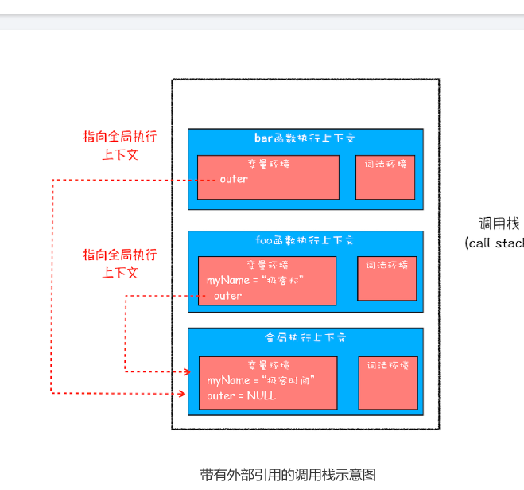

#  10 | 作用域链和闭包 ：代码中出现相同的变量，JavaScript引擎是如何选择的？


理解作用域链就是理解闭包的基础，而闭包在JavaScript中几乎无处不在，而闭包在JavaScript
中几乎无处不在，同时作用域金和作用域还是所有编程语言的基础。


那是**什么作用域链**，**什么是闭包**

```js
function bar(){
    console.log(myname)
}
function foo(){
    var myname="极客邦"
    bar()
}
var myName="极客时间"

foo()
```

会打印出什么，分析这段代码的执行流程。

通过执行上下文来分析代码的执行流程，那么这段代码执行到bar函数内部，其调用栈如图所示


1. 先查找栈顶是否存在 myName 变量，但是这里没有，所以接着往下查找 foo 函数中的
变量。
2. 在 foo 函数中查找到了 myName 变量，这时候就使用 foo 函数中的 myName。
如果按照这种方式来查找变量，那么最终执行 bar 函数打印出来的结果就应该是“极客
邦”。但实际情况并非如此，如果你试着执行上述代码，你会发现打印出来的结果是“极客
时间”。为什么会是这种情况呢？要解释清楚这个问题，那么你就需要先搞清楚作用域链
了。


## 作用域链

每个执行上文的变量环境中，都包含一个外部引用，用来指向外部的执行上下文，我们这个外部引用称为**outer**



bar函数和foo函数的outer都是指向全局上下文，这也就是意味着如果bar函数或者foo函数使用外部量，那么JavaScript引擎会去全局执行上下文中查找，我们这个查找的链条称为**作用域链**

**作用域链是由词法作用域决定的**

## 词法作用域

**词法作用域就是作用域是由代码中函数声明的位置来决定的，所以词法作用域是静态的作用域，通过它就能够预测代码在执行过程中如何查找标识符**


词法作用域就是根据代码的位置来决定的，其中main函数，bar函数包含foo函数，因为JavaScript作用域由词法作用域决定的，所以整个词法作用域的顺序是：foo函数作用域->bar函数作用域->main函数作用域->全局作用域

了解了词法作用域以及 JavaScript 中的作用域链，我们再回过头来看看上面的那个问题：
在开头那段代码中，foo 函数调用了 bar 函数，那为什么 bar 函数的外部引用是全局执行
上下文，而不是 foo 函数的执行上下文?

这是因为根据词法作用域，foo和bar的上级作用域都是全局作用域，所以如果foo或者bar函数使用一个它们没有定义的变量，那么它们会到全局作用域去查找。也就是说，**词法作用域就是代码阶段就决定好的，和函数是怎么调用的没有关系。**

## 块级作用域中的变量查找

全局作用域和函数作用域分析作用域链，那接下来看看块级作用域中变量是如何查找的？在编写代码的时候，如果使用一个当前作用域不存在的变量，这是JavaScript引擎需要按照作用域链在其他作用域查找到该变量。


首先在bar函数的执行上文中查找，但因为 bar 函数的
执行上下文中没有定义 test 变量，所以根据词法作用域的规则，下一步就在 bar 函数的外
部作用域中查找，也就是全局作用域。

## 闭包

关于闭包，理解起来可能是一道坎，但是理解了变量环境、词法环境和作用域链等概念，再理解JavaScript的闭包就容易多了。

```js
function foo(){
    var myName="极客时间"
    let test1=1
    const test2=2
    var innerBar={
        getName:function(){
            console.log(test1)
            return myName
        },
        setName:function(newName){
            myName=newName
        }
    }
    return innerBar
}

var bar=foo()
bar.setName("极客ban")
bar.getName()
console.log(bar.getName())
```

词法作用域只在乎声明环境，不在于调用环境


看到执行到foo函数内部的return innerBar这行代码调用栈的情况


innerBar是一个对象，包含了getName和setName的两个方法(通常我们把对象的函数称为方法)。两个方法都是在foo函数内部定义的，并且这两个方法都使用了myName和test1
两个变量。


这样就会报错,把test1限制到块级作用域里面了
```js
function foo(){
    var myName="极客时间"
    {
        let test1=1
    }
    const test2=2
    var innerBar={
        getName:function(){
            console.log(test1)
            return myName
        },
        setName:function(newName){
            myName=newName
        }
    }
    return innerBar
}

var bar=foo()
bar.setName("极客ban")
bar.getName()
console.log(bar.getName())
```

**根据词法作用域的规则，内部函数getName和setName总是可以访问到外部函数foo中的变量**，所以当innerBar对象返回全局变量bar时，虽然foo函数已经执行结束，但是getName和setName函数依然可以调用foo函数中变量myName和test1两个变量。所以当foo函数执行完成之后，其整个调用栈如图所示


从上图可以看出，foo函数执行之后，其执行上下文从栈顶弹出，但是由于返回的setName和getName方法使用了foo函数内部的变量myName和test1，所以这两个变量依然保存到内存中。像setName和getName方法背着一个专属的背包，无论在哪里调用setName和getName，都会背着foo函数的专属背包。

之所以是**专属**背包，是因为除了setName和getName函数之外，其他任何地方都是无法访问到该背包的，我们就可以把这个背包称为foo函数的**背包**

给一个定义，**在JavaScript中，根据词法作用域的规则，内部函数总是可以访问其外部函数中声明的变量，当通过调用一个外部函数返回一个内部函数后，即使该外部已经执行结束了，但是内部函数引用外部函数的变量依然保存在内存中，我们就把这些变量的集合称为闭包。比如外部函数foo，那么这些变量就称为foo函数的闭包。**

当执行到bar.setName方法中myName="极客邦"这句代码时，JavaScript引擎会沿着“当前执行上下文”->"foo函数闭包"->"全局执行上下文"顺序来查找myName变量


从图中可以看出，setName 的执行上下文中没有 myName 变量，foo 函数的闭包中包含
了变量 myName，所以调用 setName 时，会修改 foo 闭包中的 myName 变量的值。

同样的流程，当调用 bar.getName 的时候，所访问的变量 myName 也是位于 foo 函数闭
包中的。


你也可以通过“开发者工具”来看看闭包的情况，打开 Chrome 的“开发者工具”，在
bar 函数任意地方打上断点，然后刷新页面，可以看到如下内容：


从图中看出，调用bar.getName的时候，右边Scope项体现出作用域链的关系：Local就是当前getName函数作用域，Closure(foo)就是指foo函数的闭包，最下面的Global就是指全局作用域，从“Local-》Closure(foo)->Global”就是一个完整的作用域链。

所以说，你以后也可以通过 Scope 来查看实际代码作用域链的情况，这样调试代码也会比
较方便。


## 闭包是怎么回收的

理解什么是闭包之后，接下来我们再来简单聊聊闭包是什么时候销毁的。因为如果闭包使用
不正确，会很容易造成内存泄漏的，关注闭包是如何回收的能让你正确地使用闭包。
通常，如果引用闭包的函数是一个全局变量，那么闭包会一直存在直到页面关闭；但如果这
个闭包以后不再使用的话，就会造成内存泄漏。

如果引用闭包的函数是个局部变量，等函数销毁后，在下次 JavaScript 引擎执行垃圾回收时，判断闭包这块内容如果已经不再被使用了，那么 JavaScript 引擎的垃圾回收器就会回收这块内存。

所以在使用闭包的时候，你要尽量注意一个原则：**如果该闭包会一直使用，那么它可以作为全局变量而存在；但如果使用频率不高，而且占用内存又比较大的话，那就尽量让它成为一个局部变量**。


## 总结

- 首先，介绍什么是作用域，我们把作用域查找变量的链条称为作用域链；作用域链是通过词法作用域来确定的，而词法作用域反映了代码的结构

- 其次，介绍了在块级作用域是如何通过作用域链来查找到变量的
- 最后基于作用域链和词法环境介绍到达什么是闭包

通过展开词法作用域，我们介绍了 JavaScript 中的作用域链和闭包；通过词法作用域，我
们分析了在 JavaScript 的执行过程中，作用域链是已经注定好了，比如即使在 foo 函数中调用了 bar 函数，你也无法在 bar 函数中直接使用 foo 函数中的变量信息。

因此理解词法作用域对于你理解 JavaScript 语言本身有着非常大帮助，比如有助于你理解
下一篇文章中要介绍的 this。另外，理解词法作用域对于你理解其他语言也有很大的帮
助，因为它们的逻辑都是一样的。

```js
var bar={
    myName:'com',
    // var myName='com'
    printName:function(){
        console.log(myName)
    }
}


function foo(){
    let myName="极客时间"
    return bar.printName
}

let myName="极客邦"
let _printName=foo()
_printName()
bar.printName()

```
两次极客邦，如果是this.myName,第一次是undefined，第二次com