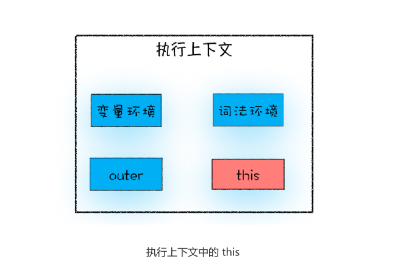

# 11|从JavaScript执行上下文的视角讲清楚this

```js
var bar={
    myName:"com",
    printName:function(){
        console.log(myName)
    }
}

function foo(){
    let myName="极客时间"
    return bar.printName
}

let myName="极客邦"
let _printName=foo()
```

conosle.log(myName)打印的不是bar对象内部的变量，但是我们有这样的需求。**对象内部的方法中使用内部属性是一个普遍的需求**。但是JavaScript的作用域机制并不支持这一点，基于这个需求，JavaScript有搞出另外一套**this机制**

所以，在JavaScript中使用this实现printName函数中访问到bar对象的myName属性了。具体怎么操作？可以调整printName的代码

```js
printName:function(){
    console.log(this.myName)
}

```

在讲解之前，希望能区分清楚**作用域**和**this**是两套不同的系统，它们之间基本没太多联系。


## JavaScript中的this是什么

执行上下文中包含了变量环境、词法环境、外部环境、但其实还有一个this没有提及到



**this是和执行上下文绑定的**，也就是说每个执行上下文中都有一个this。执行上文主要分为三种——全局执行上下文、函数执行上下文和eval执行上下文，所以对应的this也只有三种——全局执行上下文中的this、函数中的this和eval中的this。

接下来我们重点讲解下**全局执行上下文中的this**和**函数执行上下文中this**

## 全局执行上下文的this
在控制台中输入console.log(this)来答应出来window对象。得出一个结论：全局执行上下文中的this是指向window对象，也是this和作用域的唯一交点，作用域链的最底端包含了window对象，全局执行上下文中this也是window对象。

## 函数执行上下文的this

全局对象中this指向window对象，那么接下来，重点分析函数执行上下文的this

```js
function foo(){
    console.log(this)
}
foo()
```
foo函数打印出来this值，执行这段代码，打印出是window对象，这说明在默认情况下调用一个函数，其执行上下文的this也是指向window对象。通常情况下，有三种方式来设置函数执行上下文中的this值

### 1.通过函数call方法设置

通过函数的call方法来设置函数执行上下文的this指向

```js
let bar={
    myName:"极客邦"，
    test1:1
}
function foo(){
    this.myName="极客时间"
}
foo.call(bar)
console.log(bar)
console.log(myName)
```

执行这段代码，然后观察输出结果，发现foo函数内部的this已经指向bar对象，因为通过打印bar对象，可以看出bar的myName属性已经由“极客邦”变为“极客时间”了，同时在全局执行上下文中打印myName，JavaScript引擎提示该变量未定义。

除了call方法，你还可以使用**bind**和**apply**方法设置函数执行上下文中的this，它们在使用还是有点区别的。

### 2.通过对象调用方法设置

要改变函数执行上下文的this指向，除了通过call方法实现外，还可以通过对象调用的方法

```js
var myObj={
    name:"极客时间"，
    showThis:function(){
        console.log(this)
    }
}
myObj.showThis()
```
在这段代码中，我们定义了一个 myObj 对象，该对象是由一个 name 属性和一个
showThis 方法组成的，然后再通过 myObj 对象来调用 showThis 方法。执行这段代码，
你可以看到，最终输出的 this 值是指向 myObj 的。

**使用对象来调用其内部的一个方法，该方法的this指向对象本身**

```js
var myObj={
    name:"极客时间"，
    showThis:function(){
        this.name="极客邦"
        console.log(this)
    }
}
var foo=myObj.showThis
foo()
```
执行这段代码，会发现tthis又指向全局window对象

上面两个例子，可以得出下面两个结论

- 全局环境调用一个函数，函数内部的this指向全局变量window
- 通过一个对象来调用其内部的一个方法，该方法执行上下文中的this指向对象本身。

### 3.通过构造函数中设置

```js
function CreateObj(){
    this.name="极客时间"
}
var myObj=new CreateObj()
```
在这段代码中，使用new创建对象myObj，知道此时的构造函数CreateObj中的this到底指向了谁？


```js
function CreateObj(){
    this.name="极客时间"

}
var myObj=new CreateObj( )

```
new 做了什么，四种还手撕了


## this的设计缺陷以及应对方案

this并不是一个很好的设计，存在很多一些缺陷。

### 1.嵌套函数中的this不会从外层函数中继承

```js
var myObj={
    name:'极客时间',
    showThis:function(){
        console.log(this)
        function bar(){console.log(this)}
        bar()
    }
}
myObj.showThis()
```

bar函数中的this是什么？
**函数bar中的this指向是全局window对象，而函数showThis的this指向myObj对象.**
这就是JavaScript中非常容易让人迷惑的地方，也是很多问题的源头。

**通过一个小技巧来解决这个问题**，比如在showThis函数中**声明一个变量self用来保存this**，然后在bar函数使用self

```js
var myObj={
    name:'极客时间'，
    showThis:function(){
        console.log(this)
        var self=this
        function bar(){
            self.name="极客邦"
        }
        bar()
    }
}
myObj.showThis()
console.log(myObj.name)
console.log(window.name)
```
本质就是**把this体系转化为作用域的体系**

**也可以使用ES6中的箭头函数来解决这个问题**

```js
var myObj = {
 name : " 极客时间 ", 
 showThis: function(){
 console.log(this)
 var bar = ()=>{
 this.name = " 极客邦 "
 console.log(this)
 }
 bar()
 }
}
myObj.showThis()
console.log(myObj.name)
console.log(window.name)

```
执行这段代码，你会发现它也输出了我们想要的结果，也就是箭头函数 bar 里面的 this 是
指向 myObj 对象的。这是因为 ES6 中的箭头函数并不会创建其自身的执行上下文，所以
箭头函数中的 this 取决于它的外部函数。

this没有作用域的限制，这点和变量不一样，所以嵌套函数不会从调用它的函数继承this，这样会造成很多不符合直觉的代码。两钟解决方法

- 第一种是把 this 保存为一个 self 变量，再利用变量的作用域机制传递给嵌套函数。

- 第二种是继续使用 this，但是要把嵌套函数改为箭头函数，因为箭头函数没有自己的执
行上下文，所以它会继承调用函数中的 this。

### 2.普通函数
上面我们已经介绍过了，在默认情况下调用一个函数，其执行上下文中的 this 是默认指向
全局对象 window 的。

不过这个设计也是一种缺陷，因为在实际工作中，我们并不希望函数执行上下文中的 this
默认指向全局对象，因为这样会打破数据的边界，造成一些误操作。如果要让函数执行上下
文中的 this 指向某个对象，最好的方式是通过 call 方法来显示调用。

这个问题可以通过设置 JavaScript 的“严格模式”来解决。在严格模式下，默认执行一个
函数，其函数的执行上下文中的 this 值是 undefined，这就解决上面的问题了。

## 总结

首先，使用this，为了避坑，谨记以下三点

1. 当函数作为对象的方法调用时，函数的this就是该函数
2. 当函数被正常调用时，在严格模式下，this值是undefined，非严格模式this是全局对象是window
3. 嵌套函数中this不会继承外层函数的this

最后，我们还提了一下箭头函数，因为箭头函数没有自己的执行上下文，所以箭头函数的
this 就是它外层函数的 this。


## 思考

```js
let userInfo = {
 name:"jack.ma",
 age:13,
 sex:male,
 updateInfo:function(){
 // 模拟 xmlhttprequest 请求延时
 setTimeout(function(){
 this.name = "pony.ma"
 this.age = 39
 this.sex = female
 },100)
 }
}
userInfo.updateInfo()
```

不能更新userinfo，setTimeout里面的function指向window