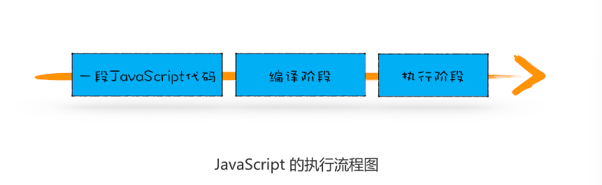

# 07|变量提升:JavaScript代码是按顺序执行的吗？

主要讲解**执行上下文**相关的内容，那为什么先讲执行上下文呢？它那么重要吗？
可以这么说，**只有理解了JavaScript的执行上下文，才能更好地理解JavaScript语言本身**，比如变量提升、作用域和闭包等

先看段代码
```js
showName()
console.log(myname)
var myname=‘极客时间’
function showName(){
    console.log('函数showName被执行')
}
```
实际执行结果


1. 在执行过程中，若使用了未声明的变量，那么 JavaScript 执行会报错。
2. 在一个变量定义之前使用它，不会出错，但是该变量的值会为 undefined，而不是定义
时的值。
3. 在一个函数定义之前使用它，不会出错，且函数能正确执行。


上面的执行结果，提前使用的
showName 函数能打印出来完整结果，但是提前使用的 myname 变量值却是
undefined，而不是定义时使用的“极客时间”这个值。

## 变量提升(Hoisting)

需要了解下什么是变量提升

在介绍变量提升之前，来看看什么是JavaScript中的**声明和赋值**

### 变量声明


```js
var myname="极客时间"

```

这段代码可以把它看成是两行代码组成

```js
var myname //声明部分
myname=‘极客时间’//赋值部分
```


再来看看**函数**的声明和赋值
```js
function foo(){
    console.log('foo')
}

var bar=function(){
    console.log('bar')
}
```

上面**变量**的声明和赋值，那接下来看看**函数**的声明和赋值

```js
function foo(){
    console.log('foo')
}
var bar=fuunction(){
    console.log('bar')
}

```
第一个函数foo是一个完整的函数声明，也就是没有涉及到赋值操作；第二个函数是最先
声明变量bar，再把function(){console.log('bar')}赋值给bar。
对了一个步骤赋值


**所谓的变量提升，是指在JavaScript代码执行过程中，JavaScript引擎把变量的声明部分和**
**函数的声明部分提升到代码开头的“行为”.变量被提升后，会给变量设置默认值，这个默认值就是熟悉的undefined。**

```js
/**
 * 变量提升部分
*/
//同时给myname赋值为undefined
var myname=undefined
//把函数 showName提升到开头

function showName(){
    console.log('showName被调用了')
}

/**
 * 可执行代码部分
*/
showName()
console.log(myname)
//去掉var声明部分，保留赋值语句
myname='极客时间’
```

为了模拟变量提升的效果，我们对代码做以下调整，如图：


从图中可以看出，对原来的代码做了两处调整

- 第一处是把声明的部分都提升到代码开头，如变量myname和函数showName，并设置变量的默认值
  undefined

- 第二处是移除原本声明的函数和声明，如var myname=“极客时间”的语句，移除了var声明，整个移除showName的函数声明
  

  通过这两步，就可以实现变量提升的效果。

  得出一个结论**函数和变量在执行之前都提升到代码开头**。


  ## JavaScrip 代码的执行流程

  “变量提升”意味着变量和函数的声明会在物理层面移动到代码的最前面
  **实际上变量和函数声明在代码里位置是不会改变的，而且是在编译阶段被JavaScript引擎放入引擎放入内存中。**

  一段代码JavaScript代码在执行之前需要被JavaScript引擎编译，**编译**完成之后，才会进入**执行**阶段。





### 1.编译阶段

那么编译阶段和变量提升存在什么关系呢？

**第一部分：变量提升部分的代码**

```js
var myname=undefined
function showName(){
    console.log('函数showName被执行')
}
```
**第二部分：执行部分的代码**

```js
showName()
console.log(myname)
myname='极客时间’
```
就可以把JavaScript的执行流程细化


