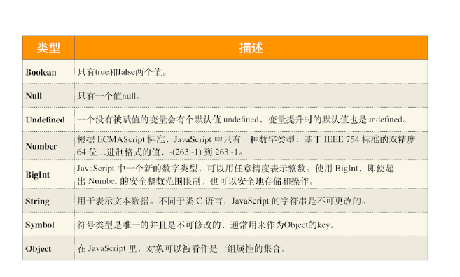

# 12|栈空间和堆空间：数据是如何存储的？

```js
fuction foo(){
    var a=1
    var b=a
    a=2
    console.log(a)
    console.log(b)
}
foo()
```

```js
function foo(){
    var a={name:"极客时间"}
    var b=a
    a.name="极客邦"
    console.log(a)
    console.log(b)
}

foo()
```

执行第一段代码，打印出来 a 的值是 2，b 的值是 1，这没什么难以理解的。

接着，再执行第二段代码，你会发现，仅仅改变了 a 中 name 的属性值，但是最终 a 和 b
打印出来的值都是{name:"极客邦"}。这就和我们预期的不一致了，因为我们想改变的仅
仅是 a 的内容，但 b 的内容也同时被改变了。

要彻底弄清楚这个问题，我们就得先从“JavaScript 是什么类型的语言”讲起。


## Javascript是什么类型的语言

每种编程语言都有内建的数据类型，但它们的数据类型有些不同，使用方式不同。c语言在定义变量之前。就需要确定变量的类型，可以看下面的C代码

```c
int main(){
    int a=1
    char*b="极客时间"
    bool c=true
    return 0; 
}
```
在声明变量之前需要定义变量类型，**我们把这种在使用之前就需要确认其变量数据类型的称为静态语言**

**相反地，我们把运行过程中需要检查数据类型的语言称为动态语言**。比如我们所讲的JavaScript就是动态语言，因为声明变量之前并不需要确认其数据类型。

C语言是静态，但是C语言中，可以把其他类型数据赋予给一个声明好的变量

```c
c=a
```
int 型的变量 a 赋值给了 bool 型的变量 c，这段代码也是可以编译执
行的，因为在赋值过程中，C 编译器会把 int 型的变量悄悄转换为 bool 型的变量，我们通
常把这种偷偷转换的操作称为**隐式类型转化**，而**支持隐式类型转换的语言称为弱类型语言**，
**不支持隐式转换的语言称为强类型语言**。在这点上C和JavaScript都是弱类型语言。


**JavaScript是一种弱类型的，动态的语言**
- 弱类型,意味着不需要告诉JavaScript引擎变量是什么数据类型，JavaScript引擎可以在运行代码时候自动计算出来
- 动态：意味着使用同一个变量保存不同类型的数据

```js

var bar
bar = 12 
bar = " 极客时间 "
bar = true
bar = null
bar = {name:" 极客时间 "}
```
从上述代码中你可以看出，我们声明了一个 bar 变量，然后可以使用各种类型的数据值赋
予给该变量。

在 JavaScript 中，如果你想要查看一个变量到底是什么类型，可以使用“typeof”运算
符。具体使用方式如下所示：

```js
var bar
console.log(typeof bar) //undefined
bar = 12 
console.log(typeof bar) //number
bar = " 极客时间 "
console.log(typeof bar)//string
bar = true
console.log(typeof bar) //boolean
bar = null
console.log(typeof bar) //object
bar = {name:" 极客时间 "}
console.log(typeof bar) //object

```
执行这段代码，你可以看到打印出来了不同的数据类型，有 undefined、number、
boolean、object 等。那么接下来我们就来谈谈 JavaScript 到底有多少种数据类型。

其实 JavaScript 中的数据类型一种有 8 种，它们分别是：


了解这些类型之后，还有三点需要你注意一下。

第一点，使用 typeof 检测 Null 类型时，返回的是 Object。这是当初 JavaScript 语言的
一个 Bug，一直保留至今，之所以一直没修改过来，主要是为了兼容老的代码。

第二点，Object 类型比较特殊，它是由上述 7 种类型组成的一个包含了 key-value 对的数
据类型。如下所示：

```js
let myObj = {
 name:'极客时间',
 update:function(){....}
}

```

从中你可以看出来，Object 是由 key-value 组成的，其中的 vaule 可以是任何类型，包括
函数，这也就意味着你可以通过 Object 来存储函数，Object 中的函数又称为方法，比如
上述代码中的 update 方法。


第三点，我们把前面的 7 种数据类型称为**原始类型**，把最后一个对象类型称为**引用类型**，
之所以把它们区分为两种不同的类型，是因为它们在内存中存放的位置不一样。


## 内存空间

内存空间种类


主要三种类型内存空间，分别是**代码空间、栈空间和堆空间**

## 栈空间和堆空间

为了搞情况栈空间是如何存储数据，先看下面的代码
```js
function foo(){
    var a="极客时间"
    var b=a
    var c={name:"极客时间"}
    var d=c
}
```
需要先编译，并创建执行上下文，然再按照顺序执行代码，当执行到第三行的时候


从图中可以看出来，当执行到第 3 行时，变量 a 和变量 b 的值都被保存在执行上下文中，
而执行上下文又被压入到栈中，所以你也可以认为变量 a 和变量 b 的值都是存放在栈中
的。

接下来继续执行第 4 行代码，由于 JavaScript 引擎判断右边的值是一个引用类型，这时候
处理的情况就不一样了，JavaScript 引擎并不是直接将该对象存放到变量环境中，而是将
它分配到堆空间里面，分配后该对象会有一个在“堆”中的地址，然后再将该数据的地址写
进 c 的变量值，最终分配好内存的示意图如下所示


从上图可以清晰，对象类型是存放在堆空间的，在栈空间中只是保留了对象的引
用地址，当 JavaScript 需要访问该数据的时候，是通过栈中的引用地址来访问的，相当于
多了一道转手流程。

好了，现在你应该知道了**原始类型的数据值都是直接保存在“栈”中的**，**引用类型的值是存**
**放在“堆”中的**。不过你也许会好奇，为什么一定要分“堆”和“栈”两个存储空间呢？所
有数据直接存放在“栈”中不就可以了吗？

答案是不可以的。这是因为 JavaScript 引擎需要用栈来维护程序执行期间上下文的状态，
如果栈空间大了话，所有的数据都存放在栈空间里面，那么会影响到上下文切换的效率，进
而又影响到整个程序的执行效率。比如文中的 foo 函数执行结束了，JavaScript 引擎需要
离开当前的执行上下文，只需要将指针下移到上个执行上下文的地址就可以了，foo 函数执
行上下文栈区空间全部回收，具体过程你可以参考下图：


所以**通常情况下，栈空间都不会设置太大主要存放一些原始类型的小数据**。而引用类型的数占用的空间都比较大，所以这一类数据都要存放到堆里，**堆空间大，能存放很多大的数据**，不过缺点分配内存和回收内存都会占用一定时间。


解释了程序在执行过程中为什么需要堆和栈两种数据结构后，我们还是回到示例代码那里，
看看它最后一步将变量 c 赋值给变量 d 是怎么执行的？

在 JavaScript 中，赋值操作和其他语言有很大的不同，**原始类型的赋值会完整复制变量**
**值，而引用类型的赋值是复制引用地址**。

所以d=c的操作就是把 c 的引用地址赋值给 d，你可以参考下图：


从图中你可以看到，变量 c 和变量 d 都指向了同一个堆中的对象，所以这就很好地解释了
文章开头的那个问题，通过 c 修改 name 的值，变量 d 的值也跟着改变，归根结底它们是
同一个对象。


## 再谈闭包

