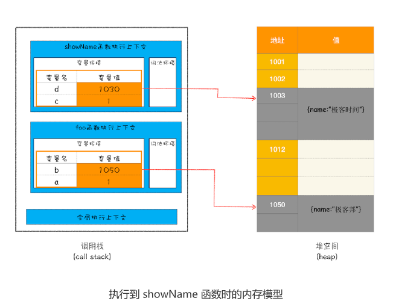

# 13|垃圾回收：垃圾数据是如何自动回收


不过有些数据被使用之后，可能就不再需要了，我们把这种数据称为**垃圾数据**。如果这些垃
圾数据一直保存在内存中，那么内存会越用越多，所以我们需要**对这些垃圾数据进行回收**，
**以释放有限的内存空间**。


## 不同语言的垃圾回收策略


通常情况下，垃圾数据回收分为**手动回收**和**自动回收**两种策略。

如C/C++是使用手动回收策略，**何时分配内存、何时销毁内存都是由代码控制的**

```c++
// 在堆中分配内存
char* p = (char*)malloc(2048); // 在堆空间中分配 2048 字节的空间，并将分配后的引用地址保存
 // 使用 p 指向的内存
 {
 //....
 }
// 使用结束后，销毁这段内存
free(p)；
p = NULL；

```
从上面这段 C 代码可以看出来，要使用堆中的一块空间，我们需要先调用 mallco 函数分
配内存，然后再使用；当不再需要这块数据的时候，就要手动调用 free 函数来释放内存。
如果这段数据已经不再需要了,但是有没有主动调用free函数来销毁，那么这种情况称为**内存泄露**

另外一种使用自动垃圾回收的策略，如JavaScript、Java、Python等语言，**产生的垃圾是有垃圾回收器来释放的**，并不是手动通过代码来释放。

对于 JavaScript 而言，也正是这个“自动”释放资源的特性带来了很多困惑，也让一些
JavaScript 开发者误以为可以不关心内存管理，这是一个很大的误解。

那么在本文，我们将围绕“JavaScript 的数据是如何回收的”这个话题来展开探讨。因为
数据是存储在栈和堆两种内存空间中的，所以接下来我们就来分别介绍“栈中的垃圾数
据”和“堆中的垃圾数据”是如何回收的。

## 调用栈的数据是如何回收的

首先是调用栈中的数据，通过一段代码的执行流程来分析其回收机制


```js
function foo(){
    var a=1
    var b={name:'极客邦'}
    function showName(){
        var c="极客时间"
        var d={name:"极客时间"}
    }
    showName()
}
foo()
```

执行到第6行代码时，其调用栈和堆空间如图所示



