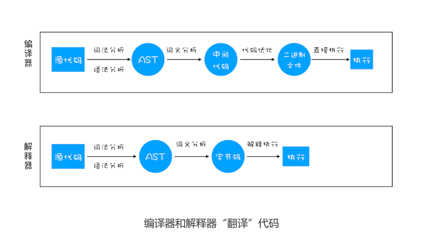
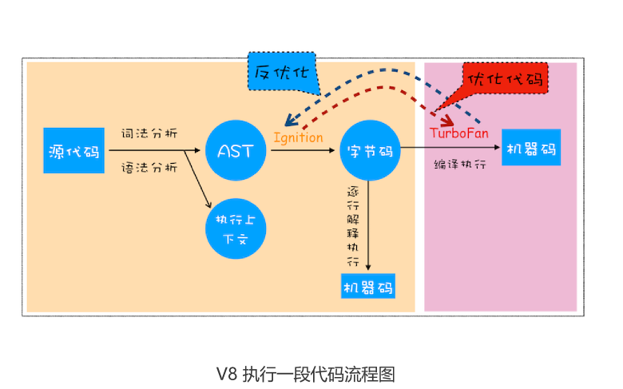
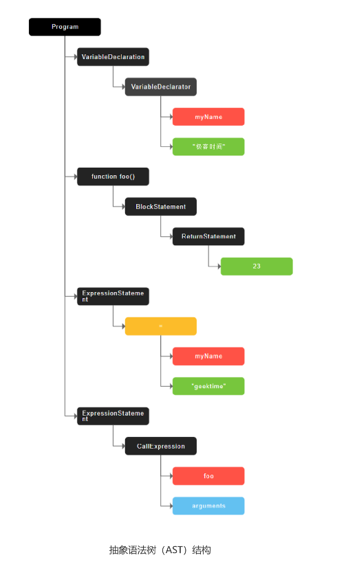
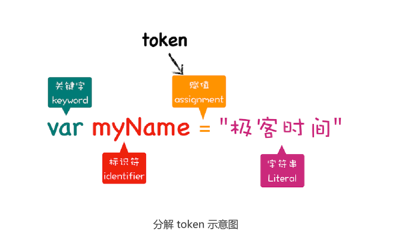
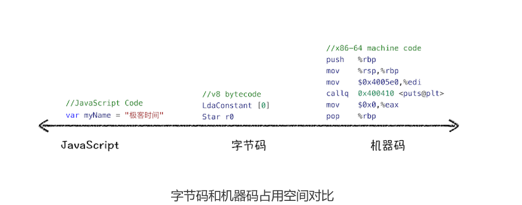
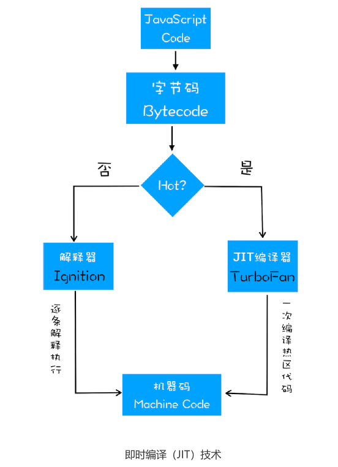

# 14|编译器和解释器：V8是如何执行一段JavaScript代码的

站在 JavaScript 引擎 V8 的视角，来分析JavaScript 代码是如何被执行的。


前端工具和框架的自身更新速度非常块，而且还不断有新的出现。要想追赶上前端工具和框
架的更新速度，你就需要抓住那些本质的知识，然后才能更加轻松地理解这些上层应用。比
如我们接下来要介绍的 V8 执行机制，能帮助你从底层了解 JavaScript，也能帮助你深入理
解语言转换器 Babel、语法检查工具 ESLint、前端框架 Vue 和 React 的一些底层实现机
制。因此，了解 V8 的编译流程能让你对语言以及相关工具有更加充分的认识。

要深入理解V8工作原理，需要搞清楚一些概念和原理，比如详细讲解**编译器(complier)**、**解释器(interpreter)**、**字节码(Bytecode)**、**即时编译器（JIT）**等概念

## 编译器和解释器

之所以存在编译器和解释器，是因为机器不能直接理解我们所写的代码，所以在执行程序之前，需要将我们所写的代码“翻译”成机器能读懂的机器语言。按语言的执行流程，可以把语言划分为编译型语言和解释型语言


**编译型语言在程序执行之前，需要经过编译器的编译过程,并且编译之后会保留机器能读懂的二进制文件，每次运行程序时，都可以直接运行该二进制文件，不需要再次重新编译**。比如C/C++\GO都是编译型语言。


**而解释语言编写的程序，每次运行时都需要通过解释器对程序进行动态解释和执行**。比如Python、JavaScript等都属于解释型语言。



1. 在编译型语言的编译过程中，编译器首先会一次对源码进行词法分析、语法分析、生成抽象语法树（AST），然后是优化代码，最后再生成处理器能理解的机器码。如果编译成功，就会生成一个可执行的文件。但如果编译过程发生语法或者其他的错误，那么编译器就会抛出异常，最后的二进制也不会生成成功。
2. 在解释型语言的解释过程中，同样解释器会对源代码进行词法分析、语法分析、并生成抽象语法树（AST），不过它会在基于抽象语法生成字节码，最后再根据字节码来执行程序、输出结果。

## V8是如何执行一段JavaScript代码

已经了解编译器和解释器了。那接下来，我们就重点分析下 V8 是
如何执行一段 JavaScript 代码的。你可以先来“一览全局”，参考下图：



## 1.生成抽象语法树（AST）和执行上下文

将源代码转换为**抽象语法树**，并生成**执行上下文**，而执行上下文我们在前面的文章中已经介
绍过很多了，主要是代码在执行过程中的环境信息。


那么下面我们就得重点讲解下抽象语法树（下面表述中就直接用它的简称 AST 了），看看
什么是 AST 以及 AST 的生成过程是怎样的。

高级语言是开发者可以理解的语言，但是让编译器或者解释器来理解就非常困难。对于编译器或者解释器来说，它们可以理解为AST。所以无论你使用的是解释型语言还是
编译型语言，在编译过程中，它们都会生成一个 AST。这和渲染引擎将 HTML 格式文件转
换为计算机可以理解的 DOM 树的情况类似。


```js
var  myName="极客时间"
function foo(){
    return 23;
}
myName="geektime"
foo()
```

这段代码经过JavaScript-ast站点处理后，生成AST结构如下:



从图中可以看出，AST 的结构和代码的结构非常相似，其实你也可以把 AST 看成代码的结
构化的表示，编译器或者解释器后续的工作都需要依赖于 AST，而不是源代码。


AST是非常重要的一种数据结构，很多项目都有着广泛的应用。其中最著名的一个项目是Babel。Babel是一个被广泛使用的代码转化器，可以将ES6转化为ES5代码，这意味着你可以现在用ES6编写程序，而不用担心现有的是否支持ES6.Babel的工作原理就是先将ES6转化为AST，然后再将ES6语法的AST转化为ES5语法的AST，最后利用ES5的AST生成JavaScript源代码。


除了Babel外，还有ESlint也使用AST。ESlint是一个用来检查JavaScript编写规范的插件，其检测流程也是需要将源码转化为AST，然后再利用AST来检查代码规范化的问题。

现在知道什么事AST以及它的一些应用，那接下来我们再看看AST是如何生成的。通常，生成AST需要经过两个阶段。


**第一阶段是分词(tokenize),又称为词法分析**，其作用是将一行行的源码拆解成一个个token，所谓**token**，指的是语法上不可能再分，最小的单个字符或字符串。可以参考下图来理解什么token



从图中可以看出来，通过var myName=“极客时间”简单地定义了一个变量，其中关键字“var”、标识符“myName”、赋值运算符“=”、字符串“极客时间”四个都是token，而且它们代表的属性还是不一样的。


**第二个阶段是解析(parse),又称为语法分析**，其作用是将上一步生成的token数据，根据语法规则转为AST。如果源码符合语法规则，这一步会顺利完成。如果源码存在语法错误，这一步就终止，并抛出一个“语法错误”

这就是 AST 的生成过程，先分词，再解析。

有了 AST 后，那接下来 V8 就会生成该段代码的执行上下文。至于执行上下文的具体内
容，你可以参考前面几篇文章的讲解。


## 2.生成字节码

有了 AST 和执行上下文后，那接下来的第二步，解释器 Ignition 就登场了，它会根据 AST
生成字节码，并解释执行字节码。


其实一开始 V8 并没有字节码，而是直接将 AST 转换为机器码，由于执行机器码的效率是
非常高效的，所以这种方式在发布后的一段时间内运行效果是非常好的。但是随着
Chrome 在手机上的广泛普及，特别是运行在 512M 内存的手机上，内存占用问题也暴露
出来了，因为 V8 需要消耗大量的内存来存放转换后的机器码。为了解决内存占用问题，
V8 团队大幅重构了引擎架构，引入字节码，并且抛弃了之前的编译器，最终花了将进四年
的时间，实现了现在的这套架构。

那什么是字节码呢？为什么引入字节码就能解决内存占用问题呢？

**字节码就是介于AST和机器码之间的一种代码。但是与特定类型的机器码无关，字节码需要通过解释器将其转换为机器码后才能执行**

理解什么是字节码，我们再来对比了高级代码、字节码和机器码  





从图中可以看出，机器码所占用的空间远远超过了字节码，所以使用字节码可以减少系统的
内存使用。


## 3.执行代码

生成字节代码之后，接下来进入执行阶段。

通常，如果一段第一次执行的代码，解释器 Ignition 会逐条解释执行。在执行字节码
的过程中，如果发现有**热点代码（HotSpot）**，比如一段代码被重复执行多次，这种就称
为热点代码，那么后台的编译器 TurboFan 就会把该段热点的字节码编译为高效的机器
码，然后当再次执行这段被优化的代码时，只需要执行编译后的机器码就可以了，这样就大
大提升了代码的执行效率。


V8 的解释器和编译器的取名也很有意思。解释器 Ignition 是点火器的意思，编译器
TurboFan 是涡轮增压的意思，寓意着代码启动时通过点火器慢慢发动，一旦启动，涡轮增
压介入，其执行效率随着执行时间越来越高效率，因为热点代码都被编译器 TurboFan 转
换了机器码，直接执行机器码就省去了字节码“翻译”为机器码的过程。


其实字节码配合解释器和编译器是最近一段时间很火的技术，比如 Java 和 Python 的虚拟
机也都是基于这种技术实现的，我们把这种技术称为**即时编译（JIT)**。具体到 V8，就是指
解释器 Ignition 在解释执行字节码的同时，收集代码信息，当它发现某一部分代码变热了
之后，TurboFan 编译器便闪亮登场，把热点的字节码转换为机器码，并把转换后的机器码
保存起来，以备下次使用。



## JavaScript的性能优化

到这里相信你现在已经了解 V8 是如何执行一段 JavaScript 代码的了。在过去几年中，
JavaScript 的性能得到了大幅提升，这得益于 V8 团队对解释器和编译器的不断改进和优
化。

虽然在 V8 诞生之初，也出现过一系列针对 V8 而专门优化 JavaScript 性能的方案，比如
隐藏类、内联缓存等概念都是那时候提出来的。不过随着 V8 的架构调整，你越来越不需要
这些微优化策略了，相反，对于优化 JavaScript 执行效率，你应该将优化的中心聚焦在单
次脚本的执行时间和脚本的网络下载上，主要关注以下三点内容：

1. 提升单次脚本执行速度，避免JavaScript的长任务霸占主线程，这样使得页面快速响应交互
2. 避免大的内联脚本，因为在解析HTML的过程中，解析和编译也会占用主线程
3. 减少JavaScript文件的容量，因为更小的文件会提升下载速度，并且占用更低的内存。

## 总结

- 首先介绍了编译器和解释器的区别

- 接着又分析了V8是如何执行一段JavaScript代码的：V8根据JavaScript代码生成AST和执行上下文，再基于AST生成字节码，通过解释器执行字节码，通过编译器来优化编译字节码

又基于字节码和编译器，又介绍了JIT技术。


