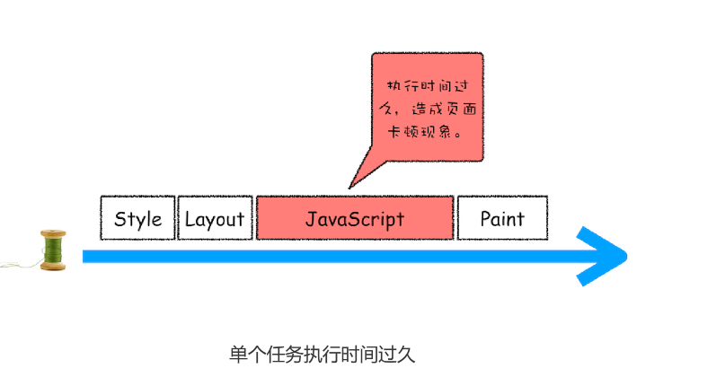
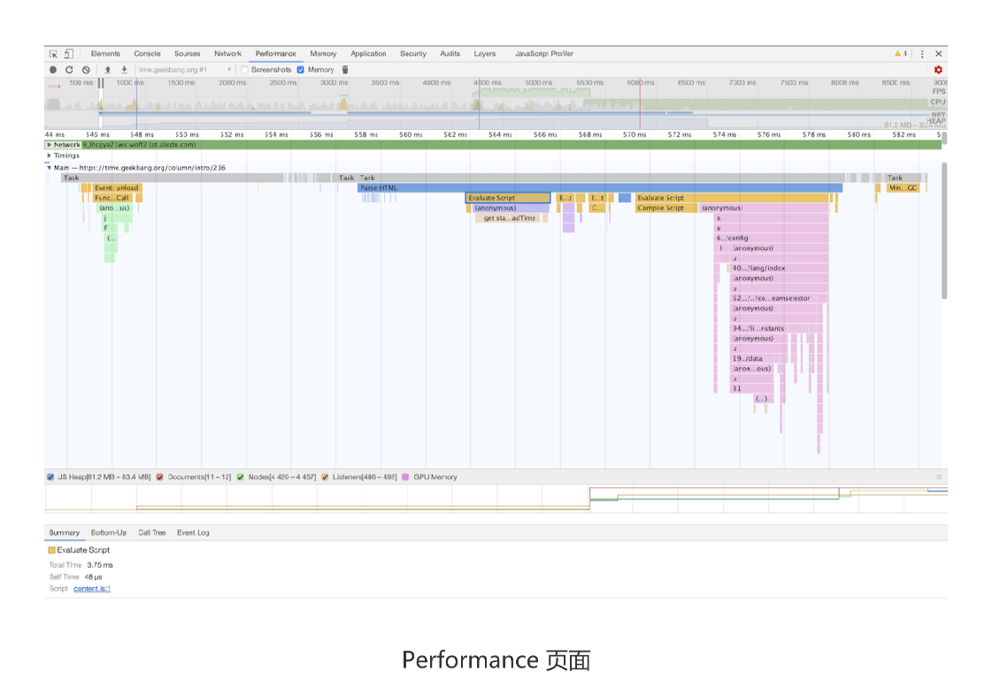

# 15|消息队列和事件循环：页面是怎么“活起来”的?


每个渲染进程都有一个主线程，并且主线程非常繁忙，既要处理DOM，又要计算样式，还要处理布局，同时还需要处理JavaScript任务以及各种输入事件。要让这么多不同类型的任务在主线程有条不紊地执行，这需要一个系统来统筹1调度这些任务，这个统筹调度系统就是今天要讲的消息队列和事件循环。


## 使用单线程处理安排好的任务

先从最简单的场景讲起，比如有如下一系列的任务：

任务1:1+2
任务2：20/5
任务3：7*8
任务4:打印出任务1、任务2、任务3的运算结果

现在要在一个线程去执行这些任务
```c++
void MainThread(){
    int num1=1+2;//任务1
    int num2=20/5//任务2
    int num3=7*&;//任务3
     print(" 最终计算的值为:%d,%d,%d",num,num2,num3)； // 任务 4
}
```

在上面的执行代码中，我们把所有任务代码按照顺序写进主线程里，等线程执行时，这些任
务会按照顺序在线程中依次被执行；等所有任务执行完成之后，线程会自动退出。可以参考
下图来直观地理解下其执行过程：


## 在线程运行过程中处理新的任务

但并不是所有的任务都是在执行之前统一安排好的，大部分情况下，新的任务是在线程运行
过程中产生的。比如在线程执行过程中，又接收到了一个新的任务要求计算“10+2”，那
上面那种方式就无法处理这种情况了。


**想要在线程过程中，能接收并执行新的任务，就需要采用事件循环机制**。我们可以通过一个for语句来监听是否新的任务

```c++
//GetInput
// 等待用户从键盘输入一个数字，并返回该输入的数字
int GetInput(){
 int input_number = 0;
 cout<<" 请输入一个数:";
 cin>>input_number;
 return input_number;
}
// 主线程 (Main Thread)
void MainThread(){
 for(;;){
 int first_num = GetInput()；
 int second_num = GetInput()；
 result_num = first_num + second_num;
 print(" 最终计算的值为:%d",result_num)；
 }
}
```


相较于第一版的线程，这一版线程两点改进了。

- 第一点引入循环机制，具体实现方式是在线程语句最后添加一个**for循环语句**，线程会一直循环执行
- 第二点引入了事件，可以在线程运行过程中，等待用户输入的数字，等待过程线程处于暂停状态，一旦接收到用户输入的信息，那么线程就会被激活，然后执行相加运算，最后输出结果。


通过引入事件循环机制，就可以让该线程“活”起来了，我们每次输入两个数字，都会打印
出两数字相加的结果，你可以结合下图来参考下这个改进版的线程：


## 处理其他线程发送过来的任务

上面改进线程的执行方式，引入事件循环机制，可以让其在执行过程中接到任务。不过在第二版的线程模型，所有的任务都来自于线程内部，如果另外一个线程让主线程执行一个任务，利用第二版的线程模型是无法做的

那下面我们就来看看其他线程是如何发送消息给渲染主线程的，具体形式你可以参考下图：


从上图可以看出，渲染主线程会频繁接收到来自于 IO 线程的一些任务，接收到这些任务之
后，渲染进程就需要着手处理，比如接收到资源加载完成的消息后，渲染进程就要着手进行
DOM 解析了；接收到鼠标点击的消息后，渲染主线程就要开始执行相应的 JavaScript 脚
本来处理该点击事件。


那么如何设计好一个线程模型，能让其能够接收其他线程发送的消息呢？

一个通用模式是使用**消息队列8*。在解释如何实现之前，我们先说说什么是消息队列，可以参考下图


从图中可以看出，**消息队列是一种数据结构，可以存放要执行的任务**。它符合队列“**先进先出**”的特点，也就是要**添加任务的话，添加到队列的尾部；要取出任务的话，从队列头部去取。**


有了队列之后，可以继续改造线程模型


从上图可以看出，改造可以分为下面三个步骤

1. 添加一个消息队列
2. IO线程中产生的新任务添加进消息队列尾部
3. 渲染主线程会循环地消息队列头部中读取任务、执行任务。

有这些步骤，那么接下来我们就可以按步骤使用代码**实现第三版的线程模型**

首先，构造一个队列。当然，在本篇文章中我们不需要考虑队列实现的细节，只是构造队列
的接口：

```c++
class TaskQueue{
    public:
    Task takeTask();//取出队列头部的一个任务
    void pushTask(Task task);//添加一个任务到队列尾部
}
```

接下来，改造主线程，让主线程从队列读取任务

```c++
TaskQueue task_queue;
void ProcessTask()

void MainThread(){
    for(;;){
        Task task=task_queue.takeTask()
        ProcessTask(task)
    }
}
```

在上面的代码中，我们添加了一个消息队列的对象，然后在主线程的 for 循环代码块中，从
消息队列中读取一个任务，然后执行该任务，主线程就这样一直循环往下执行，因此只要消
息队列中有任务，主线程就会去执行。


主线程的代码就这样改造完成了。这样改造后，主线程执行的任务都全部从消息队列中获
取。所以如果有其他线程想要发送任务让主线程去执行，只需要将任务添加到该消息队列中
就可以了，添加任务的代码如下：

```c++
Task clickTask;
task_queue.pushTask(clickTask)
```

由于是多个线程操作同一个消息队列，所以在添加任务和取出任务时还会加上一个同步锁，
这块内容你也要注意下。

## 处理其他进程发送过来的任务

通过使用消息队列，我们实现了线程之间的消息通信。在 Chrome 中，跨进程之间的任务
也是频繁发生的，那么如何处理其他进程发送过来的任务？你可以参考下图：


从图中可以看出，**渲染进程专门有一个IO线程用来接收其他进程传来的消息**，接收到消息之后，会将这些消息组装成任务发送给渲染主线程，后续的步骤就和前面讲解的“处理其他线程发送的任务”一样了，这里不再重复。


## 消息队列中的任务类型

现在你知道页面主线程是如何接收外部任务的了，那接下来我们再来看看消息队列中的任务
类型有哪些。你可以参考下Chromium 的官方源码，这里面包含了很多内部消息类型，如
输入事件（鼠标滚动、点击、移动）、微任务、文件读写、WebSocket、JavaScript 定时
器等等。

除此之外，消息队列中还包含了很多与页面相关的事件，如 JavaScript 执行、解析
DOM、样式计算、布局计算、CSS 动画等。

以上这些事件都是在主线程中执行的，所以在编写 Web 应用时，你还需要衡量这些事件所
占用的时长，并想办法解决单个任务占用主线程过久的问题。


## 如何安全退出

当页面主线程执行完成之后，又该如何保证页面主线程能够安全退出呢？Chrome 是这样
解决的，确定要退出当前页面时，页面主线程会设置一个退出标志的变量，在每次执行完一
个任务时，判断是否有设置退出标志。

如果设置了，那么就直接中断当前的所有任务，退出线程，你可以参考下面代码：

```c++
TaskQueue task_queue；
void ProcessTask();
bool keep_running = true;
void MainThread(){
 for(;;){
 Task task = task_queue.takeTask();
 ProcessTask(task);
 if(!keep_running) // 如果设置了退出标志，那么直接退出线程循环
 break; 
 }
}

```


## 页面使用单线程的缺点

面讲述的就是页面线程的循环系统是如何工作的，那接下来，我们继续探讨页面线程的一
些特征。


通过上面的介绍，你应该清楚了，页面线程所有执行的任务都来自于消息队列。消息队列
是“先进先出”的属性，也就是说放入队列中的任务，需要等待前面的任务被执行完，才会
被执行。鉴于这个属性，就有如下两个问题需要解决。


### 第一个问题是否如何处理高优先级的任务

比如一个典型的场景是监控DOM节点的变化情况(节点的插入、修改、删除等动态变化)，然后根据这些变化来处理相应的业务逻辑。一个通用的设计是，利用JavaScript设计设计一套监听接口，当变化发生时，渲染引擎同步调用这些接口，这是一个典型的观察者模式。

不过这个模式有个问题，因为 DOM 变化非常频繁，如果每次发生变化的时候，都直接调
用相应的 JavaScript 接口，那么这个当前的任务执行时间会被拉长，从而导致**执行效率的下降**。

如果将这些 DOM 变化做成异步的消息事件，添加到消息队列的尾部，那么又会影响到监
控的实时性，因为在添加到消息队列的过程中，可能前面就有很多任务在排队了。

这也就是说，如果 DOM 发生变化，采用同步通知的方式，会影响当前任务的**执行效率**；
如果采用异步方式，又会影响到**监控的实时性**。

**那么如何权衡效率和实时性**？

针对这种情况，微任务就应用而生了，下面我们来看看微任务是如何权衡效率和实时性的。

通常我们把消息队列中的任务称为宏任务，**每个宏任务中都包含了一个微任务队列**，在执行
宏任务的过程中，如果 DOM 有变化，那么就会将该变化添加到微任务列表中，这样就不
会影响到宏任务的继续执行，因此也就解决了执行效率的问题。

等宏任务中的主要功能都直接完成之后，这时候，渲染引擎并不着急去执行下一个宏任务，
而是执行当前宏任务中的微任务，因为 DOM 变化的事件都保存在这些微任务队列中，这
样也就解决了实时性问题。


### 第二个是如何解决单个任务执行时长过久的问题

因为所有的任务都是在单线程中执行的，所以每次只能执行一个任务，而其他任务就都处于
等待状态。如果其中一个任务执行时间过久，那么下一个任务就要等待很长时间。可以参考
下图：


从图中你可以看到，如果在执行动画过程中，其中有个 JavaScript 任务因执行时间过久，
占用了动画单帧的时间，这样会给用户制造了卡顿的感觉，这当然是极不好的用户体验。针
对这种情况，JavaScript 可以通过回调功能来规避这种问题，也就是让要执行的
JavaScript 任务滞后执行。至于浏览器是如何实现回调功能的，我们在后面的章节中再详
细介绍。


## 实践：浏览器页面是如何运行的
有了上面的基础知识之后，我们最后来看看浏览器的页面是如何运行的。

你可以打开开发者工具，点击“Performance”标签，选择左上角的“start porfiling and
load page”来记录整个页面加载过程中的事件执行情况，如下图所示：



从图中可以看出，我们点击展开了 Main 这个项目，其记录了主线程执行过程中的所有任
务。图中灰色的就是一个个任务，每个任务下面还有子任务，其中的 Parse HTML 任务，
是把 HTML 解析为 DOM 的任务。值得注意的是，在执行 Parse HTML 的时候，如果遇到
JavaScript 脚本，那么会暂停当前的 HTML 解析而去执行 JavaScript 脚本。


## 总结

如果有些确定好的任务，可以使用一个单线程来按照顺序处理这些任务，这是第一版线程模型。

要在线程执行过程中接收并处理新的任务，就需要引入循环语句和事件系统，这是第二版线程模型，

如果要接受其他线程发过来的任务，就需要引入消息队列，这是第三版线程模型。


如果其他进程想要发送任务给页面主线程，那么先通过IPC把任务发送给渲染进程的IO线程，IO线程再把任务发送给页面主线程。


消息队列机制并不是太灵活，为了适应效率和实时性，引入微任务。


基于消息队列的设计是目前使用最广的消息架构，无论是安卓还是 Chrome 都采用了类似
的任务机制，所以理解了本篇文章的内容后，你再理解其他项目的任务机制也会比较轻松。


## 思考时间
今天给你留的思考题是：结合消息队列和事件循环，你认为微任务是什么？引入微任务能带
来什么优势呢？


每个宏任务都有一个微任务列表，在宏任务的执行过程中产生微任务会被添加到改列表中，等宏
任务快执行结束之后，会执行微认为列表，所以微任务依然运行在当前宏任务的执行环境中，这
个特性会导致宏任务和微任务有一些本质上的区别！