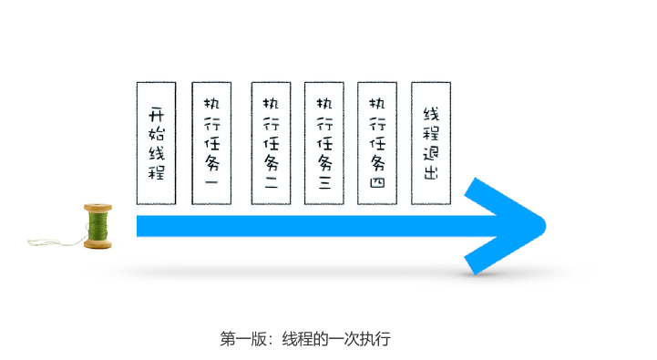
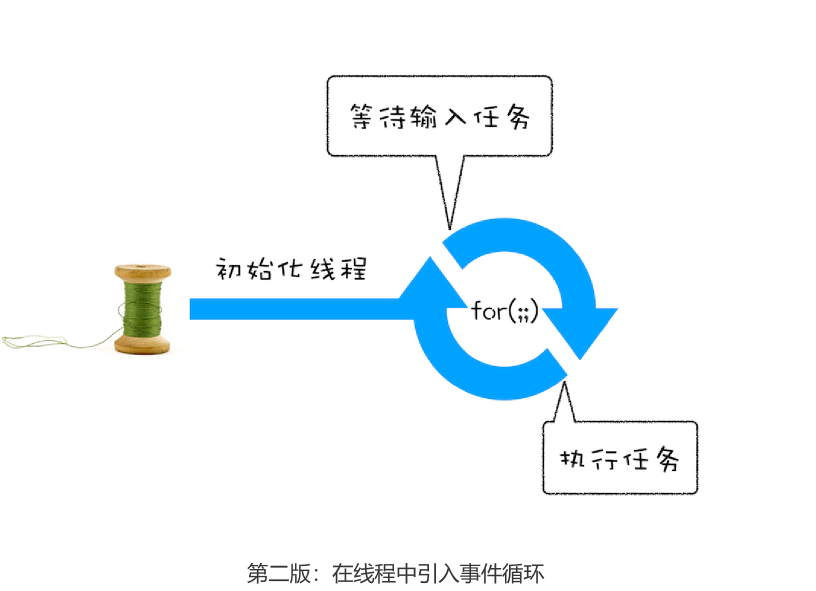
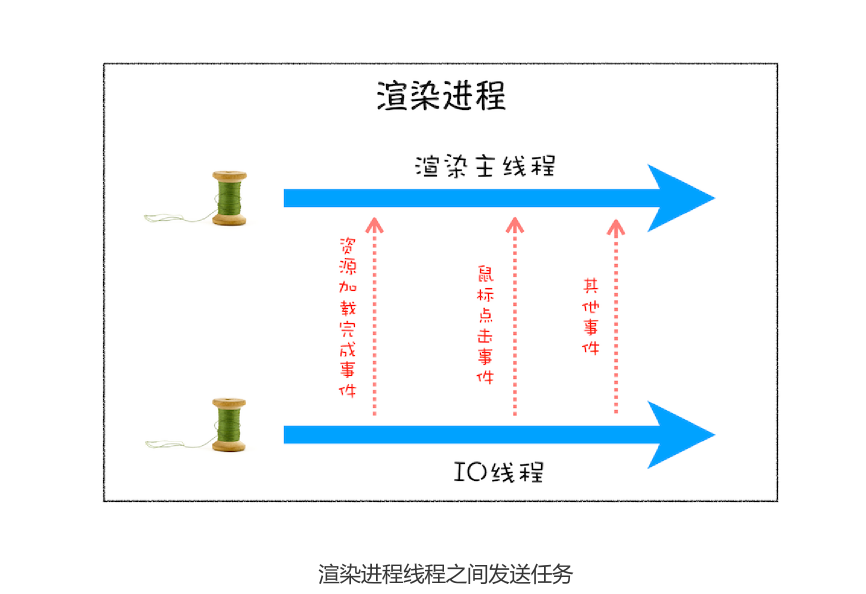
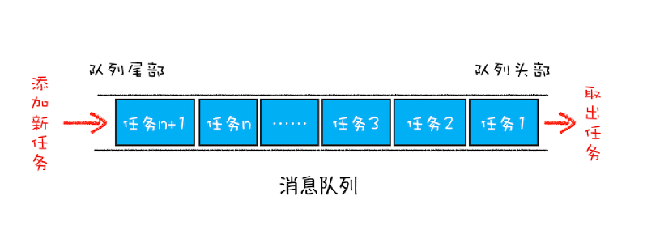
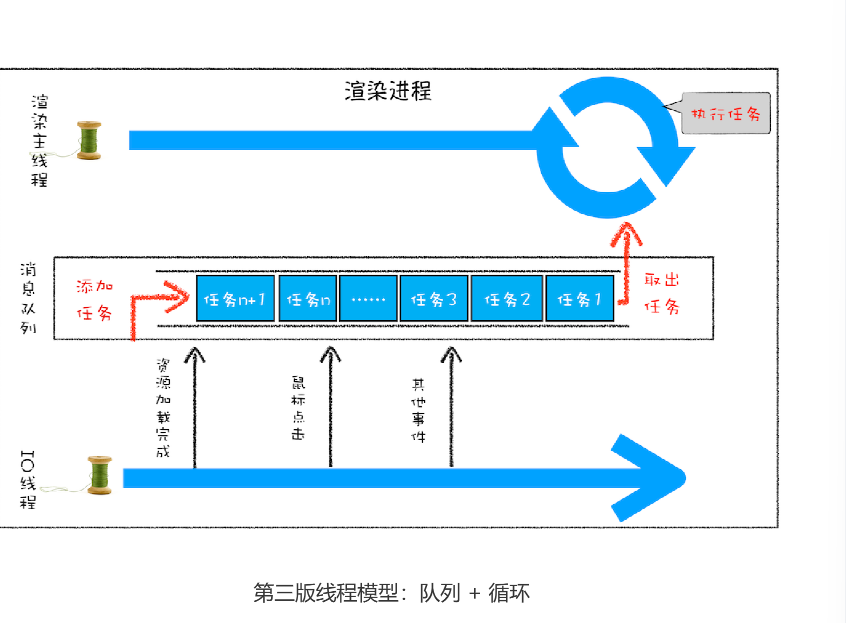
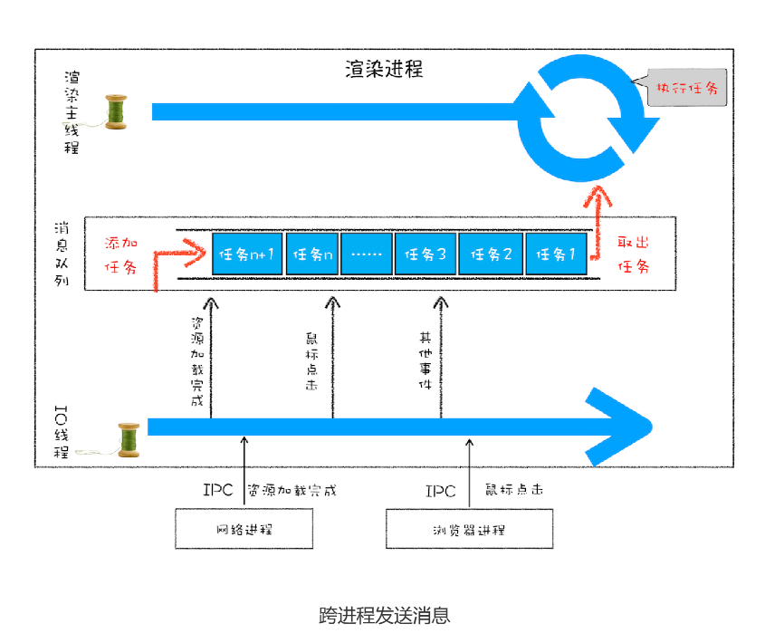

# 15|消息队列和事件循环：页面是怎么“活起来”的?


每个渲染进程都有一个主线程，并且主线程非常繁忙，既要处理DOM，又要计算样式，还要处理布局，同时还需要处理JavaScript任务以及各种输入事件。要让这么多不同类型的任务在主线程有条不紊地执行，这需要一个系统来统筹1调度这些任务，这个统筹调度系统就是今天要讲的消息队列和事件循环。


## 使用单线程处理安排好的任务

先从最简单的场景讲起，比如有如下一系列的任务：

任务1:1+2
任务2：20/5
任务3：7*8
任务4:打印出任务1、任务2、任务3的运算结果

现在要在一个线程去执行这些任务
```c++
void MainThread(){
    int num1=1+2;//任务1
    int num2=20/5//任务2
    int num3=7*&;//任务3
     print(" 最终计算的值为:%d,%d,%d",num,num2,num3)； // 任务 4
}
```

在上面的执行代码中，我们把所有任务代码按照顺序写进主线程里，等线程执行时，这些任
务会按照顺序在线程中依次被执行；等所有任务执行完成之后，线程会自动退出。可以参考
下图来直观地理解下其执行过程：



## 在线程运行过程中处理新的任务

但并不是所有的任务都是在执行之前统一安排好的，大部分情况下，新的任务是在线程运行
过程中产生的。比如在线程执行过程中，又接收到了一个新的任务要求计算“10+2”，那
上面那种方式就无法处理这种情况了。


**想要在线程过程中，能接收并执行新的任务，就需要采用事件循环机制**。我们可以通过一个for语句来监听是否新的任务

```c++
//GetInput
// 等待用户从键盘输入一个数字，并返回该输入的数字
int GetInput(){
 int input_number = 0;
 cout<<" 请输入一个数:";
 cin>>input_number;
 return input_number;
}
// 主线程 (Main Thread)
void MainThread(){
 for(;;){
 int first_num = GetInput()；
 int second_num = GetInput()；
 result_num = first_num + second_num;
 print(" 最终计算的值为:%d",result_num)；
 }
}
```


相较于第一版的线程，这一版线程两点改进了。

- 第一点引入循环机制，具体实现方式是在线程语句最后添加一个**for循环语句**，线程会一直循环执行
- 第二点引入了事件，可以在线程运行过程中，等待用户输入的数字，等待过程线程处于暂停状态，一旦接收到用户输入的信息，那么线程就会被激活，然后执行相加运算，最后输出结果。


通过引入事件循环机制，就可以让该线程“活”起来了，我们每次输入两个数字，都会打印
出两数字相加的结果，你可以结合下图来参考下这个改进版的线程：




## 处理其他线程发送过来的任务

上面改进线程的执行方式，引入事件循环机制，可以让其在执行过程中接到任务。不过在第二版的线程模型，所有的任务都来自于线程内部，如果另外一个线程让主线程执行一个任务，利用第二版的线程模型是无法做的

那下面我们就来看看其他线程是如何发送消息给渲染主线程的，具体形式你可以参考下图：


从上图可以看出，渲染主线程会频繁接收到来自于 IO 线程的一些任务，接收到这些任务之
后，渲染进程就需要着手处理，比如接收到资源加载完成的消息后，渲染进程就要着手进行
DOM 解析了；接收到鼠标点击的消息后，渲染主线程就要开始执行相应的 JavaScript 脚
本来处理该点击事件。


那么如何设计好一个线程模型，能让其能够接收其他线程发送的消息呢？

一个通用模式是使用**消息队列8*。在解释如何实现之前，我们先说说什么是消息队列，可以参考下图




从图中可以看出，**消息队列是一种数据结构，可以存放要执行的任务**。它符合队列“**先进先出**”的特点，也就是要**添加任务的话，添加到队列的尾部；要取出任务的话，从队列头部去取。**


有了队列之后，可以继续改造线程模型




从上图可以看出，改造可以分为下面三个步骤

1. 添加一个消息队列
2. IO线程中产生的新任务添加进消息队列尾部
3. 渲染主线程会循环地消息队列头部中读取任务、执行任务。

有这些步骤，那么接下来我们就可以按步骤使用代码**实现第三版的线程模型**

首先，构造一个队列。当然，在本篇文章中我们不需要考虑队列实现的细节，只是构造队列
的接口：

```c++
class TaskQueue{
    public:
    Task takeTask();//取出队列头部的一个任务
    void pushTask(Task task);//添加一个任务到队列尾部
}
```

接下来，改造主线程，让主线程从队列读取任务

```c++
TaskQueue task_queue;
void ProcessTask()

void MainThread(){
    for(;;){
        Task task=task_queue.takeTask()
        ProcessTask(task)
    }
}
```

在上面的代码中，我们添加了一个消息队列的对象，然后在主线程的 for 循环代码块中，从
消息队列中读取一个任务，然后执行该任务，主线程就这样一直循环往下执行，因此只要消
息队列中有任务，主线程就会去执行。


主线程的代码就这样改造完成了。这样改造后，主线程执行的任务都全部从消息队列中获
取。所以如果有其他线程想要发送任务让主线程去执行，只需要将任务添加到该消息队列中
就可以了，添加任务的代码如下：

```c++
Task clickTask;
task_queue.pushTask(clickTask)
```

由于是多个线程操作同一个消息队列，所以在添加任务和取出任务时还会加上一个同步锁，
这块内容你也要注意下。

## 处理其他进程发送过来的任务

通过使用消息队列，我们实现了线程之间的消息通信。在 Chrome 中，跨进程之间的任务
也是频繁发生的，那么如何处理其他进程发送过来的任务？你可以参考下图：


从图中可以看出，**渲染进程专门有一个IO线程用来接收其他进程传来的消息**，接收到消息之后，会将这些消息组装成任务发送给渲染主线程，后续的步骤就和前面讲解的“处理其他线程发送的任务”一样了，这里不再重复。


## 消息队列中的任务类型
