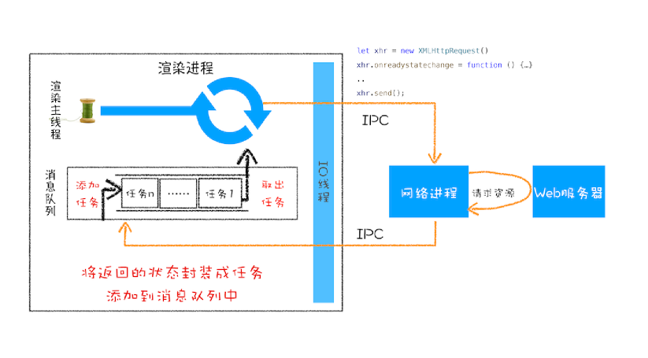
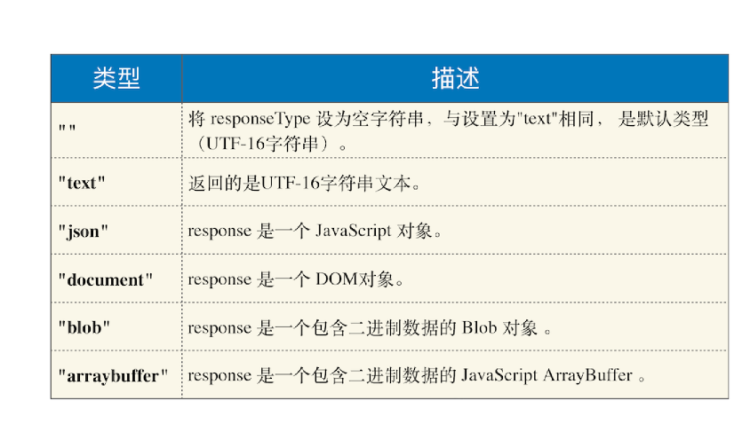

# 17|WebAPI:XMLHttpRequest是怎么实现的

我们介绍了 setTimeout 是如何结合渲染进程的循环系统工作的，那本篇文
章我们就继续介绍另外一种类型的 WebAPI——XMLHttpRequest。


自从网页中引入了 JavaScript，我们就可以操作 DOM 树中任意一个节点，例如隐藏 / 显
示节点、改变颜色、获得或改变文本内容、为元素添加事件响应函数等等， 几乎可以“为
所欲为”了。

不过在 XMLHttpRequest 出现之前，如果服务器数据有更新，依然需要重新刷新整个页
面。而 XMLHttpRequest 提供了从 Web 服务器获取数据的能力，如果你想要更新某条数
据，只需要通过 XMLHttpRequest 请求服务器提供的接口，就可以获取到服务器的数据，
然后再操作 DOM 来更新页面内容，整个过程只需要更新网页的一部分就可以了，而不用
像之前那样还得刷新整个页面，这样既有效率又不会打扰到用户。


关于 XMLHttpRequest，本来我是想一带而过的，后来发现这个 WebAPI 用于教学非常
好。首先前面讲了那么网络内容，现在可以通过它把 HTTP 协议实践一遍；其次，
XMLHttpRequest 是一个非常典型的 WebAPI，通过它来讲解浏览器是如何实现 WebAPI
的很合适，这对于你理解其他 WebAPI 也有非常大的帮助，同时在这个过程中我们还可以
把一些安全问题给串起来。


但在深入讲解 XMLHttpRequest 之前，我们得先介绍下**同步回调**和**异步回调**这两个概念，
这会帮助你更加深刻地理解 WebAPI 是怎么工作的。


## 回调函数vs系统调用栈

那什么是回调函数呢（Callback Function）？

将一个函数作为参数传递给另外一个函数，那作为参数的这个函数就是**回调函数**。简化的代
码如下所示：

```js
let callback = function(){
 console.log('i am do homework')
}
function doWork(cb) {
 console.log('start do work')
 cb()
 console.log('end do work')
}
doWork(callback)

```

既然有同步回调，那肯定也有异步回调。看看异步回调的例子

```js
let callback = function(){
 console.log('i am do homework')
}
function doWork(cb) {
 console.log('start do work')
 setTimeout(cb,1000) 
 console.log('end do work')
}
doWork(callback)
```

在这个例子中，我们使用了 setTimeout 函数让 callback 在 doWork 函数执行结束后，又
延时了 1 秒再执行，这次 callback 并没有在主函数 doWork 内部被调用，我们把这种回
调函数在主函数外部执行的过程称为***异步回调**。


## XMLHttpRequest 运作机制


理解了什么是同步回调和异步回调，接下来我们就来分析 XMLHttpRequest 背后的实现机
制，具体工作过程你可以参考下图：




这是 XMLHttpRequest 的总执行流程图，下面我们就来分析从发起请求到接收数据的完整
流程。

```js
 function GetWebData(URL){
 /**
 * 1: 新建 XMLHttpRequest 请求对象
 */
 let xhr = new XMLHttpRequest()
 /**
 * 2: 注册相关事件回调处理函数
 */
 xhr.onreadystatechange = function () {
 switch(xhr.readyState){
 case 0: // 请求未初始化
 console.log(" 请求未初始化 ")
 break;
 case 1://OPENED
 console.log("OPENED")
 break;
 case 2://HEADERS_RECEIVED
 console.log("HEADERS_RECEIVED")
 break;
 case 3://LOADING 
 console.log("LOADING")
 break;
 case 4://DONE
 if(this.status == 200||this.status == 304){
 console.log(this.responseText);
 }
 console.log("DONE")
 break;
 }
 }
 xhr.ontimeout = function(e) { console.log('ontimeout') }
 xhr.onerror = function(e) { console.log('onerror') }
 /**
 * 3: 打开请求
 */
 xhr.open('Get', URL, true);// 创建一个 Get 请求, 采用异步
 /**
 * 4: 配置参数
 */
 xhr.timeout = 3000 // 设置 xhr 请求的超时时间
 xhr.responseType = "text" // 设置响应返回的数据格式
 xhr.setRequestHeader("X_TEST","time.geekbang")
 /**
 * 5: 发送请求
 */
 xhr.send();
}
```

上面是一段利用了 XMLHttpRequest 来请求数据的代码，再结合上面的流程图，我们可以
分析下这段代码是怎么执行的。


###  第一步:创建XMLHttpRequest对象

当执行到let xhr=new XMLHttpRequest()后，JavaScript会创建一个XMLHttpRequest对象xhr，用来执行实际的网络请求。

### 第二步：为xhr对象注册回调函数


因为网络请求比较耗时，所以要注册回调函数，这样后台执行完成之后就会通过回调函数来告诉其执行结果。

XMLHttpRequest的回调函数主要有下面几种

- ontimeout，用来监控超时请求，如果后台请求超时，该函数会被调用；
- onerror,用来监控出错信息，如果后台请求出错，该函数会被调用
- onreadystatechange，用来监控后台请求过程中的状态，比如可以监控到HTTP加载完成的消息、HTTP响应体消息以及数据加载完成的消息等。


### 第三步:配置基础的请求信息

注册好回调事件，接下来就需要配置基础的请求信息，首先要通过 open 接口配置
一些基础的请求信息，包括请求的地址、请求方法（是 get 还是 post）和请求方式（同步
还是异步请求）。

然后通过 xhr 内部属性类配置一些其他可选的请求信息，你可以参考文中示例代码，我们
通过xhr.timeout = 3000来配置超时时间，也就是说如果请求超过 3000 毫秒还没有响
应，那么这次请求就被判断为失败了。

我们还可以通过xhr.responseType = "text"来配置服务器返回的格式，将服务器返
回的数据自动转换为自己想要的格式，如果将 responseType 的值设置为 json，那么系统
会自动将服务器返回的数据转换为 JavaScript 对象格式。下面的图表是我列出的一些返回
类型的描述：

假如你还需要添加自己专用的请求头属性，可以通过 xhr.setRequestHeader 来添加。


### 第四步:发起请求
一切准备就绪，就可以调用xhr.send来发起网络请求。可以对照上面请求流程图，可以请求流程图，可以看到：渲染进程将请求发送给网络进程，然后网络进程负责资源下载，等网络进程接收到数据之后，就会利用IPC来通知渲染进程；渲染进程接收到消息之后，就将xhr的回调函数封装成任务并添加到消息队列中，等主线程循环系统执行到该任务时候，就会根据相关的状态调用对应的回调函数。


- 如果网络请求出错了，就会执行xhr.onerror
- 如果超时了，就会执行xhr.ontimeout
- 如果是正常数据接收，就会执行onreadystatechange来反馈相应的状态

## XMLHttpRequest 使用过程的“坑”

上述过程看似简单，但由于浏览器很多安全策略的限制，所以会导致你在使用过程中踩到非
常多的“坑”。

浏览器安全问题是前端工程师避不开的一道坎，通常在使用过程遇到的“坑”，很大一部分都是安全策略引起的，正是由于加了安全限制，导致使用起来非常麻烦。


而你要做的是正式安全问题，想要更加完美地使用XMLHttpRequest，就要了解浏览器的安全策略。

下面看看使用XMLHttpRequest的过程中所遇到的跨域问题和混合内容问题


### 1.跨域问题
比如在极客邦的官网使用 XMLHttpRequest 请求极客时间的页面内容，由于极客邦的官网
是www.geekbang.org,极客时间的官网time.geekbang.org，它们不是同一个源，所以涉及到了**跨域**。默认情况下，跨域请求是不被允许

```js
var xhr=new XMLHttpRequest()
var url="https://time.geekbang.org/"
function handler(){
    switch(xhr.readyState){
        case 0://请求未初始化
        console.log("请求未出初始化")
        break;
        case 1://
        console.log("OPEND")
        break;
         case 3://LOADING
        console.log("LOADING")
        break;
        case 4://DONE
        if(this.status == 200||this.status == 304){
        console.log(this.responseText);
        }
        console.log("DONE")
        break;
    }
}

function callOtherDomain(){
    if(xhr){
        xhr.open('GET',url,true)
        xhr.onreadystatechange=handler
        xhr.send()
    }
}
callOtherDomain()
```

你可以在控制台测试下。首先通过浏览器打开www.geekbang.org，然后打开控制台，在
控制台输入以上示例代码，再执行，会看到请求被 Block 了。控制台的提示信息如下：

```js
Access to XMLHttpRequest at 'https://time.geekbang.org/' from origin 'https://www.geekba
```

因为 www.geekbang.org 和 time.geekbang.com 不属于一个域，所以以上访问就属于跨
域访问了，这次访问失败就是由于跨域问题导致的。


### 2.HTTPS混合内容的问题

了解完跨域问题后，我们再来看看 HTTPS 的混合内容。HTTPS 混合内容是 HTTPS 页面中
包含了不符合 HTTPS 安全要求的内容，比如包含了 HTTP 资源，通过 HTTP 加载的图像、
视频、样式表、脚本等，都属于混合内容。


## 总结

setTimeout 是直接将延迟任务添加到延迟队列中，而
XMLHttpRequest 发起请求，是由浏览器的其他进程或者线程去执行，然后再将执行结果
利用 IPC 的方式通知渲染进程，之后渲染进程再将对应的消息添加到消息队列中。如果你
搞懂了 setTimeout 和 XMLHttpRequest 的工作机制后，再来理解其他 WebAPI 就会轻
松很多了，因为大部分 WebAPI 的工作逻辑都是类似的。


