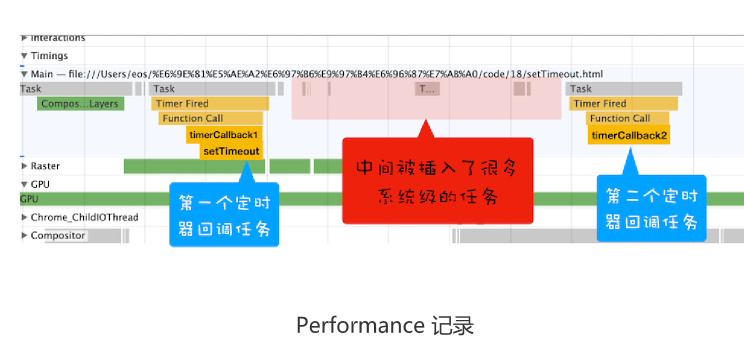
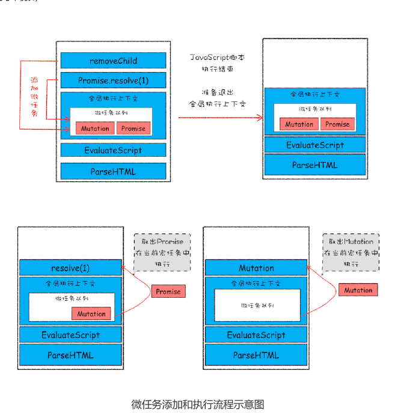

# 18|宏任务和微任务：不是所有任务都是一个待遇


介绍了消息队列，并结合消息队列介绍了两种典型的WebAPI——**setTimeout和XMLHttpRequest**，
通过这两个WebAPI我们搞清楚浏览器的消息循环系统是怎么工作的。不过随着浏览器的应用领域越来越广泛，消息队列中这种粗时间颗粒度的任务不能胜任部分领域的需求1，所以又出现一种新的技术——
**微任务**。**微任务可以在实时性和效率之间做一个有效的权衡**

有微任务已被广泛地应用，基于微任务技术有MutationObserve、Promise以及Promise为基础开发很多其他技术。所以微任务的重要性也与日俱增，了解其底层的工作原理对于读懂别人的代码，以及写出更高
效、更具现代的代码有着决定性的作用。


有微任务，也就有宏任务，那么这两组到底有什么区别，如何相互取长补短？


## 宏任务

页面中大部分都是在主线程上执行，这些任务包括了
- 渲染事件(如解析DOM、计算布局、绘制)
- 用户交互事件(如鼠标点击、滚动页面、放大缩小等)
- JavaScript脚本执行事件
- 网络请求完成、文件读写完成事件


为了协调这些任务有条不紊地在主线程执行，页面进程进入消息队列和事件循环机制，
渲染进程内部会维护多个消息队列，比如延迟执行队列和普通的消息队列，然后主线程采用一个for循环，不断地从这些任务队列中取出任务并执行任务。我们把这些消息队列中任务称为**宏任务**


先从多个消息队列中选出一个最老的任务，这个任务称为 oldestTask；

然后循环系统记录任务开始执行的时间，并把这个 oldestTask 设置为当前正在执行的任
务；

当任务执行完成之后，删除当前正在执行的任务，并从对应的消息队列中删除掉这个
oldestTask；

最后统计执行完成的时长等信息。


宏任务可以满足大部分的日常需求，不过如果有对时间精度要求比较高的需求，宏任务难以胜任，下面我们就来分析下为什么宏任务难以满足对时间精度要求较高的任务。

前面说过，页面的渲染事件、各种IO完成的事件、执行JavaScript脚本的事件、用户交互的事件等随时都有可能添加到消息队列中，而且添加事件是由系统操作的，JavaScript代码不能准确掌握任务要添加到队列中的位置，控制不了任务在消息队列中的位置，所以很难控制开始执行任务的时间。


```js
function timerCallback2(){
    console.log(2)
}
function timerCallback(){
    console.log(1)
    setTimeout(timerCallback2,0)
}

setTimeout(timerCallback,0)

```
在这段代码中，我的目的是想通过 setTimeout 来设置两个回调任务，并让它们按照前后顺
序来执行，中间也不要再插入其他的任务，因为如果这两个任务的中间插入了其他的任务，
就很有可能会影响到第二个定时器的执行时间了。


但实际情况是我们不能控制的，比如在你调用 setTimeout 来设置回调任务的间隙，消息队
列中就有可能被插入很多系统级的任务。你可以打开 Performance 工具，来记录下这段任
务的执行过程，也可参考文中我记录的图片：




setTimeout函数触发的回调函数都是宏任务，如图中，左右两个黄色块就是setTimeout触发的两个定时器


现在你可以重点观察上图中间浅红色区域，这里有很多一段一段的任务，这些是被渲染引擎
插在两个定时器任务中间的任务。试想一下，如果中间被插入的任务执行时间过久的话，那
么就会影响到后面任务的执行了。


所以说宏任务的时间粒度比较大，执行的时间间隔是不能精确控制的，对一些高实时性的需
求就不太符合了，比如后面要介绍的监听 DOM 变化的需求。


## 微任务


我们介绍过异步回调的概念，主要两种方式

- **第一种把异步回调函数封装成宏任务，添加到消息队列尾部，当循环系统执行到该任务就执行回调函数**这种比较好理解，我们前面介绍的 setTimeout 和
XMLHttpRequest 的回调函数都是通过这种方式来实现的。

- **第二种方式的执行时机是在主函数执行结束之后，当前宏任务结束之前执行回调函数，这种通常都是以微任务形式体现**


**微任务就是一个需要异步执行的函数，执行时机是在主函数执行结束之后，当前宏任务结束之前**

不过要搞清楚微任务系统是怎么运转起来的，就得站在 V8 引擎的层面来分析下。


知道JavaScript执行一段脚本的时候，V8会创建一个全局执行上下文，在创建全局执行上下文的同时，V8引擎也会在内部创建一个**微任务队列**。顾名思义，这个微任务队列就是存放微任务，因此在宏任务执行的过程中，有时候会产生多个微任务，这时候需要使用这个微任务队列来保存微任务，不过这个微任务队列是给 V8 引擎内部使用的，所以你是无法通过 JavaScript 直接访问的。


也就是说每个宏任务都关联了一个微任务队列。那么接下来，我们就需要分析两个重要的时
间点——**微任务产生的时机**和**执行微任务队列的时机**。


我们先来看看微任务是怎么产生的？在现代浏览器里面，产生微任务有两种方式。

第一种方式是使用MutationObserver监控某个DOM节点，然后再通过JavaScript来修改这个节点，或者为这个节点添加、删除部分子节点，当DOM节点发生变化时，就会产生DOM变化记录微任务


第二种方式使用Promise，当调用Promise.resolve()或者Promise.reject()的时候，也会产生微任务


通过 DOM 节点变化产生的微任务或者使用 Promise 产生的微任务都会被 JavaScript 引擎
按照顺序保存到微任务队列中。


好了，现在微任务队列中有了微任务了，那接下来就要看看微任务队列是何时被执行的。


微任务里面产生微任务会放到当前微任务队列中顺序执行

宏任务产生的微任务，会放到下轮微任务队列中




在执行一个ParseHTML的宏任务，在执行过程中，遇到了 JavaScript 脚本，
那么就暂停解析流程，进入到 JavaScript 的执行环境。从图中可以看到，全局上下文中包
含了微任务列表。
在 JavaScript 脚本的后续执行过程中，分别通过 Promise 和 removeChild 创建了两个微
任务，并被添加到微任务列表中。接着 JavaScript 执行结束，准备退出全局执行上下文，
这时候就到了检查点了，JavaScript 引擎会检查微任务列表，发现微任务列表中有微任
务，那么接下来，依次执行这两个微任务。等微任务队列清空之后，就退出全局执行上下
文。


消息队列里面是宏任务，宏任务会有自己的微任务队列

以上微任务的工作流程，从上面分析可以得出**结论**

- 微任务和宏任务是绑定的，每个宏任务在执行时，会创建自己的微任务队列。


- 微任务的执行时长会影响到当前宏任务的时长。比如一个宏任务在执行过程中，产生了
100 个微任务，执行每个微任务的时间是 10 毫秒，那么执行这 100 个微任务的时间就
是 1000 毫秒，也可以说这 100 个微任务让宏任务的执行时间延长了 1000 毫秒。所以
你在写代码的时候一定要注意控制微任务的执行时长。


- 在一个宏任务中，分别创建一个用于回调的宏任务和微任务，无论什么情况下，微任务都
早于宏任务执行。


## 监听DOM变化方法演变


现在知道了微任务是怎么工作的，那接下来我们再来看看微任务是如何应用在
MutationObserver 中的。MutationObserver 是用来监听 DOM 变化的一套方法，而监
听 DOM 变化一直是前端工程师一项非常核心的需求。


比如许多 Web 应用都利用 HTML 与 JavaScript 构建其自定义控件，与一些内置控件不
同，这些控件不是固有的。为了与内置控件一起良好地工作，这些控件必须能够适应内容更
改、响应事件和用户交互。因此，**Web 应用需要监视 DOM 变化并及时地做出响应**。


虽然监听DOM的需求如此重要，不过早期页面并没有提供监听的支持，所以那时要检查DOM是否变化，唯一能做就是**轮询**检测，比如使用setTimeout或者setInterval来定时检查DOM是否有改变。这种方式简单粗暴，但是会遇到两个问题:如果时间设置过长，DOM变化反应不够及时；反过来如果时间间隔设置过短，又会浪费很多无用的工作量去检查 DOM，会让页面变得低效。


Mutation Event采用**观察的设计模式**，当DOM有变动是立刻相应的事件，这种方式属于同步回调。

采用 Mutation Event 解决了实时性的问题，因为 DOM 一旦发生变化，就会立即调用
JavaScript 接口。但也正是这种实时性造成了严重的性能问题，因为每次 DOM 变动，渲
染引擎都会去调用 JavaScript，这样会产生较大的性能开销。比如利用 JavaScript 动态创
建或动态修改 50 个节点内容，就会触发 50 次回调，而且每个回调函数都需要一定的执行
时间，这里我们假设每次回调的执行时间是 4 毫秒，那么 50 次回调的执行时间就是 200
毫秒，若此时浏览器正在执行一个动画效果，由于 Mutation Event 触发回调事件，就会导
致动画的卡顿。


了解决了 Mutation Event 由于同步调用 JavaScript 而造成的性能问题，从 DOM4 开
始，推荐使用 MutationObserver 来代替 Mutation Event。MutationObserver API 可以
用来监视 DOM 的变化，包括属性的变化、节点的增减、内容的变化等。


我们通过异步调用和减少触发次数来缓解了性能问题，那么如何保持消息通知的及时性呢？
如果采用 setTimeout 创建宏任务来触发回调的话，那么实时性就会大打折扣，因为上面我
们分析过，在两个任务之间，可能会被渲染进程插入其他的事件，从而影响到响应的实时
性。


这个时候，微任务就可以上场了，在每次节点发生变化的时候，渲染引擎将变化记录
封装成微任务，并将微任务添加进当前的微任务队列中。这样当执行到检查点的时候，V8
引擎就会按照顺序执行微任务了。


综上所述，MutationObserver采用"**异步+微任务**"的策略

通过**异步**操作解决了同步操作的**性能问题**

通过**微任务**解决了**实时性的问题**


## 总结


1. 首先回顾了宏任务，然后在宏任务基础之上，分析了异步回调函数的两种形式，其中最后一张回调方式通过微任务来实现

2. 接下来详细分析了浏览器是如何实现微任务，包括微任务队列、检查点等概念


3. 最后介绍了监听 DOM 变化技术方案的演化史，从轮询到 Mutation Event 再到最新
使用的 MutationObserver。MutationObserver 方案的核心就是采用了微任务机制，有
效地权衡了实时性和执行效率的问题。


