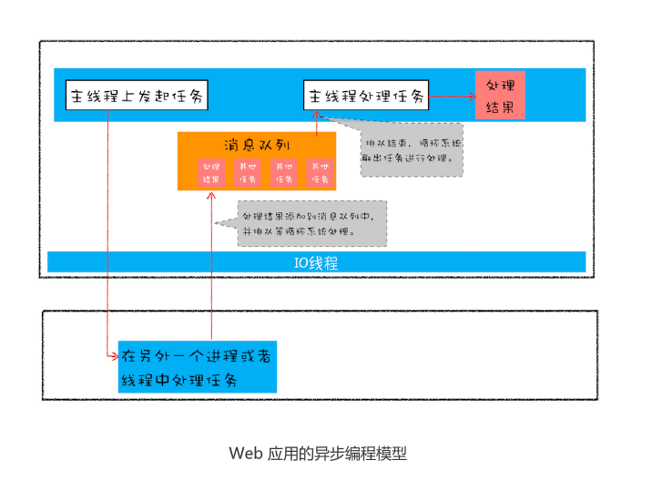
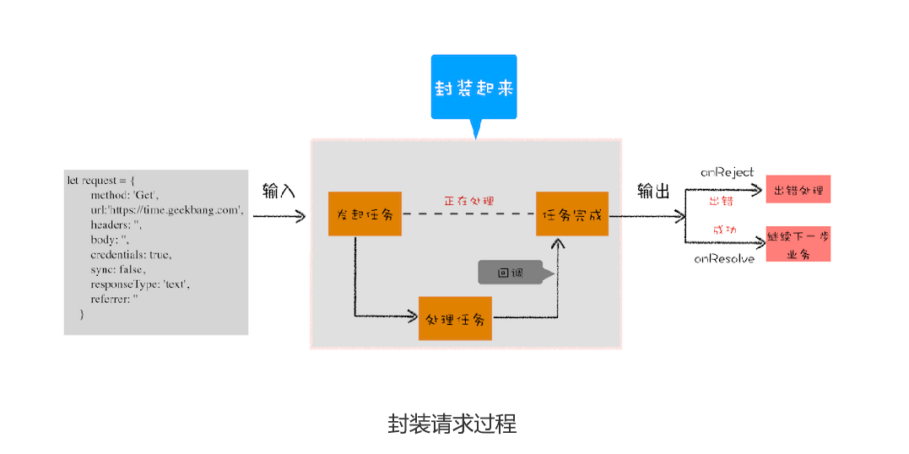

# 19|Promise:使用Promise，告别回调函数


在上一篇文章中我们聊到了微任务是如何工作的，并介绍了 MutationObserver 是如何利
用微任务来权衡性能和效率的。今天我们就接着来聊聊微任务的另外一个应用**Promise**，DOM/BOM API中新加入的API大多数都是建立在Promise上的，而且新的前端框架也使用了大量的Promise。可以这么说，Promise已经成为现代前端的“水”和“电”,很是关键，所以深入学习Promise势在必行


如果你想要学习一门新技术，最好的方式是先了解这门技术是如何诞生的，以及它所解决的
问题是什么。了解了这些后，你才能抓住这门技术的本质。所以本文我们就来重点聊聊
JavaScript 引入 Promise 的动机，以及解决问题的几个核心关键点。


要谈动机，我们一般都是先从问题切入，那么 Promise 到底解决了什么问题呢？在正式开
始介绍之前，我想有必要明确下，Promise 解决的是异步编码风格的问题，而不是一些其
他的问题，所以接下来我们聊的话题都是围绕编码风格展开的。


要谈动机，我们一般都是先从问题切入，那么 Promise 到底解决了什么问题呢？在正式开
始介绍之前，我想有必要明确下，Promise 解决的是异步编码风格的问题，而不是一些其
他的问题，所以接下来我们聊的话题都是围绕编码风格展开的。


## 异步编程的问题:代码逻辑不连续


首先我们来回顾下 JavaScript 的异步编程模型，你应该已经非常熟悉页面的事件循环系统
了，也知道页面中任务都是执行在主线程之上的，相对于页面来说，主线程就是它整个的世
界，所以在执行一项耗时的任务时，比如下载网络文件任务、获取摄像头等设备信息任务，
这些任务都会放到页面主线程之外的进程或者线程中去执行，这样就避免了耗时任务“霸
占”页面主线程的情况。你可以结合下图来看看这个处理过程




上图展示的是一个标准的异步编程模型，页面主线程发起了一个耗时的任务，并将任务交给
另外一个进程去处理，这时页面主线程会继续执行消息队列中的任务。等该进程处理完这个
任务后，会将该任务添加到渲染进程的消息队列中，并排队等待循环系统的处理。排队结束
之后，循环系统会取出消息队列中的任务进行处理，并触发相关的回调操作。

这就是页面编程的一大特点：**异步回调**

Web 页面的单线程架构决定了异步回调，而异步回调影响到了我们的编码方式，到底是如
何影响的呢？


假设有一个下载的需求，使用XMLHttpRequest来实现，具体的实现方法可以参考


```js
//执行状态
function onResolve(response){console.log(response)}
function onReject(error){console.log(error)}

let xhr=new XMLHttpRequest()
xhr.ontimeout=function(e){OnRejected(e)}
xhr.onerror=function(e){onReject(e)}
xhr.onreadystatechange=function(){onResolve(xhr.respone)}


//设置请求类型，请求url，是否同步信息

let URL="https://time.geekingbang.com"
xhr.open('GET',url,true)


//设置参数
xhr.timeout=3000//设置xhr请求超时时间
xhr.responseType="text"//设置响应返回的数据格式
xhr.setRequestHeader("X_TEST","time.geekbang")

//发出请求
xhr.send()
```

我们执行上面这段代码，可以正常输出结果的。但是，这短短的一段代码里面竟然出现了五
次回调，这么多的回调会导致代码的逻辑不连贯、不线性，非常不符合人的直觉，这就是异
步回调影响到我们的编码方式。


## 封装异步代码，让处理流程变得线性



从图中你可以看到，我们将 XMLHttpRequest 请求过程的代码封装起来了，重点关注输入
数据和输出结果。


那我们就按照这个思路来改造代码，首先，我们把输入的HTTP请求信息全部保存到一个request 的结构中，
包括请求地址、请求头、请求方式、引用地址、同步请求还是异步请求、安全设置等信息


```js
//makeRequest 用来构造request对象

function makeRequest(request_url){
    let request={
        method:'Get',
        url:request_url,
        header:'',
        body:'',
        credentials:false,
        sync:true,
        response:'text',
        referrer:''
    }
    return request
}
```


然后就可以封装请求过程，这里所有的请求细节封装进XFetch函数，XFetch代码如下

```js
function XFetch(request,resolve,reject){
    let xhr=new XMLHttpRequest()
    xhr.ontimeout=function (e){reject(e)}
    xhr.onerror=function(e){reject(e)}
    xhr.onreadystatechange=function(){
        if(xhr.status=200){
            resolve(xhr.reponse)
        }
    }
    xhr.open(request.method,request.url,request.sync)
    xhr.timeout=request.timeout
    xhr.responseType=request.responseType
     // 补充其他请求信息
    //...
    xhr.send();
}

```


这个 XFetch 函数需要一个 request 作为输入，然后还需要两个回调函数 resolve 和
reject，当请求成功时回调 resolve 函数，当请求出现问题时回调 reject 函数。

有了这些后，我们就可以来实现业务代码了，具体的实现方式如下所示：

```js
XFetch(makeRequest('https://time.geekbang.org'),
 function resolve(data) {
 console.log(data)
 }, function reject(e) {
 console.log(e)
})

```


## 新的问题:回调地域

上面的示例代码已经比较符合人的线性思维了，在一些简单的场景下运行效果也是非常好
的，不过一旦接触到稍微复杂点的项目时，你就会发现，如果嵌套了太多的回调函数就很容
易使得自己陷入了**回调地狱**，不能自拔。你可以参考下面这段让人凌乱的代码：
```js
XFetch(makeRequest('https://time.geekbang.org/?category'),
 function resolve(response) {
    console.log(response)
    XFetch(makeRequest('https://time.geekbang.org/column'),
         function resolve(response) {
        console.log(response)
            XFetch(makeRequest('https://time.geekbang.org')
                function resolve(response) {
                console.log(response)
                }, function reject(e) {
                console.log(e)
            })
        }, function reject(e) {
        console.log(e)
        })
 }, function reject(e) {
 console.log(e)
})

```

这段代码先请求time.geekbang.org/?category，如果请求成功，那么再请求t
ime.geekbang.org/column，如果再次请求成功的话，就继续请求time.geekbang.o
rg。也就是说这段代码用了三层嵌套请求，就已经让代码变得混乱不堪，所以，我们还需
要解决这种嵌套调用后混乱的代码结构。


这段代码之所以看上去很乱，归结其原因有两点

- **第一是嵌套调用**，下面的任务依赖上个任务的请求结果，并且**上个任务的回调函数内部执行新的业务逻辑**，这样当嵌套层次多了，代码可读性就变得非常差了。
- **第二是任务的不确定性**，执行每个任务都有两种可能得结果(成功或者失败)，所以体现在代码中需要对每个任务的执行结果做两次判断，这种每个任务都进行一次额外的错误处理的方式，明显增加了代码的混乱程度。


原因分析出来，那么问题解决思路就很清晰了

**第一是消灭嵌套调用**

**第二是合并多个任务的错误处理**


这么讲可能有点抽象，不过 Promise 已经帮助我们解决了这两个问题。那么接下来我们就
来看看 Promise 是怎么消灭嵌套调用和合并多个任务的错误处理的。


## Promise：消灭嵌套调用和多次错误处理
首先，使用Promis来重构代码XFetch代码


```js
function XFetch(request){
    function executor(resolve,reject){
        let xhr=new XMLHttpRequest()
        xhr.open('GET', request.url, true)
        xhr.ontimeout = function (e) { reject(e) }
        xhr.onerror = function (e) { reject(e) }
         xhr.onreadystatechange = function () {
            if (this.readyState === 4) {
                if (this.status === 200) {
                  resolve(this.responseText, this)
                 } else {
                 let error = {
                 code: this.status,
                response: this.response
                    }
                 reject(error, this)
                      }
             }
            }
    }
    return new Promise(executor)
}

```

接下来，再利用XFetch来构造请求函数

```js
var x1=XFecth((makeRequest('https://time.geekbang.org/?category'))
var x2=x1.then(value=>{
    console.log(value)
    return XFetch(makeRequest('https://www.geekbang.org/column'))
})


var x3=x2.then(value => {
 console.log(value)
 return XFetch(makeRequest('https://time.geekbang.org'))
})

x3.catch(error=>{
    console.log(error)
})


```
then里面的是回调函数


解释下上面的代码：

首先引入Promise，在调用XFetch时，会返回一个Promise对象

- 构建Promise对象时，需要传入一个**executor函数**，XFetch主要业务流程都在executor函数中执行

- 如果运行在excutor函数业务执行成功，会调用resolve函数；如果执行失败，则调用reject函数


- 在excutor函数中调用resolve函数时，会调用promise.then设置的回调函数；而调用reject函数，会触发promise.catch设置回调函数;而调用reject函数时，会触发promise.catch的回调函数


以上简单介绍了 Promise 一些主要的使用方法，通过引入 Promise，上面这段代码看起来
就非常线性了，也非常符合人的直觉，是不是很酷？基于这段代码，我们就可以来分析
Promise 是如何消灭嵌套回调和合并多个错误处理了。


看个简单promise

```js
function executor(resolve,reject){
    resolve(100)
}

let demo=new Promise(executor)

function onResolve(value){
    console.log(value)
}

demo.then(onResolve)

```

重点关注下执行顺序

首先执行new Promise时，Promise的构造函数会被执行，不过由于Promise是V8引擎提供的，所以暂时看不到Promise构造函数的细节

接下来，Promise的构造函数会调用Promise的参数executor函数，然后executor中执行了resolve，resolve函数也是在v8内部实现的，那么resolve函数到底做什么呢？我们知道，执行 resolve 函数，会触发 demo.then 设置的回调函数 onResolve，所
以可以推测，resolve 函数内部调用了通过 demo.then 设置的 onResolve 函数。


不过这里需要注意一下，由于 Promise 采用了回调函数延迟绑定技术，所以在执行
resolve 函数的时候，回调函数还没有绑定，那么只能推迟回调函数的执行。


